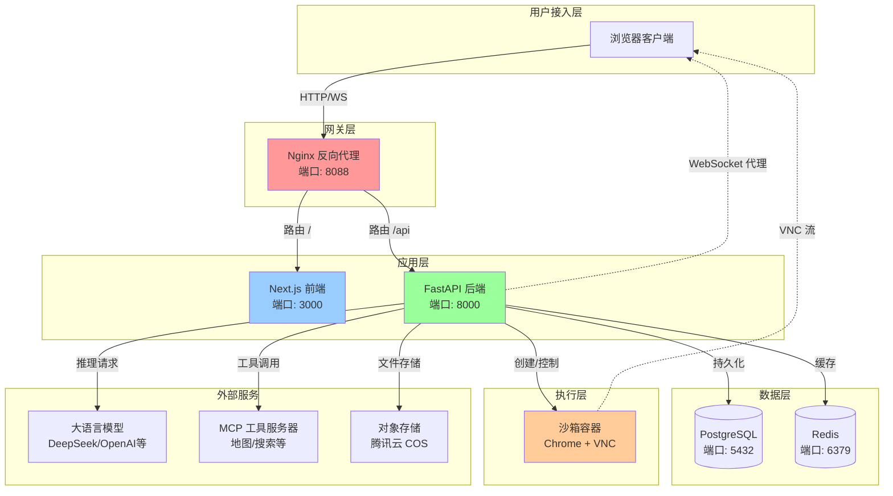

MultiGen 是一个通用 AI Agent 系统，专为需要完全私有化部署的企业级场景设计。系统通过 A2A (Agent-to-Agent) 和 MCP (Model Context Protocol) 协议连接各种 Agent 和工具，并提供了沙箱环境来安全地执行浏览器自动化、文件操作等复杂任务。无论您是需要构建智能客服、自动化工作流，还是探索 AI Agent 的能力边界，MultiGen 都提供了一个开箱即用的完整解决方案。
Sources: [README.zh-CN.md](README.zh-CN.md#L1-L9)

## 核心价值定位

传统 AI 应用往往需要深度定制开发才能满足特定业务需求，而 MultiGen 采用了模块化的 Agent 架构设计，让开发者可以通过配置而非编码的方式快速构建智能应用。系统内置的沙箱环境支持 Chrome 浏览器自动化，能够完成网页浏览、数据采集、表单填写等复杂操作，同时通过 VNC 提供实时可视化监控。这种设计将 AI Agent 的强大能力与安全可控的执行环境完美结合，既降低了开发门槛，又确保了生产环境的安全性。
Sources: [README.md](README.md#L1-L14)

## 技术栈概览

MultiGen 采用经典的前后端分离架构，技术选型兼顾了开发效率和运行性能。下表展示了系统核心组件及其职责：

| 层级 | 技术组件 | 版本要求 | 核心职责 |
|------|---------|----------|----------|
| **前端** | Next.js | 最新版 | 渐进式 Web 应用，支持 SSR 和流式渲染 |
| **后端** | FastAPI | Python 3.12+ | 异步 API 服务，自动生成 OpenAPI 文档 |
| **数据库** | PostgreSQL | - | 持久化存储会话、文件、Agent 状态等业务数据 |
| **缓存** | Redis | - | 会话状态缓存、任务队列、分布式锁 |
| **沙箱** | Ubuntu + Chrome | - | 隔离环境，执行浏览器自动化和文件操作 |
| **网关** | Nginx | - | 反向代理、SSL 终止、负载均衡 |
Sources: [README.zh-CN.md](README.zh-CN.md#L15-L30), [api/README.md](api/README.md#L1-L14)

## 系统架构全景

MultiGen 的架构设计遵循了清晰的关注点分离原则，通过六层协作实现完整的 AI Agent 能力闭环。下图展示了系统的核心架构和组件交互关系：



系统采用微服务思想设计，但通过 Docker Compose 实现了单体化部署体验。Nginx 作为唯一对外入口，统一处理静态资源、API 路由和 WebSocket 代理。FastAPI 后端采用分层架构（接口层、应用层、领域层、基础设施层），通过 SQLAlchemy 实现数据持久化，通过 Docker SDK 动态管理沙箱容器。这种设计既保证了服务间的独立性和可扩展性，又简化了运维复杂度。
Sources: [README.zh-CN.md](README.zh-CN.md#L52-L75), [README.md](README.md#L121-L153)

## 核心功能特性

MultiGen 的能力可以概括为三个维度：智能对话、工具执行、安全沙箱。下表详细对比了各特性的技术实现和应用场景：

| 功能维度 | 技术实现 | 应用场景 | 核心优势 |
|---------|---------|----------|----------|
| **智能对话** | LLM + SSE 流式响应 | 智能客服、知识问答、内容创作 | 支持多模型切换，流式输出降低首字延迟 |
| **多模态工具** | A2A + MCP 协议 | 网页搜索、地图导航、文件处理 | 松耦合的工具注册机制，易于扩展 |
| **沙箱执行** | Docker + Chrome + Playwright | 浏览器自动化、表单填写、数据采集 | 完全隔离的执行环境，支持实时 VNC 监控 |
| **会话管理** | PostgreSQL + Redis | 多轮对话历史、上下文保持 | 持久化存储 + 内存缓存双层保障 |
| **状态可视化** | WebSocket + VNC | 实时查看 Agent 操作过程 | 透明化执行过程，便于调试和监控 |
Sources: [README.md](README.md#L16-L36), [api/README.md](api/README.md#L45-L56)

## 项目目录结构

MultiGen 采用多模块单体架构，各个子系统在物理上分离但在部署上统一。以下是顶层目录的职责划分：

```
MultiGen/
├── api/                # 后端 API 服务 - FastAPI 应用
│   ├── app/           # 核心代码（按分层架构组织）
│   ├── alembic/       # 数据库迁移脚本
│   └── config.yaml    # LLM/MCP 配置文件
├── ui/                 # 前端服务 - Next.js 应用
│   ├── src/           # 源代码（组件、页面、工具函数）
│   └── public/        # 静态资源
├── sandbox/            # 沙箱服务 - 独立的执行环境
│   ├── app/           # 沙箱 API 和工具实现
│   └── Dockerfile     # 基于 Ubuntu 的镜像定义
├── nginx/              # 网关配置
│   ├── nginx.conf     # 全局配置
│   └── conf.d/        # 站点配置
└── docker-compose.yml  # 容器编排定义
```

这种结构清晰地分离了前端、后端、沙箱三大核心组件，同时通过 docker-compose.yml 统一编排，既保持了代码的可维护性，又实现了部署的便捷性。初学者可以从最感兴趣的子系统入手，逐步理解整体架构。
Sources: [README.zh-CN.md](README.zh-CN.md#L15-L30)

## 快速开始指引

MultiGen 的部署极其简单，只需 Docker 环境和配置文件即可一键启动：

**前提条件**：确保已安装 Docker ≥ 20.10 和 Docker Compose ≥ 2.0

**三步启动**：

1. **配置环境变量**：在项目根目录创建 `.env` 文件，配置必要的 API 密钥和存储服务信息（详见 [环境变量配置](4-huan-jing-bian-liang-pei-zhi)）
2. **配置 AI 模型**：修改 `api/config.yaml` 设置 LLM 提供商和 MCP 工具服务器（详见 [AI 模型配置](5-ai-mo-xing-pei-zhi)）
3. **一键启动**：执行 `docker compose up -d --build`，访问 `http://localhost:8088` 即可使用

系统启动后会在后台运行六个容器：Nginx 网关、Next.js 前端、FastAPI 后端、PostgreSQL 数据库、Redis 缓存、Ubuntu 沙箱。所有服务的日志可通过 `docker compose logs -f` 实时查看，单个服务可通过 `docker compose restart <服务名>` 重启。
Sources: [README.zh-CN.md](README.zh-CN.md#L32-L75)

## 下一步学习路径

根据您的学习目标和技术背景，我们推荐以下阅读顺序：

- **快速体验** → [快速开始](2-kuai-su-kai-shi)（15分钟完成本地部署）
- **理解架构** → [系统架构](3-xi-tong-jia-gou)（深入理解组件协作关系）
- **配置优化** → [环境变量配置](4-huan-jing-bian-liang-pei-zhi) + [AI 模型配置](5-ai-mo-xing-pei-zhi)（根据需求调整系统参数）
- **理解核心** → [Agent 系统设计](6-agent-xi-tong-she-ji) + [A2A 与 MCP 协议](7-a2a-yu-mcp-xie-yi)（掌握 Agent 工作原理）
- **开发实践** → 根据兴趣选择前端（[UI 开发文档](ui/README.md)）或后端（[API 开发文档](api/README.md)）路径

对于希望深入参与开发的读者，建议首先阅读 [系统架构](3-xi-tong-jia-gou) 建立全局视角，然后根据自己的技术栈选择前后端开发路径。后端开发者需要特别关注 [分层架构设计](10-fen-ceng-jia-gou-she-ji) 和 [领域模型定义](11-ling-yu-mo-xing-ding-yi)，这两部分是理解整个系统设计的核心。