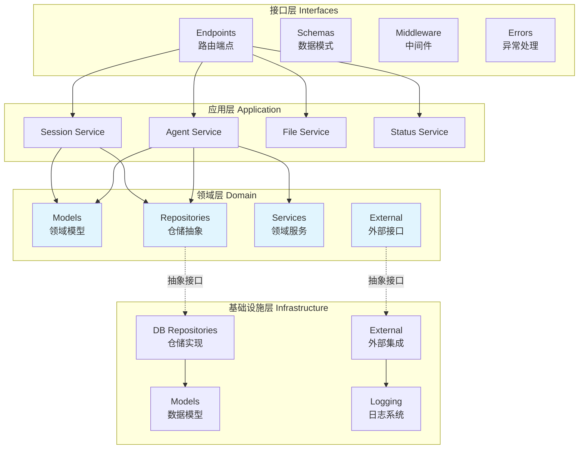
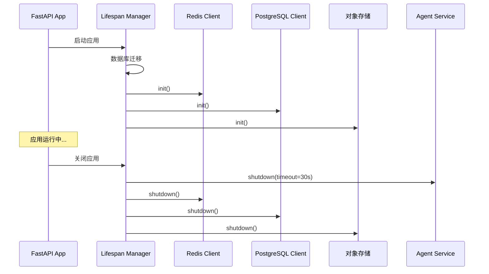
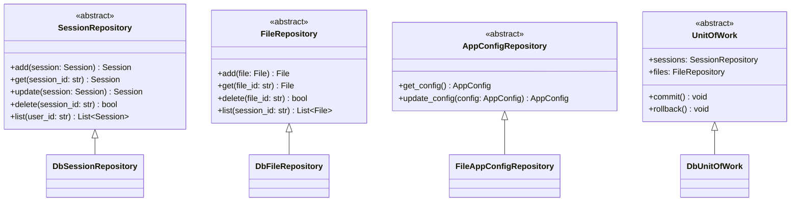
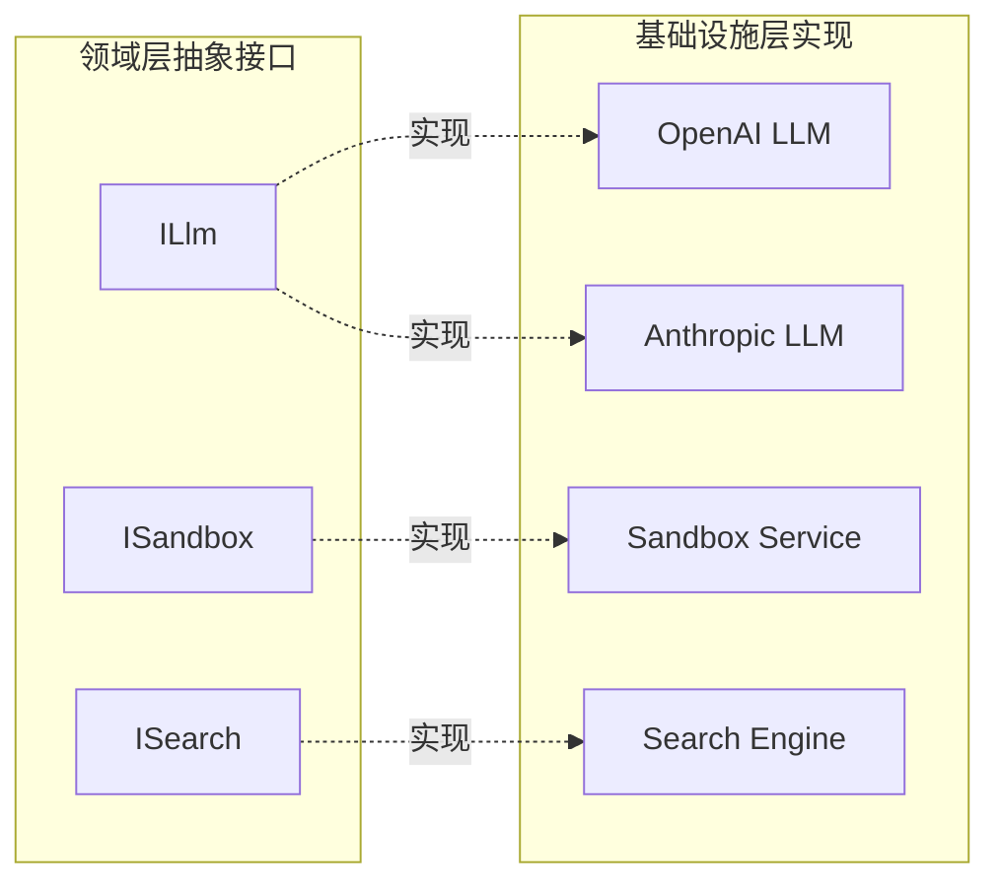

MultiGen 后端采用经典的分层架构（Layered Architecture）设计模式，实现了关注点分离和依赖倒置原则。整个系统从上到下划分为四个核心层次：**接口层、应用层、领域层和基础设施层**，每层职责清晰、边界明确，通过抽象接口实现松耦合的系统架构。

## 架构概览

系统的分层架构遵循依赖倒置原则，**高层模块不依赖低层模块，二者都依赖于抽象**。领域层作为系统的核心，定义业务规则和抽象接口；基础设施层实现这些接口，提供技术支撑；应用层编排业务流程；接口层暴露系统功能。这种设计使得业务逻辑与技术实现解耦，便于独立演化、测试和维护。

Sources: [main.py](api/app/main.py#L1-L104)

## 接口层

接口层（Interfaces Layer）是系统的最外层防线，负责处理外部 HTTP 请求、响应格式化和异常处理。该层采用 **FastAPI 框架构建 RESTful API**，通过路由端点暴露系统功能，同时处理认证、授权、CORS 等横切关注点。

### 核心组件构成

接口层组织为四个核心模块：**Endpoints 模块** 定义 API 路由和请求处理逻辑，包括会话路由、文件路由、配置路由和状态路由；**Schemas 模块** 定义请求/响应的数据结构，使用 Pydantic 进行数据验证和序列化；**Middleware 模块** 实现认证中间件等横切关注点；**Errors 模块** 统一异常处理机制，将领域异常转换为 HTTP 响应。

各组件通过依赖注入机制获取应用层服务实例，**严格控制不直接访问领域层和基础设施层**，遵循单向依赖原则。接口层仅负责 HTTP 协议相关的逻辑，所有业务逻辑委托给应用层处理。

| 模块 | 职责范围 | 典型文件 |
|------|---------|---------|
| Endpoints | API 路由定义、请求处理、响应封装 | `session_routes.py`, `file_routes.py`, `app_config_routes.py`, `status_routes.py` |
| Schemas | 数据验证、序列化、API 文档定义 | `event.py`, `session.py`, `app_config.py` |
| Middleware | 认证授权、请求预处理 | `admin_auth.py` |
| Errors | 异常转换、错误响应统一 | `exception_handlers.py` |

Sources: [interfaces/](api/app/interfaces/) 目录结构

### 应用入口与生命周期管理

系统的应用入口通过 **Lifespan 上下文管理器** 管理整个应用的生命周期，在启动阶段初始化 Redis、PostgreSQL、对象存储等基础设施客户端，并运行数据库迁移；在关闭阶段优雅地停止 Agent 服务，释放所有资源。这种设计确保系统启动时所有依赖就绪，关闭时资源正确释放。

Sources: [main.py](api/app/main.py#L33-L80)

## 应用层

应用层作为系统的协调中心，**编排领域对象完成业务用例**。该层定义了一系列应用服务，每个服务对应一个业务能力边界，负责协调多个领域对象和基础设施服务完成完整的业务流程。

### 应用服务划分

应用层按照业务能力划分服务边界：**AgentService** 管理 Agent 生命周期、任务调度和智能体协作；**SessionService** 处理会话创建、状态管理和历史记录；**FileService** 负责文件上传、存储和版本管理；**StatusService** 提供系统健康检查和状态监控；**AppConfigService** 管理应用配置和系统设置。

应用服务通过依赖注入获取仓储接口和外部服务接口，**在服务方法内部协调多个领域对象完成业务流程**，但不包含业务规则本身。业务规则由领域层的领域服务和领域模型负责，应用层仅负责流程编排和事务管理。

| 服务名称 | 核心职责 | 依赖的仓储 | 依赖的外部服务 |
|---------|---------|-----------|---------------|
| AgentService | Agent 生命周期管理、任务执行 | SessionRepository | LLM, Sandbox, Search, Browser |
| SessionService | 会话创建、查询、状态转换 | SessionRepository | MessageQueue |
| FileService | 文件存储、检索、删除 | FileRepository | FileStorage |
| StatusService | 系统健康状态监测 | - | HealthChecker |
| AppConfigService | 应用配置管理 | AppConfigRepository | - |

Sources: [application/services/](api/app/application/services/) 目录结构

### 服务依赖注入机制

应用层服务通过 **依赖注入容器** 管理实例生命周期和依赖关系，接口层的路由端点通过 FastAPI 的 Depends 机制获取服务实例。这种设计使得服务实例可以被复用，同时便于在测试环境注入 Mock 实例，实现测试替身策略。

Sources: [service_dependencies.py](api/app/interfaces/service_dependencies.py)

## 领域层

领域层是系统的核心，**包含所有业务规则、领域模型和业务抽象接口**。该层完全独立于技术实现，定义业务核心概念如会话、消息、计划、文件等，并通过抽象接口定义与外部系统的交互契约。

### 领域模型设计

领域层定义了丰富的领域模型：**Session 模型** 表示用户与 Agent 的交互会话；**Message 模型** 表示会话中的消息，支持用户、助手、工具等多种角色；**Plan 模型** 表示任务计划和步骤；**Memory 模型** 表示 Agent 的记忆和上下文；**File 模型** 表示上传的文件资源；**Event 模型** 表示系统事件和状态变化。

每个领域模型都是 **富含行为的领域对象**，不仅仅是数据容器。模型内部封装业务逻辑和验证规则，通过方法暴露业务操作，保证业务不变性和一致性约束。

Sources: [domain/models/](api/app/domain/models/) 目录结构

### 仓储抽象接口

领域层定义了 **仓储抽象接口**，声明数据持久化的操作契约，但不提供实现。这些接口使用抽象类定义，声明如 `add`, `get`, `update`, `delete`, `list` 等方法，具体的实现由基础设施层提供。仓储接口使得领域层不依赖具体的数据库技术，便于更换持久化方案。

Sources: [domain/repositories/](api/app/domain/repositories/) 目录结构

### 外部服务抽象接口

领域层通过 **外部服务接口** 定义与外部系统的交互契约，包括 LLM 服务、沙箱服务、搜索引擎、消息队列、文件存储等。这些接口抽象了外部系统的能力，使领域层可以独立于具体的技术供应商，便于集成不同的服务实现。

| 接口名称 | 抽象能力 | 典型方法 |
|---------|---------|---------|
| LLM | 大语言模型调用 | `chat()`, `stream_chat()` |
| Sandbox | 沙箱环境执行 | `execute_code()`, `run_tool()` |
| Search | 网络搜索 | `search()` |
| MessageQueue | 消息队列 | `publish()`, `subscribe()` |
| FileStorage | 文件存储 | `upload()`, `download()`, `delete()` |

Sources: [domain/external/](api/app/domain/external/) 目录结构

### 领域服务

领域层包含复杂的领域服务，**封装跨多个领域对象的业务规则**。AgentTaskRunner 负责编排 Agent 任务执行流程；Agents 目录包含不同类型的 Agent 实现；Flows 目录定义任务执行流程；Tools 目录定义可用的工具集；Prompts 目录管理提示词模板。

领域服务是无状态的，接收领域对象作为参数，执行业务计算后返回结果或更新领域对象状态。**通过领域服务实现业务规则的集中管理和复用**。

Sources: [domain/services/](api/app/domain/services/) 目录结构

## 基础设施层

基础设施层是系统的技术实现层，**提供所有技术支撑和外部系统集成**。该层实现领域层定义的抽象接口，将业务逻辑与技术细节分离，支持数据库持久化、外部 API 调用、日志记录等横切关注点。

### 仓储实现

基础设施层提供仓储接口的具体实现，**每个仓储实现对应特定的持久化技术**。DbSessionRepository 基于 PostgreSQL 实现会话持久化；DbFileRepository 基于数据库实现文件元数据管理；FileAppConfigRepository 基于文件系统实现配置存储；DbUnitOfWork 实现工作单元模式，管理事务边界。

仓储实现使用 SQLAlchemy ORM 框架，定义数据库模型映射，实现领域模型与数据模型之间的转换。**领域模型专注于业务语义，数据模型专注于存储优化**，二者通过转换层解耦。

| 实现类 | 基础技术 | 负责数据 |
|-------|---------|---------|
| DbSessionRepository | PostgreSQL + SQLAlchemy | 会话、消息 |
| DbFileRepository | PostgreSQL + SQLAlchemy | 文件元数据 |
| FileAppConfigRepository | 文件系统 | 应用配置 |
| DbUnitOfWork | 数据库事务 | 事务管理 |

Sources: [infrastructure/repositories/](api/app/infrastructure/repositories/) 目录结构

### 外部服务集成实现

基础设施层实现所有外部服务接口，**将不同的技术供应商适配到统一的接口契约**。LLM 模块集成 OpenAI、Anthropic 等大模型 API；Sandbox 模块实现沙箱环境管理；Search 模块集成搜索引擎 API；Browser 模块实现浏览器自动化；MessageQueue 模块基于 Redis 实现消息队列。

每个集成模块封装了复杂的 API 调用细节、错误处理和重试机制，**为领域层提供简洁、可靠的接口实现**。通过适配器模式，不同的供应商实现可以相互替换，系统不受特定供应商锁定。

Sources: [infrastructure/external/](api/app/infrastructure/external/) 目录结构

### 数据模型与 ORM 映射

基础设施层定义数据库模型，**使用 SQLAlchemy ORM 框架实现对象关系映射**。Base 模型提供公共字段（如 id, created_at, updated_at）；SessionModel 和 FileModel 分别映射会话表和文件表。这些数据模型关注存储优化、索引设计、查询效率等技术问题。

数据模型与领域模型是分离的：**领域模型表达业务概念，数据模型表达存储结构**。仓储实现负责在两种模型之间转换，保证领域层不受存储细节影响。

Sources: [infrastructure/models/](api/app/infrastructure/models/) 目录结构

## 层间依赖与通信机制

### 依赖倒置实现

系统严格遵循 **依赖倒置原则**，所有跨层依赖都指向抽象接口。接口层依赖应用服务接口；应用层依赖仓储接口和外部服务接口；领域层定义抽象接口但不依赖具体实现；基础设施层实现接口并依赖领域层的抽象定义。

这种依赖结构使得 **高层模块不受低层模块变化的影响**。数据库技术可以更换、外部服务商可以替换、基础设施可以重构，只要遵守接口契约，领域层和应用层的代码无需修改。

Sources: 架构设计原则分析

### 依赖注入与服务定位

系统使用 **依赖注入模式** 管理组件实例和依赖关系。FastAPI 的 Depends 机制将服务实例注入到路由处理函数；应用服务通过构造函数接收仓储和外部服务实例；服务依赖配置集中在 service_dependencies 模块。

依赖注入提供了几个关键优势：**组件解耦，便于单元测试（可注入 Mock 对象），生命周期集中管理**。测试时可以为应用层注入内存仓储或 Mock 服务，实现快速、可靠的单元测试。

Sources: [service_dependencies.py](api/app/interfaces/service_dependencies.py)

### 数据流向与返回路径

请求处理遵循清晰的 **自顶向下的调用链**：接口层接收 HTTP 请求 → 调用应用服务编排业务流程 → 应用服务协调领域对象执行业务规则 → 领域对象通过仓储接口访问数据 → 基础设施层实现数据持久化。响应数据则沿相反路径返回，每层负责必要的数据转换。

这种单向数据流保证了 **每个层次都可以独立演化**。领域模型的变更不影响数据库模式；API 契约的变更不传播到领域层；基础设施的重构不影响业务逻辑。系统通过清晰的层次边界实现了高内聚、低耦合的架构目标。

Sources: 架构数据流分析

## 架构优势与设计权衡

### 核心优势

分层架构设计带来了显著的架构优势：**关注点分离使得每层可以独立开发、测试和维护**；依赖倒置保证了业务逻辑不受技术实现影响；清晰的抽象边界促进了代码复用和团队协作；标准化的层次结构降低了新人理解成本。

系统的 **可测试性得到显著提升**：应用层可以通过 Mock 仓储进行单元测试；领域层完全独立，无需任何基础设施即可测试；接口层通过 TestClient 进行集成测试。测试金字塔得以建立，快速反馈的开发实践得到技术支撑。

**维护性和扩展性同步增强**：新功能通过添加新的领域服务和应用服务实现，不影响现有代码；新的外部服务通过实现适配器接口集成，不侵入领域层；数据库优化、性能调优在基础设施层进行，业务代码零改动。

Sources: 架构优势分析

### 设计权衡

分层架构也带来了一定的 **开发成本和学习曲线**：需要定义较多的抽象接口和转换层；跨层调用增加了代码量；开发者需要理解分层的设计意图才能正确放置代码。对于小型项目，这种架构可能显得过度设计。

**性能考虑**在分层系统中也需要关注：每层的数据转换可能带来性能开销；抽象层增加了调用深度。系统通过合理设计领域模型与数据模型的映射、使用缓存机制、批量操作优化等策略缓解这些开销。

团队需要权衡 **架构复杂度与项目规模** 的匹配性。MultiGen 作为复杂的企业级系统，选择分层架构是合理的；但对于简单项目，可以适当简化层次，保持架构与需求的适配。

Sources: 架构权衡分析

## 延伸阅读

分层架构为整个系统奠定了坚实的架构基础。要深入理解系统的设计思想和实现细节，建议继续阅读以下页面：

- **[领域模型定义](11-ling-yu-mo-xing-ding-yi)**：深入了解 Session、Message、Plan 等领域模型的设计细节和业务语义
- **[仓储模式实现](12-cang-chu-mo-shi-shi-xian)**：掌握仓储接口定义、实现技巧和工作单元模式的应用
- **[Agent 服务实现](13-agent-fu-wu-shi-xian)**：探索应用层如何编排 Agent 任务、管理智能体协作
- **[会话服务](14-hui-hua-fu-wu)**：理解会话生命周期管理、状态转换和历史记录机制