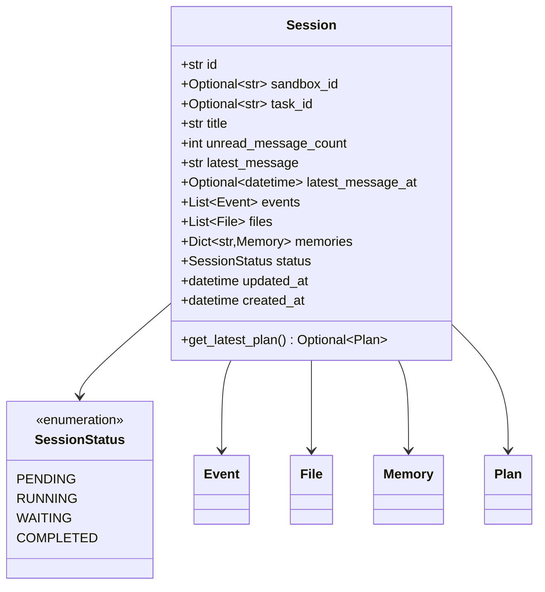
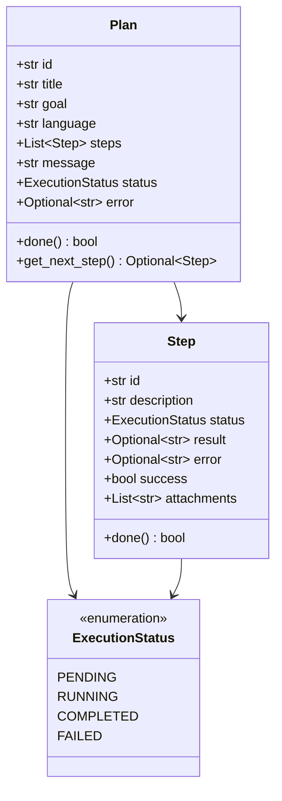
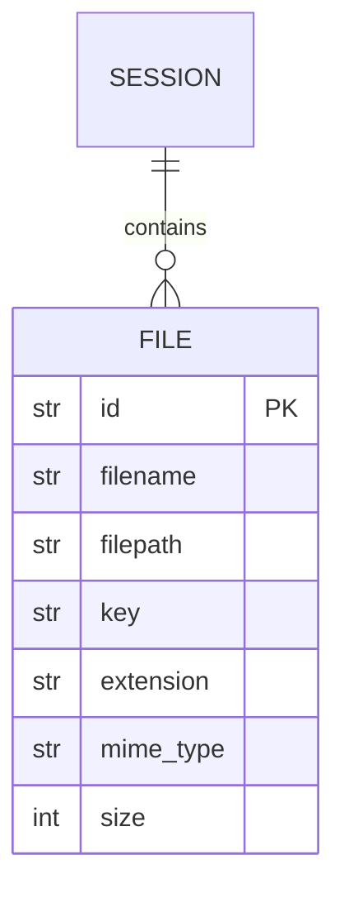
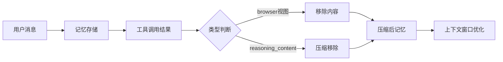
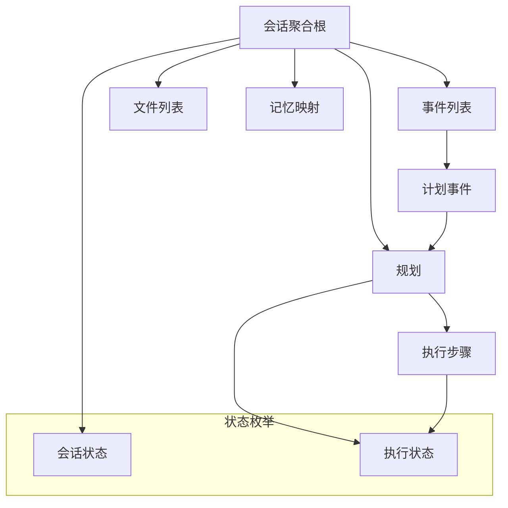

本文档深入阐述 MultiGen 后端系统中采用 DDD 方法设计的领域模型边界与行为。领域模型承载业务核心概念，对外隔离基础设施与接口层变更，为 Agent、会话、文件与记忆等实体建立稳定的一致性边界。

## 会话模型

会话是系统中最核心的聚合根，承担一次用户请求的全生命周期管理与状态编排。会话持有事件列表、文件列表与记忆映射关系，形成业务对象的唯一一致性边界。

会话状态严格限定为四种：等待任务、运行中、等待人类响应与已完成，通过状态字段表达会话的执行阶段。`get_latest_plan` 方法从事件列表中倒序查找并返回最新的计划对象，确保后续执行能够获得当前规划上下文。每个会话与沙箱环境、任务标识关联，便于追踪隔离环境与外部系统映射。

Sources: [session.py](api/app/domain/models/session.py#L1-L47)

## 规划模型

规划模型用于将用户目标拆解为可执行的子任务序列，每个子任务具备独立的执行状态与结果记录，为 Agent 提供结构化的行动路线。

规划通过 `get_next_step` 方法不断获取未完成的子任务，驱动整个执行流程向前推进。状态属性与只读属性 `done` 的设计确保外部只能通过领域行为改变状态，避免直接修改导致的一致性问题。

Sources: [plan.py](api/app/domain/models/plan.py#L1-L51)

## 消息模型

消息模型用于封装用户输入的文本与附件信息，作为系统入口处数据传输的载体，其结构简洁而语义明确。

Sources: [message.py](api/app/domain/models/message.py#L1-L10)

## 文件模型

文件模型记录系统中上传或生成的文件元信息，与会话形成聚合关系，支持文件存储与检索的场景需求。

文件通过 `key` 字段映射至对象存储路径，`size` 字段以字节为单位记录文件大小，为存储管理与配额控制提供依据。

Sources: [file.py](api/app/domain/models/file.py#L1-L15)

## 记忆模型

记忆模型作为 Agent 执行上下文的存储容器，管理对话历史与工具调用结果，提供消息增删、回滚与压缩等行为以控制上下文窗口长度。

记忆压缩机制针对浏览器视图类工具结果与推理过程内容进行选择性移除，确保在保留关键决策信息的前提下减少传递给模型的令牌数量。

Sources: [memory.py](api/app/domain/models/memory.py#L1-L63)

## 模型关系图谱

以下图谱展示核心领域模型之间的关系与依赖结构：

以下表格对比各模型的核心属性与方法定位：

| 模型 | 核心职责 | 关键字段 | 主要方法 |
|------|---------|---------|---------|
| Session | 会话聚合与生命周期管理 | status, events, files, memories | get_latest_plan |
| Plan | 任务分解与步骤编排 | steps, goal, language | get_next_step, done |
| Step | 子任务执行状态追踪 | status, result, error | done |
| File | 文件资源元信息记录 | filename, filepath, key | - |
| Memory | 对话历史与工具结果缓存 | messages | add_message, compact, roll_back |

会话作为聚合根持有规划、事件、文件与记忆的集合，各模型之间通过组合关系而非继承关系建立连接，这种设计确保边界清晰且利于后续扩展新的领域对象。

Sources: [session.py](api/app/domain/models/session.py#L1-L47), [plan.py](api/app/domain/models/plan.py#L1-L51), [file.py](api/app/domain/models/file.py#L1-L15), [memory.py](api/app/domain/models/memory.py#L1-L63)

## 设计原则与边界划分

领域模型遵循以下 DDD 核心原则：**聚合根唯一性**：会话作为聚合根控制所有内部对象的生命周期，外部访问必须通过会话根节点；**状态机流转**：会话状态与执行状态均采用枚举定义，避免非法状态值；**行为封装**：模型方法实现业务规则，属性只读面向外部查询；**一致性边界**：聚合内所有修改通过领域事件触发，保证事件溯源的完整性。

后续章节将深入探讨领域模型的持久化实现方式，详见 [仓储模式实现](12-cang-chu-mo-shi-shi-xian)。