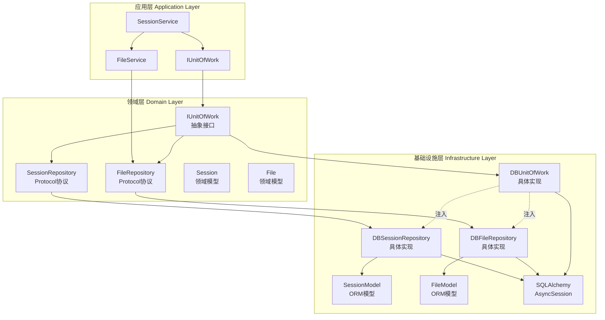

仓储模式（Repository Pattern）是本系统数据持久化的核心设计模式，通过在领域层与基础设施层之间引入抽象层，实现了业务逻辑与数据访问的彻底解耦。该实现采用 Protocol 协议定义仓储接口，配合工作单元（Unit of Work）模式管理事务边界，确保了数据一致性和可测试性。

## 设计原理与架构分层

系统采用严格的分层架构设计，仓储模式在其中扮演着承上启下的关键角色。领域层定义仓储协议接口，仅关注业务语义和数据契约；基础设施层提供具体实现，封装数据库访问细节；应用层通过依赖注入使用仓储，无需感知底层技术选型。这种分层设计使得系统能够轻松切换数据源（如从 PostgreSQL 切换到 MongoDB），同时为单元测试提供了 Mock 注入点。



上图展示了仓储模式在三层架构中的定位与交互关系：应用层服务通过接口编程依赖领域层抽象，基础设施层实现类在运行时注入，形成依赖倒置的稳定结构。

Sources: [application services directory](api/app/application/services#L1-L10), [domain repositories](api/app/domain/repositories#L1-L5), [infrastructure repositories](api/app/infrastructure/repositories#L1-L5)

## 核心组件实现

### 领域层仓储接口定义

领域层使用 Protocol 协议定义仓储接口，这是 Python 3.8+ 引入的结构化子 typing 机制，支持静态类型检查且不要求显式继承。SessionRepository 接口定义了会话实体的完整生命周期操作，包括 CRUD 基础方法、状态更新方法、关联对象管理方法等，每个方法都有清晰的语义和类型签名。

```python
class SessionRepository(Protocol):
    """会话仓库协议定义"""
    
    async def save(self, session: Session) -> None:
        """存储或更新传递进来的会话"""
        ...
    
    async def get_by_id(self, session_id: str) -> Optional[Session]:
        """根据传递的会话id查询会话"""
        ...
    
    async def add_event(self, session_id: str, event: BaseEvent) -> None:
        """往会话中新增事件"""
        ...
```

接口设计遵循单一职责原则，每个方法聚焦单一业务能力，参数类型使用领域模型而非数据库实体，确保领域层不依赖基础设施细节。Protocol 的使用使得类型检查器在编译期验证实现类是否符合契约，避免运行时错误。

Sources: [session_repository.py](api/app/domain/repositories/session_repository.py#L1-L76)

### 工作单元模式接口

工作单元模式通过抽象接口 IUnitOfWork 定义，该接口继承了 ABC（抽象基类）并声明了 commit、rollback 以及异步上下文管理器方法。UoW 模式的核心职责是管理事务边界：在业务操作开始时创建数据库会话，操作成功时提交事务，出现异常时回滚事务，确保多个仓储操作在同一个事务上下文中执行，维护数据一致性。

```python
class IUnitOfWork(ABC):
    """Uow模式协议接口"""
    file: FileRepository
    session: SessionRepository

    @abstractmethod
    async def commit(self):
        """提交数据库数据持久化"""
        ...

    @abstractmethod
    async def rollback(self):
        """数据库回滚"""
        ...

    @abstractmethod
    async def __aenter__(self: T) -> T:
        """进入上下文管理器"""
        ...
```

UoW 接口通过属性暴露仓储实例，应用层代码通过 `uow.session`、`uow.file` 访问仓储，避免了直接创建仓储实例的耦合。异步上下文管理器设计使得事务边界清晰可见，符合 Python 资源管理的最佳实践。

Sources: [uow.py](api/app/domain/repositories/uow.py#L1-L34)

### 基础设施层仓储实现

基础设施层的 DBSessionRepository 是 SessionRepository 协议的具体实现，封装了 SQLAlchemy 异步数据库操作。该实现通过构造函数注入 AsyncSession 实例，所有方法都使用该会话执行数据库操作，确保事务在 UoW 管理的上下文中执行。save 方法通过查询判断实体是否存在，实现新增或更新的智能分发；add_event、add_file 等方法利用 PostgreSQL 的 JSONB 数组操作实现原子性更新，避免并发问题。

```python
class DBSessionRepository(SessionRepository):
    """基于Postgres数据库的会话仓库"""

    def __init__(self, db_session: AsyncSession) -> None:
        """构造函数，完成数据仓库的初始化"""
        self.db_session = db_session

    async def save(self, session: Session) -> None:
        """根据传递的领域模型更新或者新增会话"""
        stmt = select(SessionModel).where(SessionModel.id == session.id)
        result = await self.db_session.execute(stmt)
        record = result.scalar_one_or_none()

        if not record:
            record = SessionModel.from_domain(session)
            self.db_session.add(record)
            return

        record.update_from_domain(session)
```

实现层引入了领域模型到持久化模型的映射机制：SessionModel.from_domain 将领域对象转换为 ORM 实体，record.update_from_domain 执行字段级同步，record.to_domain 将数据库记录还原为领域对象。这种双向映射确保了领域层与基础设施层的彻底隔离，修改数据库表结构不影响领域模型定义。

Sources: [db_session_repository.py](api/app/infrastructure/repositories/db_session_repository.py#L1-L200)

### 数据库工作单元实现

DBUnitOfWork 是 IUnitOfWork 接口的 PostgreSQL 实现，其核心职责是管理 AsyncSession 的生命周期和事务状态。在 `__aenter__` 方法中，UoW 从会话工厂创建新的 AsyncSession，并初始化所有仓储实例，每个仓储共享同一个数据库会话；在 `__aexit__` 方法中，根据执行结果决定提交或回滚，最后关闭会话释放数据库连接。

```python
class DBUnitOfWork(IUnitOfWork):
    """基于Postgres数据库的UoW实例"""

    async def __aenter__(self) -> "DBUnitOfWork":
        """进入UoW操作上下文管理器的逻辑"""
        # 1.为每个上下文开启一个新的会话
        self.db_session = self.session_factory()

        # 2.初始化所有数据库仓库
        self.file = DBFileRepository(db_session=self.db_session)
        self.session = DBSessionRepository(db_session=self.db_session)

        return self

    async def __aexit__(self, exc_type, exc_val, exc_tb):
        """退出上下文时执行的逻辑"""
        try:
            if exc_type:
                await self.rollback()
            else:
                await self.commit()
        except asyncio.CancelledError:
            logger.warning("UoW提交/回滚操作被取消(可能是客户端断开连接)")
        finally:
            await self.db_session.close()
```

特别值得注意的是 `__aexit__` 方法对 CancelledError 异常的处理：本系统使用 SSE（Server-Sent Events）推送实时消息流，当客户端断开连接时，sse-starlette 库会取消所有进行中的 async 操作，包括数据库提交操作。如果不捕获该异常，会导致数据库连接池中的连接处于异常状态，影响后续请求。实现中通过 try-except-finally 结构确保在任何情况下都执行会话关闭操作，维护连接池健康状态。

Sources: [db_uow.py](api/app/infrastructure/repositories/db_uow.py#L1-L66)

## 使用模式与最佳实践

### 在应用服务中使用 UoW

应用层服务通过依赖注入获得 UoW 工厂实例，使用异步上下文管理器模式定义事务边界。在上下文块内的所有仓储操作共享同一个数据库事务，块结束时自动提交，异常时自动回滚。这种模式确保了业务操作的原子性，同时使事务边界在代码中显式可见，提升代码可维护性。

```python
# 典型使用模式
async with self.uow_factory() as uow:
    session = await uow.session.get_by_id(session_id)
    session.update_title(new_title)
    await uow.session.save(session)
    # 退出上下文时自动commit
```

### 仓储接口与实现的分离优势

| 维度 | 接口定义层 | 实现层 | 优势说明 |
|------|-----------|--------|---------|
| **职责范围** | 定义数据契约和业务语义 | 封装数据库访问细节 | 关注点分离，降低认知负担 |
| **依赖方向** | 不依赖任何基础设施 | 依赖领域层和数据库驱动 | 依赖倒置，提升稳定性 |
| **可测试性** | 易于 Mock 和 Stub | 按需集成测试 | 支持快速单元测试 |
| **可替换性** | 契约稳定不变 | 可切换数据源 | 降低技术锁定风险 |
| **团队协作** | 领域专家主导定义 | 技术专家优化实现 | 并行开发，减少冲突 |

上表对比了接口定义层与实现层在设计职责和技术特性上的差异，这种分离架构为系统演进提供了充足的灵活性空间。当需要从 PostgreSQL 迁移到 MongoDB 时，仅需新增一个 MongoUnitOfWork 实现类，应用层代码无需任何修改；当需要为单元测试构造内存数据库时，可以实现 InMemoryUoW 提供快速反馈。

Sources: [application services](api/app/application/services#L1-L10), [infrastructure models](api/app/infrastructure/models#L1-L5)

## 高级特性与并发控制

### PostgreSQL JSONB 数组的原子操作

会话实体关联的事件列表和文件列表使用 PostgreSQL 的 JSONB 类型存储，以数组形式嵌入会话记录。增删操作利用 SQLAlchemy 的函数表达式实现原子性更新，避免先读取后修改再保存的并发冲突风险。add_event 方法使用 `func.coalesce(events, []) + [new_event]` 表达式，在数据库服务端完成数组追加操作，无需在应用层加锁。

```python
async def add_event(self, session_id: str, event: BaseEvent) -> None:
    """往会话中新增事件"""
    event_data = event.model_dump(mode="json")
    
    stmt = (
        update(SessionModel)
        .where(SessionModel.id == session_id)
        .values(
            events=func.coalesce(SessionModel.events, cast([], JSONB)) 
                  + cast([event_data], JSONB),
        )
    )
    result = await self.db_session.execute(stmt)
```

这种设计利用了 PostgreSQL 的 JSONB 类型支持和 SQLAlchemy 的函数表达式编译能力，将并发控制下沉到数据库层，应用层代码无需关心锁机制。JSONB 类型同时提供了良好的查询性能，支持对事件内容进行条件过滤，适合事件溯源和审计日志场景。

Sources: [db_session_repository.py](api/app/infrastructure/repositories/db_session_repository.py#L101-L121)

### 乐观锁与并发安全

remove_file 方法展示了悲观锁的使用场景：当需要在应用层执行复杂逻辑（如过滤数组元素）时，使用 `with_for_update()` 对记录加排他锁，防止并发事务同时修改导致数据丢失。该锁在事务提交或回滚时自动释放，确保数据一致性。这种模式适用于低冲突率的操作，对于高并发场景建议改用乐观锁或事件溯源模式。

```python
async def remove_file(self, session_id: str, file_id: str) -> None:
    """移除会话中的指定文件"""
    # 查询会话记录并加锁
    stmt = select(SessionModel).where(SessionModel.id == session_id).with_for_update()
    result = await self.db_session.execute(stmt)
    record = result.scalar_one_or_none()
    
    # 在内存中过滤files
    new_files = [file for file in record.files if file.get("id") != file_id]
    record.files = new_files
```

系统在高并发场景下通过合理的锁策略和事务隔离级别保证数据安全，UoW 的短生命周期设计（每次业务操作创建新的 UoW 实例）减少了锁持有时间，提升了并发吞吐量。

Sources: [db_session_repository.py](api/app/infrastructure/repositories/db_session_repository.py#L151-L179)

## 与其他架构组件的关联

仓储模式是分层架构的关键组成部分，与领域模型、应用服务、基础设施组件协同工作。领域模型定义业务实体和值对象，仓储负责持久化和检索；应用服务协调多个仓储完成业务用例，UoW 管理事务边界；基础设施层提供具体实现，包括数据库访问、缓存集成、外部 API 调用等。该架构模式参考 Martin Fowler 的《企业应用架构模式》，结合 Python 异步特性和现代 ORM 技术进行了适配。

建议读者继续阅读 [领域模型定义](11-ling-yu-mo-xing-ding-yi) 了解 Session、File 等领域对象的详细设计，阅读 [分层架构设计](10-fen-ceng-jia-gou-she-ji) 理解应用层、领域层、基础设施层的整体协作机制，阅读 [会话服务](14-hui-hua-fu-wu) 学习应用层如何使用仓储模式实现复杂业务逻辑。