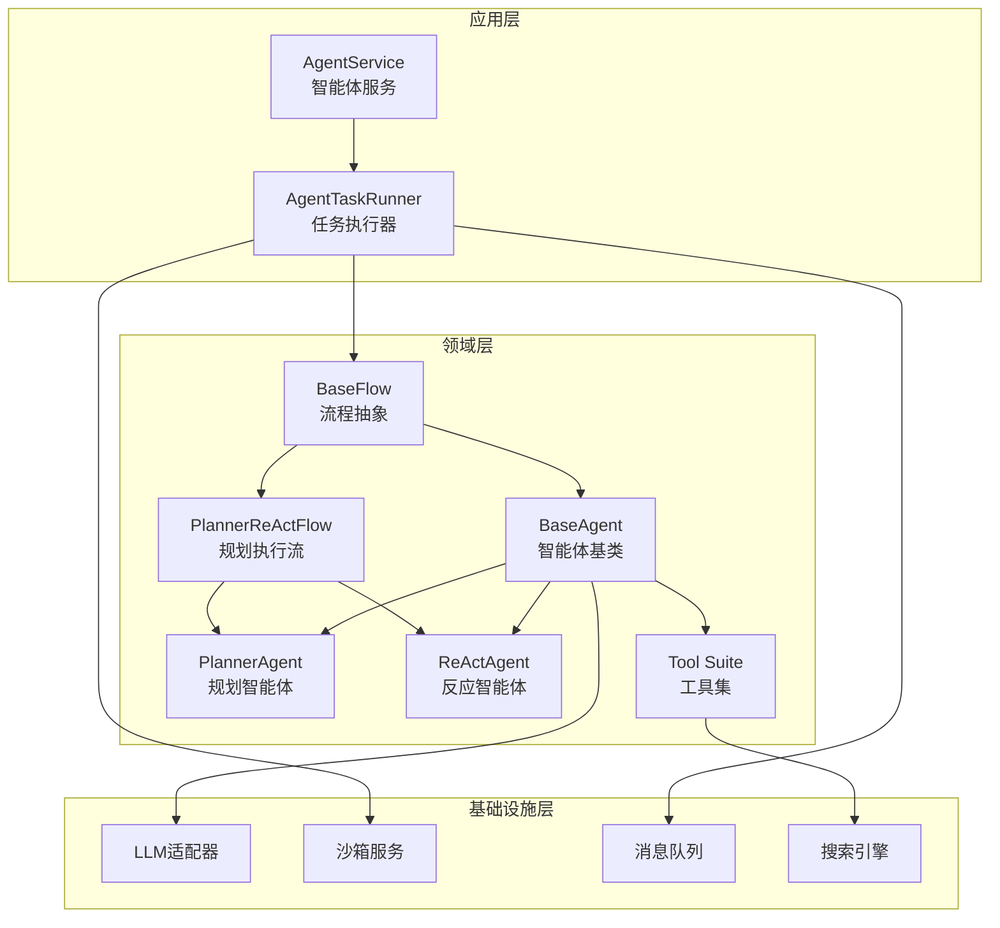

Agent 服务是 MultiGen 系统的核心引擎，负责协调智能体与用户之间的交互流程。该服务采用分层架构设计，在应用层提供统一的对话入口，在领域层实现智能体逻辑、流程编排与工具调度，通过依赖注入将基础设施层的外部服务（LLM、沙箱、搜索引擎等）整合到智能体运行时环境中。整体架构以 **任务驱动** 为核心特征，每个会话对应一个独立的 Task 实例，Task 内部运行 Agent Flow，通过事件流实现前后端实时通信。

## 架构设计概览

Agent 服务采用典型的三层协作模式：**应用服务层**负责会话生命周期管理和任务调度，**领域服务层**实现智能体推理逻辑与流程编排，**基础设施层**提供 LLM 调用、沙箱管理、消息队列等能力。核心组件包括 AgentService（应用层入口）、BaseAgent（智能体基类）、BaseFlow（流程抽象）和 AgentTaskRunner（任务执行器），它们通过依赖注入和事件流机制协同工作，实现用户请求到智能体响应的完整链路。

上图中，AgentService 作为应用层入口接收用户请求，创建或恢复 Task 实例并启动 AgentTaskRunner。AgentTaskRunner 维护会话上下文，调用 Flow 进行流程编排。Flow 协调多个 Agent（Planner 负责任务规划，ReAct 负责工具调用），每个 Agent 通过 Tool Suite 执行具体操作。基础设施层提供跨层能力支持，LLM 适配器为智能体提供推理能力，沙箱服务隔离执行环境，消息队列实现事件流通信。

Sources: [agent_service.py](api/app/application/services/agent_service.py#L1-L45), [base.py](api/app/domain/services/agents/base.py#L1-L50), [base.py](api/app/domain/services/flows/base.py#L1-L32)

## 核心组件详解

### AgentService：应用层服务入口

AgentService 是应用层的核心服务类，负责管理会话生命周期、任务创建与恢复、事件流转发等职责。该服务通过构造函数注入一系列依赖：工作单元工厂（uow_factory）、LLM 实例、智能体配置（agent_config）、MCP/A2A 配置、沙箱类、任务类、JSON 解析器、搜索引擎和文件存储。这种依赖注入设计使得服务具备良好的可测试性和可扩展性，同时支持在不同环境下灵活切换基础设施实现。

服务的核心方法 `chat()` 提供了统一的对话入口，采用异步生成器模式返回事件流。方法首先验证会话是否存在，然后根据会话状态判断是否需要创建新任务或恢复现有任务。对于需要创建任务的场景，服务会自动获取或创建沙箱实例，初始化浏览器、工具集和任务执行器，最后将用户消息注入任务的输入流并启动执行。整个流程通过 `latest_event_id` 实现增量事件推送，避免重复传输历史数据。

Sources: [agent_service.py](api/app/application/services/agent_service.py#L47-L194)

### 任务管理机制

AgentService 内部通过 `_create_task()` 和 `_get_task()` 两个私有方法实现任务生命周期管理。`_create_task()` 方法的执行流程包括：首先检查会话是否已有沙箱实例，如果没有则创建新沙箱；然后从沙箱中获取浏览器实例用于工具调用；接着构造 AgentTaskRunner 实例，注入所有必要的依赖项；最后创建 Task 对象并更新会话的 task_id 字段。这种设计确保每个会话都有独立的执行环境，同时支持会话恢复和沙箱复用。

任务创建过程中的关键创新点是 **沙箱懒加载机制**：只有在用户首次发送消息时才创建沙箱实例，而非在会话创建时预先分配资源。这显著降低了空闲会话的资源开销，特别适合多租户场景下的大规模并发控制。同时，通过将 sandbox_id 持久化到会话记录中，系统能够在任务中断后恢复执行上下文，实现断点续传能力。

Sources: [agent_service.py](api/app/application/services/agent_service.py#L68-L104)

### BaseAgent：领域层智能体基类

BaseAgent 是所有智能体的抽象基类，定义了智能体的通用行为模式：系统提示词管理、记忆维护、LLM 调用、工具解析和重试逻辑。基类通过构造函数接收工作单元工厂、会话 ID、智能体配置、LLM 实例、JSON 解析器和工具列表，这些依赖项支撑了智能体的完整推理循环。关键属性包括 `_system_prompt`（系统级指令）、`_format`（响应格式约束）、`_retry_interval`（重试间隔）和 `_tool_choice`（强制工具选择策略）。

智能体的核心能力通过 `_invoke_llm()` 方法实现，该方法封装了与语言模型交互的复杂逻辑：首先将用户消息添加到记忆中，然后构建符合 token 限制的提示词序列，接着发起 LLM 调用并处理可能的异常情况。方法实现了 **自动 token 预算管理**，在调用前检查总 token 数是否超过限制，若超限则自动压缩历史记忆直到符合预算。异常处理层面，方法支持上下文溢出检测和自动压缩重试，避免因单次失败导致整个交互中断。

Sources: [base.py](api/app/domain/services/agents/base.py#L1-L180)

### 工具解析与智能纠正

BaseAgent 实现了鲁棒的工具名称解析机制，通过 `_resolve_tool()` 方法提供三层容错：首先进行工具名精确匹配，若无匹配则进行名称标准化（去除特殊字符、统一小写）后再次查找，最后使用 difflib 计算编辑距离进行模糊匹配。这种设计大幅提升了工具调用的容忍度，即使 LLM 输出的工具名存在轻微拼写错误或格式差异，系统仍能正确路由到目标工具，显著降低了用户感知的错误率。

工具解析的日志策略也值得关注：每次自动纠正都会记录警告级别日志，包含原始工具名和纠正后的工具名，便于开发者在生产环境中追踪 LLM 输出质量。同时，当所有匹配策略均失败时，系统会返回可用工具列表的前 12 个作为提示信息，帮助开发者快速定位问题。这种 **开发者友好的错误提示** 体现了工程化思维在系统设计中的渗透。

Sources: [base.py](api/app/domain/services/agents/base.py#L83-L130)

## Agent 类型与职责分工

系统当前实现了两种智能体类型：**PlannerAgent** 负责任务分解与规划，**ReActAgent** 负责工具调用与执行。这种职责分离遵循了分层规划的 AI 设计原则，使得复杂任务能够被系统化地拆解为可执行的原子操作。PlannerAgent 专注于高层策略制定，生成包含步骤描述的计划列表；ReActAgent 则采用经典的 ReAct 模式（Reasoning-Acting），通过推理-行动循环逐步完成每个步骤。

### PlannerAgent：规划智能体

PlannerAgent 的核心职责是分析用户需求并生成结构化的执行计划。该智能体接收用户原始意图和上下文信息，通过专门的 Prompt 模板引导 LLM 输出包含 step_id、description、reason 等字段的计划项列表。规划过程考虑任务依赖关系、资源可用性和执行顺序，确保生成的计划既满足用户目标又具备可执行性。PlannerAgent 的输出作为 ReActAgent 的输入，实现了规划与执行的解耦。

Sources: [planner.py](api/app/domain/services/agents/planner.py)

### ReActAgent：执行智能体

ReActAgent 采用推理-行动循环模式，每个迭代包括三个阶段：Observation（观察当前状态）、Thought（推理下一步行动）、Action（执行工具调用）。智能体维护当前步骤计数和完成状态，通过 `_should_continue()` 方法判断是否需要继续执行。ReActAgent 的关键特性是 **自适应工具选择**：根据当前任务上下文和可用工具列表，自主决策调用哪个工具及其参数。

ReActAgent 的记忆机制值得一提：智能体不仅存储用户和助手消息，还记录工具调用的输入输出，形成完整的执行轨迹。这些历史记录作为后续推理的上下文，使得智能体能够基于前序结果做出更合理的决策。记忆压缩算法会优先保留工具调用记录，因为在多步任务中，工具结果往往比用户消息更具参考价值。

Sources: [react.py](api/app/domain/services/agents/react.py)

## 流程编排机制

### BaseFlow：流程抽象基类

BaseFlow 定义了流程编排的标准接口，核心属性包括 `FlowStatus` 枚举（表示流的当前状态）和 `done` 只读属性（标识流程是否结束）。抽象方法 `invoke()` 接收 Message 对象，返回异步事件生成器，这种设计允许流程在执行过程中逐步产生中间结果，而非等待全部完成后才返回。状态机模型使得流程能够被暂停、恢复或中断，支持复杂的交互式场景。

FlowStatus 枚举定义了六种流程状态：IDLE（空闲，等待输入）、PLANNING（规划中）、EXECUTING（执行工具）、UPDATING（更新计划）、SUMMARIZING（汇总结果）、COMPLETED（已完成）。状态转换遵循预定义规则，例如只有处于 IDLE 状态的流程才能接受用户输入，只有 COMPLETED 状态的流程才能被重新激活。这种 **状态约束机制** 防止了流程进入非法状态，提升了系统稳定性。

Sources: [base.py](api/app/domain/services/flows/base.py#L1-L32)

### PlannerReActFlow：规划执行流程

PlannerReActFlow 是当前系统的主流程实现，协调 PlannerAgent 和 ReActAgent 的协作。流程的执行逻辑为：首先调用 PlannerAgent 生成初始计划，然后遍历计划中的每个步骤，为每个步骤启动 ReActAgent 执行具体操作。在执行过程中，流程监控 ReActAgent 的输出，若检测到计划需要调整（如工具调用失败、资源不可用），则暂停执行并触发 PlannerAgent 重新规划，实现 **动态计划调整** 能力。

流程的事件生成策略体现了用户友好的设计理念：在规划阶段生成 PlanEvent，展示任务分解结构；在执行阶段生成 ToolEvent，实时反馈工具调用状态；在完成阶段生成 DoneEvent，返回最终结果。这种 **渐进式信息披露** 让用户能够清晰感知系统的工作进展，降低了长时间操作的焦虑感，同时为前端提供了丰富的 UI 渲染素材。

Sources: [planner_react.py](api/app/domain/services/flows/planner_react.py)

## 工具集成架构

### 工具抽象与注册机制

系统通过 BaseTool 抽象类定义工具的标准接口，包括 `get_tools()` 方法（返回工具的 JSON Schema 声明）和 `execute()` 方法（执行工具逻辑）。工具注册采用 **组合模式**：每个 Agent 持有工具列表，工具可以包含多个子工具（如 multimodal_core 提供图片生成、视频合成等多个功能）。这种设计使得工具具备良好的可扩展性，新增工具只需实现 BaseTool 接口并注入到 Agent 的构造函数即可。

工具的 JSON Schema 声明遵循 OpenAI Function Calling 规范，包含 name（工具名）、description（功能描述）和 parameters（参数结构）。系统在调用 LLM 时将工具列表转换为 tools 参数，LLM 根据描述自主选择合适的工具并生成调用参数。工具执行后，结果被包装为 ToolResult 对象，包含 status（状态）、output（输出）和 error（错误信息），随后注入到 Agent 的记忆中作为下一轮推理的依据。

Sources: [base.py](api/app/domain/services/tools/base.py)

### 工具类型概览

系统当前集成了丰富的工具类型，覆盖多模态内容生成的核心场景。分类概览如下表所示：

| 工具类别 | 工具名称 | 功能描述 | 典型应用场景 |
|---------|---------|---------|-------------|
| **多模态生成** | image_generation | 图像生成工具 | 文生图、图生图 |
| | video_concatenation | 视频拼接工具 | 多段视频合成 |
| | audio_mixing | 音频混音工具 | 背景音乐叠加 |
| | virtual_anchor_generation | 虚拟主播生成 | 数字人播报 |
| | volcano_image_generation | 火山引擎图像生成 | 高质量商用图 |
| | volcano_video_generation | 火山引擎视频生成 | 商用视频内容 |
| | model_3d_generation | 3D 模型生成 | 三维资产创建 |
| **交互工具** | browser | 浏览器操作工具 | 网页抓取、截图 |
| | search | 搜索引擎工具 | 信息检索 |
| | shell | Shell 命令工具 | 代码执行 |
| **协作工具** | a2a | Agent 间通信工具 | 多智能体协作 |
| | mcp | MCP 协议工具 | 外部能力集成 |
| | message | 消息工具 | 向用户提问 |
| **文件工具** | file | 文件管理工具 | 上传、下载、预览 |
| **语音工具** | qwen_tts | 通义语音合成 | 文本转语音 |

工具的设计遵循 **职责单一原则**，每个工具专注于特定领域的操作，避免功能重叠。同时，工具之间可以通过 A2A（Agent-to-Agent）机制进行协作，例如图像生成工具的输出可以作为视频拼接工具的输入，形成内容生成流水线。这种 **工具链式组合** 能力是系统实现复杂多模态任务的关键。

Sources: [tools directory](api/app/domain/services/tools)

## 事件流与实时通信

### 事件类型系统

Agent 服务采用事件驱动架构，所有智能体输出被抽象为事件对象，通过消息队列实现前后端实时通信。核心事件类型包括：**MessageEvent**（用户/助手消息）、**ToolEvent**（工具调用状态）、**PlanEvent**（任务计划）、**DoneEvent**（流程完成）、**ErrorEvent**（错误通知）和 **WaitEvent**（等待用户输入）。每种事件类型继承自 BaseEvent，包含 id、timestamp、session_id 等通用字段，同时定义了各自的负载属性。

事件流的设计哲学是 **双向异步通信**：用户消息通过任务输入流注入智能体，智能体输出通过任务输出流推送到前端。AgentService 的 `chat()` 方法返回异步生成器，前端通过 SSE（Server-Sent Events）协议订阅事件流，实现增量更新。这种架构天然支持断线重连：前端只需提供 `latest_event_id` 参数，即可从断点继续接收后续事件，无需重新传输历史数据。

Sources: [event.py](api/app/domain/models/event.py), [agent_service.py](api/app/application/services/agent_service.py#L196-L259)

### 消息队列集成

系统通过 Redis Stream 实现高性能消息队列，Task 类封装了输入流和输出流的双向通道。输入流使用 `put()` 方法将序列化的事件写入队列，输出流使用 `get()` 方法阻塞读取新事件，支持通过 `start_id` 参数指定读取起点。消息队列的持久化特性确保即使服务发生重启，未消费的事件仍可通过 `latest_event_id` 恢复，保障了系统的 **至少一次投递** 语义。

消息队列的消费者侧实现了 **长轮询机制**：`get()` 方法支持 `block_ms` 参数，指定最大阻塞等待时间。如果队列中没有新消息，调用方会阻塞等待直到超时 или 新消息到达。这种设计避免了高频轮询带来的资源浪费，同时保证了事件的及时性。超时机制还防止了无限等待，使得调用方能够定期检查任务状态或执行其他维护操作。

Sources: [redis_stream_task.py](api/app/infrastructure/external/task/redis_stream_task.py)

## 记忆管理与上下文优化

### 记忆存储结构

Agent 的记忆采用分层存储：会话级记忆存储在数据库中，通过 Session 模型的 memory 字段持久化；运行时记忆缓存在智能体实例的 `_memory` 属性中，避免频繁的数据库访问。记忆内容以 Message 列表形式组织，每条消息包含 role（角色）、content（内容）、tool_calls（工具调用）等字段，完整记录了交互历史。`_ensure_memory()` 方法负责懒加载记忆数据，支持按需初始化和内存优化。

记忆的核心挑战是 **上下文长度限制**：LLM 通常有最大 token 限制（如 GPT-4 的 128K），而多轮对话和工具调用会快速累积 token 数。系统通过 `_estimate_total_tokens()` 方法预估当前记忆的 token 数，通过 `_shrink_memory_to_target_prompt_tokens()` 方法执行压缩。压缩策略优先保留最近的对话轮次和工具调用结果，同时支持摘要生成，将历史对话压缩为简短的文本描述。

Sources: [base.py](api/app/domain/services/agents/base.py#L131-L200), [memory.py](api/app/domain/models/memory.py)

### Token 预算管理

系统实现了多层次的 token 预算管理策略。首先是 **预检查机制**：在调用 LLM 前，`_invoke_llm()` 方法会预估总 token 数，若超过 `_max_prompt_tokens` 限制（默认 122K），则先执行记忆压缩直到符合预算。其次是 **异常恢复机制**：如果 LLM 返回上下文长度超限错误，异常处理逻辑会捕获错误信息并调用 `_shrink_memory_for_context_overflow()` 方法执行压缩，然后自动重试。

预算管理的关键创新点是 **双层压缩策略**：轻量级压缩基于滑动窗口，直接丢弃最早的历史消息；重量级压缩调用 LLM 生成历史摘要，保留关键信息的同时大幅降低 token 数。系统根据当前 token 超限量动态选择压缩策略，在压缩效果和计算成本之间取得平衡。压缩操作会被记录到日志中，包含压缩原因、压缩前后的 token 数，便于后续分析和优化。

Sources: [base.py](api/app/domain/services/agents/base.py#L201-L280)

## 错误处理与重试机制

### 分层异常处理

Agent 服务实现了多层次的异常处理策略。在 AgentService 层，`chat()` 方法使用 try-except-finally 结构捕获所有异常，确保会话状态更新和资源清理得以执行。异常被包装为 ErrorEvent 推送给前端，同时记录详细的错误日志。在 BaseAgent 层，`_invoke_llm()` 方法实现了针对特定错误类型的处理：网络超时触发重试，上下文超限触发压缩，认证错误立即抛出。

重试机制通过 `_agent_config.max_retries` 参数控制最大重试次数，默认值为 3 次。每次重试前会睡眠 `_retry_interval` 秒（默认 1.0 秒），避免短时间内密集请求。重试逻辑不仅应用于 LLM 调用，还应用于工具执行：如果工具抛出异常，异常信息会被注入到记忆中，作为下一轮推理的上下文，智能体有机会选择不同的工具或调整参数重试。这种 **失败即反馈** 的设计提升了系统的健壮性。

Sources: [agent_service.py](api/app/application/services/agent_service.py#L196-L259), [base.py](api/app/domain/services/agents/base.py#L130-L180)

### 优雅降级策略

系统在关键路径上实现了优雅降级策略，确保部分失败不影响整体可用性。例如，沙箱创建失败时会尝试重新创建新沙箱，而非直接抛出异常；浏览器获取失败时会记录错误日志并中断当前操作，但不会导致会话崩溃。记忆压缩失败时，系统会尝试更激进的压缩策略或直接丢弃部分历史，确保至少能继续交互。这种 **逐步降级** 的设计哲学保证了服务在非理想环境下的可用性。

降级策略的另一个体现是工具调用的容错设计。如果某个工具执行失败，ReActAgent 会将错误信息作为 Tool Result 返回给 LLM，LLM 有机会根据错误信息调整策略或选择备用工具。这种 **错误作为信息** 的处理方式避免了工具失败导致的死循环，同时为智能体提供了自我修正的机会。日志系统会记录每次降级操作的详细信息，便于后续问题诊断和系统优化。

Sources: [agent_service.py](api/app/application/services/agent_service.py#L68-L104)

## 性能优化策略

### 异步并发设计

Agent 服务全面采用 Python 的 async/await 语法实现异步并发，核心优势在于 I/O 密集型场景下的高吞吐量。LLM 调用、沙箱操作、数据库访问、消息队列读写等耗时操作均被包装为协程，通过事件循环调度执行。多个会话的请求可以在同一线程中并发处理，避免了传统多线程模型的上下文切换开销。异步设计还天然支持长连接场景，如 SSE 事件流推送。

并发控制的细节体现在 AgentTaskRunner 的设计上：Runner 维护独立的输入流和输出流，通过 `asyncio.create_task()` 在后台执行智能体循环，主线程负责流转发和状态监控。这种 **生产者-消费者模式** 解耦了事件产生和事件处理，使得前端能够实时接收部分结果，而非等待整个流程完成。并发执行还支持多智能体协作场景，不同 Agent 可以在独立任务中并行工作。

Sources: [agent_task_runner.py](api/app/domain/services/agent_task_runner.py)

### 资源隔离与复用

系统通过沙箱机制实现资源隔离，每个会话绑定独立的沙箱实例，沙箱内部包含独立的文件系统、进程空间和网络命名空间。沙箱实例通过 Docker 容器实现，支持资源配额限制（CPU、内存、磁盘）。会话结束后，沙箱会被保留一段时间（通过 TTL 配置），支持会话恢复时复用已有环境，避免重复初始化开销。资源回收由后台任务定期执行，清理过期沙箱释放占用的系统资源。

复用策略的另一个体现是浏览器实例管理：每个沙箱包含一个持久化的浏览器实例，支持多标签页操作。浏览器上下文（Cookies、LocalStorage）在会话期间保持，避免了重复登录和状态恢复。智能体在执行网页操作时可以直接使用现有标签页，或创建新标签页进行隔离。这种 **上下文复用** 能力显著提升了连续任务的执行效率，特别是在需要多次访问同一网站的场景下。

Sources: [docker_sandbox.py](api/app/infrastructure/external/sandbox/docker_sandbox.py), [agent_service.py](api/app/application/services/agent_service.py#L68-L104)

## 扩展性与可维护性

### 配置驱动的灵活性

Agent 服务采用配置驱动的设计哲学，核心行为通过配置对象控制而非硬编码。AgentConfig 定义了智能体的通用参数（最大重试次数、token 预算、温度系数等），MCPConfig 和 A2AConfig 定义了外部协议集成的参数。配置对象在应用启动时从 YAML 文件或环境变量加载，注入到 AgentService 的构造函数。这种设计使得运维人员可以通过修改配置文件调整系统行为，无需重新部署代码。

配置热更新是系统扩展性的重要体现：通过外部配置中心（如 Consul、Etcd），运行时可以动态调整智能体参数。例如，在系统负载高时可以降低 `max_retries` 减少重试成本，在用户反馈质量差时可以提高 `temperature` 增加输出多样性。配置变更通过事件机制通知到相关组件，组件更新内部状态后立即生效，实现 **无中断参数调整**。

Sources: [app_config.py](api/app/domain/models/app_config.py), [config.py](api/core/config.py)

### 插件化工具扩展

工具系统采用插件化架构，新增工具只需实现 BaseTool 接口并在配置中注册，无需修改核心代码。工具的注册通过工具清单文件（如 mcptools.json）管理，支持动态加载和卸载。工具的实现可以是 Python 内置模块，也可以通过 MCP 协议调用外部服务。这种 **低侵入性扩展** 机制降低了功能迭代的开发成本，同时支持第三方开发者贡献工具。

工具的版本管理也是扩展性的关键一环：每个工具声明兼容的 Agent 版本和依赖的其他工具，系统在启动时进行依赖检查，确保工具集的完整性。工具升级时采用渐进式策略：新版本工具注册为新名称（如 `image_generation_v2`），旧版本工具保留兼容性，给予开发者迁移时间。废弃的工具标记为 deprecated，在日志中输出警告信息，但不会立即移除，避免破坏现有用户的工作流。

Sources: [base.py](api/app/domain/services/tools/base.py), [mcptools.json](api/mcptools.json)

## 监控与可观测性

### 结构化日志系统

Agent 服务实现了结构化日志系统，所有关键操作输出 JSON 格式的日志记录，包含时间戳、日志级别、会话 ID、智能体名称、操作类型和详细参数。日志系统通过 Python 的 logging 模块配置，支持输出到文件、标准输出或远程日志聚合服务（如 ELK、Loki）。结构化日志的优势在于支持后续查询和分析，例如通过会话 ID 追踪完整的交互轨迹，或统计某个工具的调用频率和成功率。

日志级别的分层设计也值得关注：DEBUG 级别记录详细的内部状态（如 token 预算检查、记忆压缩决策），INFO 级别记录关键生命周期事件（如会话创建、任务启动、流程完成），WARNING 级别记录非预期但可恢复的情况（如工具名自动纠正、沙箱复用失败），ERROR 级别记录需要人工干预的异常。生产环境通常设置为 INFO 级别，平衡可观测性和性能开销，开发环境可设置为 DEBUG 级别进行深度调试。

Sources: [logging.py](api/app/infrastructure/logging/logging.py), [agent_service.py](api/app/application/services/agent_service.py#L1-L45)

### 指标收集与告警

系统集成了 Prometheus 指标收集，关键指标包括：会话创建数、任务执行数、LLM 调用延迟、工具执行成功率、消息队列积压量等。指标通过 `/metrics` 端点暴露，由 Prometheus 服务器定期抓取。Grafana 仪表盘可视化展示指标趋势，支持多维度的筛选和聚合（如按会话 ID、智能体类型、工具名称）。告警规则定义了关键指标的阈值，超过阈值时触发通知（如 LLM 调用延迟超过 10 秒告警）。

指标系统与日志系统的联动是故障诊断的利器：当某个指标异常时，运维人员可以通过指标标签（如会话 ID）在日志系统中查询相关的详细日志，快速定位根因。例如，工具执行成功率突然下降时，系统会记录每次失败的工具名称、参数和异常栈，通过聚合分析可以发现是某个工具的特定参数组合导致的问题。这种 **指标-日志闭环** 设计显著缩短了问题排查时间。

Sources: [logging.py](api/app/infrastructure/logging/logging.py)

## 最佳实践建议

### 会话管理最佳实践

在实际使用 Agent 服务时，建议遵循以下会话管理策略：首先，为每个独立任务创建新会话，避免在长会话中堆积过多历史数据导致 token 超限；其次，合理设置会话超时时间，及时清理空闲会话释放沙箱资源；再次，利用 `latest_event_id` 实现断点续传，避免重复传输历史事件消耗带宽；最后，对于复杂任务，考虑拆分为多个子任务分别执行，降低单次交互的复杂度。

会话恢复场景下的数据一致性也需要关注：如果用户在多个客户端同时连接同一会话，系统通过 `update_unread_message_count()` 方法同步消息状态，确保所有客户端看到的未读计数一致。后台任务通过 `asyncio.create_task()` 独立执行更新操作，避免了 SSE 连接取消导致的数据不一致问题。这种 **多端同步** 能力在移动端和多设备场景下尤为重要。

Sources: [agent_service.py](api/app/application/services/agent_service.py#L106-L135)

### 工具使用最佳实践

工具调用是 Agent 服务的核心能力，合理使用工具能显著提升任务完成质量。建议包括：首先，为工具提供清晰的描述和参数说明，帮助 LLM 准确理解工具用途；其次，工具的参数设计应具有容错性，避免过于严格的校验导致 LLM 频繁生成无效参数；再次，工具执行时间较长时应返回中间状态事件，保持用户对进度的感知；最后，工具失败时应返回详细的错误信息，帮助 LLM 重试或调整策略。

工具的组合使用也是提升效率的关键：某些复杂操作可以通过多个工具协作完成，例如先用搜索工具获取信息，再用浏览器工具渲染网页，最后用文件工具保存结果。系统支持工具间的数据传递，前序工具的输出可以通过参数注入到后续工具。开发者应合理设计工具间的协同接口，避免过度依赖全局状态，保证工具的可测试性和可复用性。

Sources: [base.py](api/app/domain/services/tools/base.py)

## 总结

Agent 服务实现是 MultiGen 系统的核心技术底座，通过分层架构、事件驱动和插件化设计实现了高度可扩展的智能体框架。系统在记忆管理、错误处理、性能优化等方面体现了深厚的工程实践积累，为多模态内容生成场景提供了可靠的支撑。开发者可以基于该框架快速构建新的智能体类型和工具集，满足不断演进的业务需求。

进一步探索建议：深入了解 [Agent 系统设计](6-agent-xi-tong-she-ji) 的整体架构，学习 [会话服务](14-hui-hua-fu-wu) 的持久化机制，研究 [LLM 集成](17-llm-ji-cheng) 的适配器模式，探索 [沙箱服务集成](18-sha-xiang-fu-wu-ji-cheng) 的隔离技术。这些关联主题共同构成了 Agent 服务的完整技术视图，帮助开发者建立系统化的知识体系。