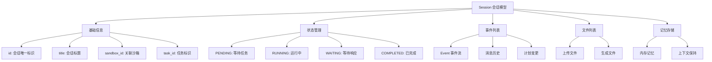
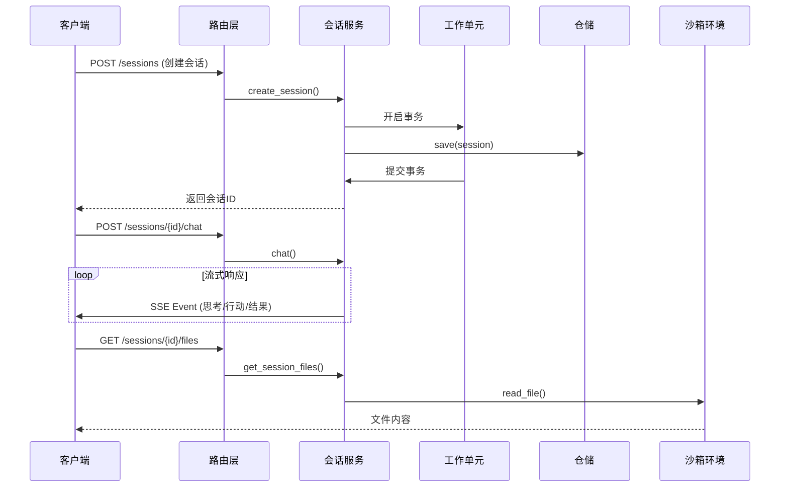

会话服务是 MultiGen 系统的核心服务之一，负责管理用户与 Agent 之间的对话上下文、维护会话状态、协调沙箱环境，并为上层业务提供统一的会话生命周期管理接口。作为连接用户交互、Agent 执行和沙箱环境的中间层，会话服务采用领域驱动设计思想，通过清晰的分层架构实现了业务逻辑与技术实现的解耦。

## 核心领域模型

会话服务的核心是 **Session 领域模型**，该模型封装了会话的所有状态信息和业务行为。每个会话代表一个独立的任务上下文，包含事件流、文件列表、记忆存储和状态机。领域模型采用 Pydantic BaseModel 实现，保证了数据验证的一致性和序列化的规范性。



会话状态通过 **SessionStatus 枚举**进行管理，包含四种状态：PENDING（等待任务）、RUNNING（运行中）、WAITING（等待人类响应）、COMPLETED（已完成）。这种状态机设计确保了会话生命周期的可控性和可追溯性。领域模型还提供了 `get_latest_plan()` 方法，通过倒序遍历事件列表获取最新计划，支撑Agent的决策逻辑。

Sources: [session.py](api/app/domain/models/session.py#L1-L47)

## 服务层架构

会话服务采用应用服务层模式，通过 **SessionService 类**封装所有与会话相关的业务逻辑。该服务依赖工作单元工厂和沙箱抽象，遵循依赖倒置原则，使得核心业务逻辑不依赖于具体的基础设施实现。

```
SessionService 核心职责矩阵：

┌─────────────────────┬──────────────────┬─────────────────────────┐
│ 业务能力             │ 核心方法          │ 协作组件                 │
├─────────────────────┼──────────────────┼─────────────────────────┤
│ 会话生命周期管理      │ create_session   │ IUnitOfWork            │
│                      │ delete_session   │ SessionRepository      │
├─────────────────────┼──────────────────┼─────────────────────────┤
│ 会话状态查询         │ get_session      │ SessionRepository      │
│                      │ get_all_sessions │                        │
├─────────────────────┼──────────────────┼─────────────────────────┤
│ 沙箱环境交互         │ read_file        │ Sandbox                │
│                      │ read_shell_output│                        │
│                      │ get_vnc_url      │                        │
├─────────────────────┼──────────────────┼─────────────────────────┤
│ 消息通知管理         │ clear_unread_    │ SessionRepository      │
│                      │ message_count    │                        │
└─────────────────────┴──────────────────┴─────────────────────────┘
```

服务层通过 **async with 工作单元模式**管理事务边界，确保数据一致性。每个业务方法都包含完整的日志记录，便于追踪会话操作的全生命周期。在删除会话等敏感操作中，服务层还实现了管理员权限验证，通过比对 `admin_api_key` 保证操作安全性。

Sources: [session_service.py](api/app/application/services/session_service.py#L1-L146)

## API 接口设计

会话服务通过 RESTful API 和 **Server-Sent Events（SSE）** 混合模式对外提供接口。API 路由位于 `/sessions` 路径下，所有接口均通过管理员权限中间件保护，确保系统安全性。



核心接口包括：**创建会话**（POST /sessions）返回新会话标识符；**流式会话列表**（POST /sessions/stream）通过 SSE 每隔 5 秒推送所有会话状态更新；**会话聊天**（POST /sessions/{id}/chat）采用 SSE 流式返回 Agent 执行过程的事件流；**文件读取**和 **Shell 输出查看**接口则与会话关联的沙箱环境交互，获取执行结果。路由层通过依赖注入机制获取服务实例，实现了接口层与业务层的解耦。

Sources: [session_routes.py](api/app/interfaces/endpoints/session_routes.py#L1-L200)

## 会话与沙箱协同

会话服务的一个关键设计是 **会话-沙箱绑定机制**。每个会话通过 `sandbox_id` 字段关联一个独立的沙箱环境，这种一对一绑定确保了任务执行的隔离性和安全性。当需要读取文件内容、查看 Shell 输出或访问 VNC 连接时，会话服务首先验证会话是否存在，然后通过沙箱标识获取沙箱实例，最后调用沙箱的具体功能接口。

这种设计模式将沙箱环境管理的复杂性封装在沙箱抽象背后，会话服务只需关注业务流程编排。同时，通过独立的沙箱环境，系统能够为每个会话提供独立的文件系统、进程空间和网络环境，支撑 MultiGen 系统中 Agent 的自主执行能力。当沙箱不存在或已销毁时，服务层会抛出明确的 `NotFoundError` 异常，避免业务逻辑进入错误状态。

Sources: [session_service.py](api/app/application/services/session_service.py#L103-L146)

## 后续学习建议

掌握会话服务的设计理念后，建议继续探索相关的核心服务实现：了解会话数据如何在数据库中持久化和查询，可以阅读 [仓储模式实现](12-cang-chu-mo-shi-shi-xian)；深入理解会话如何驱动 Agent 执行任务，请参考 [Agent 服务实现](13-agent-fu-wu-shi-xian)；探究会话与沙箱环境的深度集成机制，详见 [沙箱服务集成](18-sha-xiang-fu-wu-ji-cheng)。