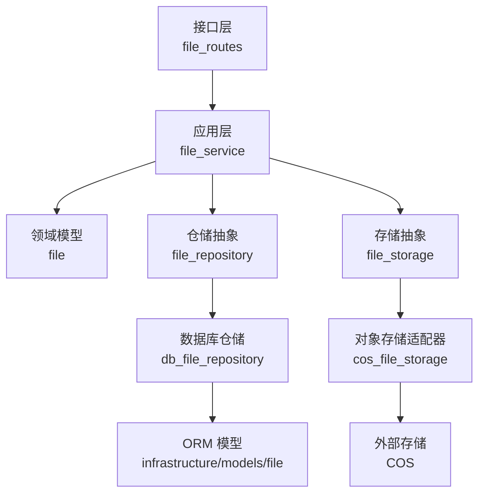

文件管理服务负责系统内与文件相关的建模、持久化、外部存储与接口暴露。它在分层架构中贯穿领域层、基础设施层、应用层与接口层，并通过协议与实现分离来支持不同存储后端的可替换性。核心职责包括：定义文件领域模型与仓储抽象、提供基础设施层的数据库与对象存储实现、封装应用层统一业务入口，以及对外提供 REST 接口与可被 Agent 调用的工具函数。

## 领域模型与仓储抽象

领域层以纯业务视角定义文件的核心属性与行为契约，屏蔽实现细节。模型文件提供文件实体的基础定义；仓储接口则规定增删改查与批量操作的统一抽象。协议层对外部存储行为建模，使上层仅依赖接口而非具体实现，便于在本地存储、云对象存储等方案间进行替换。该层强调“依赖抽象、依赖倒置”，为后续基础设施层的实现提供稳定契约。

Sources: [file](api/app/domain/models/file.py#L1-L50)
Sources: [file_repository](api/app/domain/repositories/file_repository.py#L1-L80)
Sources: [file_storage](api/app/domain/external/file_storage.py#L1-L60)

## 基础设施层实现

基础设施层负责兑现领域层的契约：一方面通过数据库实现文件元数据的持久化与查询，另一方面通过对象存储适配器完成文件内容的实际存取。数据库仓储负责与 ORM 模型映射，实现按会话、标识符等维度的检索与更新；对象存储适配器则封装上传、下载、删除等底层操作，并处理认证、重试与错误映射。该层保证领域的纯粹性，将技术细节局限在基础设施内部。

Sources: [db_file_repository](api/app/infrastructure/repositories/db_file_repository.py#L1-L120)
Sources: [file](api/app/infrastructure/models/file.py#L1-L60)
Sources: [cos_file_storage](api/app/infrastructure/external/file_storage/cos_file_storage.py#L1-L100)

## 应用层服务

应用层服务聚合多个基础设施能力，提供面向业务场景的高层接口。它协调仓库与存储适配器，完成文件上传、信息更新、列表查询与删除等常见流程，并负责参数校验、事务边界与错误处理。该层避免直接暴露领域实体的细节，以稳定的业务方法为上层屏蔽复杂度，同时为接口层与工具层提供一致、可测试的入口。

Sources: [file_service](api/app/application/services/file_service.py#L1-L150)

## 接口层与工具集成

接口层负责将应用服务以 REST API 形式暴露，并提供请求验证、响应序列化与异常处理。路由文件定义了文件相关的端点映射、参数绑定与返回结构。工具模块则将文件操作封装为可被 Agent 系统调用的函数，使其成为多智能体工作流中的可用能力。通过这种组织，文件管理服务在用户界面与自动化流程中具备一致的访问方式。

Sources: [file_routes](api/app/interfaces/endpoints/file_routes.py#L1-L80)
Sources: [file](api/app/domain/services/tools/file.py#L1-L60)

## 架构关系概览

以下示意图展示文件管理服务在分层架构中的主要依赖方向与数据流向，帮助理解各层职责边界与协作方式。箭头由调用方指向被调用方，强调“自上而下、依赖抽象”的设计原则。

## 层次职责对比

通过下表可快速了解各层在文件管理服务中的定位、核心类型与职责边界，便于在阅读代码时进行映射。

| 层级 | 核心模块/文件 | 职责边界 |
|------|---------------|----------|
| 领域层 | domain/models/file, domain/repositories/file_repository, domain/external/file_storage | 定义实体、仓储接口与存储协议，不依赖基础设施 |
| 基础设施层 | infrastructure/repositories/db_file_repository, infrastructure/external/file_storage/cos_file_storage | 实现领域契约，处理数据库与对象存储细节 |
| 应用层 | application/services/file_service | 聚合基础设施能力，提供统一业务接口与流程编排 |
| 接口层 | interfaces/endpoints/file_routes, domain/services/tools/file | 暴露 REST API 与可被 Agent 调用的工具函数 |

## 延伸阅读

- 在分层架构中的整体定位：[分层架构设计](10-fen-ceng-jia-gou-she-ji)
- 领域模型的通用定义方法：[领域模型定义](11-ling-yu-mo-xing-ding-yi)
- 仓储模式的统一抽象与实现：[仓储模式实现](12-cang-chu-mo-shi-shi-xian)
- 文件工具如何被 Agent 工作流调用：[Agent 服务实现](13-agent-fu-wu-shi-xian)