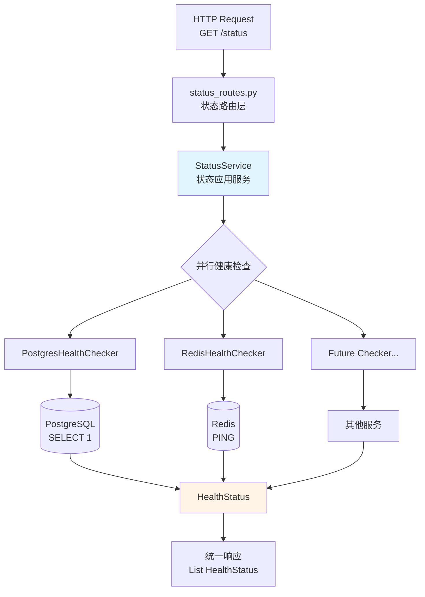

状态服务是 MultiGen 系统的健康监控中枢，负责实时检测核心基础设施组件（PostgreSQL、Redis）的可用性，为系统运维提供即时反馈。通过**策略模式**与**并行执行机制**，该服务实现了高扩展性的健康检查框架，确保单点故障不影响整体监控能力。

## 服务架构设计

状态服务采用分层架构，从领域模型到基础设施实现形成清晰的责任边界。**HealthChecker 协议**定义统一检查接口，**StatusService 应用服务**编排并行检查逻辑，而具体检查器实现则封装底层连接测试细节。这种设计使得新增监控目标（如消息队列、外部API）只需实现协议接口并注册到服务中，完全符合**开闭原则**。



该架构通过依赖注入机制将检查器实例传递给 StatusService，在 `get_status_service` 工厂函数中完成所有依赖组装。服务启动时，PostgreSQL 和 Redis 检查器被自动注册，若需扩展监控范围，只需在此函数中添加新的检查器实例即可，无需修改核心业务逻辑。

Sources: [status_service.py](api/app/application/services/status_service.py#L1-L37), [service_dependencies.py](api/app/interfaces/service_dependencies.py#L52-L66)

## 核心模型定义

**HealthStatus 领域模型**是状态服务的唯一数据载体，采用 Pydantic BaseModel 确保类型安全与自动验证。该模型包含三个核心字段：`service` 标识监控对象名称，`status` 表达健康状态（"ok" 或 "error"），`details` 在异常时提供详细诊断信息。这种扁平化设计兼顾了可读性与易扩展性，前端可直接渲染状态列表而无需额外数据转换。

| 字段名 | 类型 | 默认值 | 用途说明 | 示例值 |
|--------|------|--------|----------|--------|
| service | str | "" | 服务标识名称 | "postgres", "redis" |
| status | str | "" | 健康状态标识 | "ok", "error" |
| details | str | "" | 错误详情描述 | "Connection refused to localhost:5432" |

**HealthChecker 协议**作为领域层的核心抽象，定义了 `check()` 异步方法契约。该协议遵循 Python 的 Structural Subtyping（结构化子类型）机制，任何实现了 `check() -> HealthStatus` 的类自动满足协议要求，无需显式继承。这种设计降低了耦合度，使得第三方模块可独立实现检查逻辑而无需引入领域层依赖。

Sources: [health_status.py](api/app/domain/models/health_status.py#L1-L9), [health_checker.py](api/app/domain/external/health_checker.py#L1-L12)

## 并行检查机制

**StatusService 的核心价值在于并发执行能力**，通过 `asyncio.gather` 同时发起多个健康检查请求，显著降低整体检测耗时。该实现采用 `return_exceptions=True` 参数确保单个检查器的异常不会中断其他检查，而是将异常对象作为返回值传递，随后在结果处理阶段统一转换为 HealthStatus 对象。这种容错设计保证了即使某个检查器实现存在缺陷，系统仍能完整报告其他服务的健康状态。

```python
# 并行执行关键逻辑
results = await asyncio.gather(
    *(checker.check() for checker in self._checkers),
    return_exceptions=True,  # 捕获异常而非中断
)

# 异常统一处理
for res in results:
    if isinstance(res, Exception):
        processed_results.append(HealthStatus(
            service="未知服务",
            status="error", 
            details=f"未知检查器发生错误: {str(res)}"
        ))
```

检查器的添加通过构造函数注入完成，在 `get_status_service` 工厂函数中实例化并传递给 StatusService。当前系统注册了 PostgreSQL 和 Redis 两个检查器，若需新增监控目标（如 Elasticsearch、MongoDB），只需实现 HealthChecker 协议并在工厂函数中添加到 `checkers` 列表即可。这种**依赖注入 + 策略模式**的组合使得扩展过程无需修改任何既有代码。

Sources: [status_service.py](api/app/application/services/status_service.py#L12-L35), [service_dependencies.py](api/app/interfaces/service_dependencies.py#L57-L66)

## 检查器实现对比

当前系统提供了两个基础设施检查器实现，分别针对 PostgreSQL 和 Redis 设计轻量级验证逻辑。**PostgresHealthChecker** 通过执行 `SELECT 1` 空查询验证数据库连接池可用性，而 **RedisHealthChecker** 则调用原生 `PING` 命令测试缓存连接状态。两者均采用 try-except 捕获底层异常并将其转换为结构化的 HealthStatus 响应。

| 检查器类 | 监控目标 | 检测方法 | 成功判定 | 异常处理 |
|----------|----------|----------|----------|----------|
| PostgresHealthChecker | PostgreSQL | `SELECT 1` 查询 | 无异常抛出即成功 | 捕获所有异常并记录日志 |
| RedisHealthChecker | Redis | `client.ping()` | 返回 True | 捕获所有异常并记录日志 |

**PostgresHealthChecker 的实现关注点**在于验证数据库会话的活跃性，通过 `text("SELECT 1")` 构造最简查询语句，避免触发实际数据操作。检查器持有 AsyncSession 实例并直接调用 `execute` 方法，若连接池耗尽或网络中断，异常会被顶层 try-except 捕获并转换为包含错误详情的 HealthStatus。日志记录器在此处输出错误信息，为运维人员提供排障入口。

**RedisHealthChecker 则利用 Redis 协议的原生心跳机制**，调用 `client.ping()` 方法要求服务端返回 PONG 响应。该检查额外判断返回值的布尔状态，若 ping 成功但返回 False（极端情况），也会生成 error 状态并标注"Ping失败"。这种双重验证逻辑确保了检查器对 Redis 服务状态的准确判断，避免误报健康状态。

Sources: [postgres_health_checker.py](api/app/infrastructure/external/health_checker/postgres_health_checker.py#L13-L29), [redis_health_checker.py](api/app/infrastructure/external/health_checker/redis_health_checker.py#L13-L28)

## HTTP 接口设计

**状态服务的对外暴露层通过 FastAPI 路由实现**，提供单一 `GET /status` 端点供监控系统调用。该接口返回 `Response[List[HealthStatus]]` 结构化响应，包含所有检查器的状态列表。当任意服务处于 error 状态时，接口返回 503 状态码并附带"系统存在服务异常"消息，符合 HTTP 语义规范；全部健康时返回 200 状态码表示系统可用。

接口通过 `Depends(get_status_service)` 注入服务实例，FastAPI 的依赖注入系统会在请求到达时自动调用工厂函数构建完整的检查器链。这种**声明式依赖管理**避免了手动实例化的烦琐，同时为单元测试提供了 Mock 替换点——测试时只需覆盖 `get_status_service` 依赖即可注入模拟服务。

路由层还承担了状态汇总判断职责，通过 `any(item.status == "error" for item in statues)` 快速扫描结果列表，一旦发现异常立即构造失败响应。这种**快速失败**策略使得监控系统能够通过 HTTP 状态码迅速判断系统健康度，无需解析响应体内容。

Sources: [status_routes.py](api/app/interfaces/endpoints/status_routes.py#L14-L31)

## 扩展指南

当需要新增监控目标时，开发者应遵循**领域驱动设计原则**，从领域层逐步向下实现功能。首先在 `domain/external/health_checker.py` 中协议已定义完毕，无需修改；随后在 `infrastructure/external/health_checker/` 目录下创建新检查器模块，实现 `check()` 方法；最后在 `service_dependencies.py` 的 `get_status_service` 函数中实例化并注册检查器。

```python
# 新增检查器示例：ElasticsearchHealthChecker
class ElasticsearchHealthChecker(HealthChecker):
    def __init__(self, es_client: AsyncElasticsearch) -> None:
        self._es_client = es_client

    async def check(self) -> HealthStatus:
        try:
            health = await self._es_client.cluster.health()
            if health['status'] in ('green', 'yellow'):
                return HealthStatus(service="elasticsearch", status="ok")
            return HealthStatus(
                service="elasticsearch", 
                status="error",
                details=f"集群状态异常: {health['status']}"
            )
        except Exception as e:
            logger.error(f"Elasticsearch健康检查失败: {str(e)}")
            return HealthStatus(service="elasticsearch", status="error", details=str(e))
```

扩展过程中需注意**异常容错**原则：检查器内部的所有数据库/网络调用必须包裹在 try-except 中，避免将底层异常抛向 StatusService。虽然服务层有兜底处理，但检查器自身捕获异常可提供更精准的错误信息，帮助运维人员快速定位问题根因。此外，检查逻辑应**保持轻量**，避免执行耗时操作影响系统启动速度或监控响应时间。