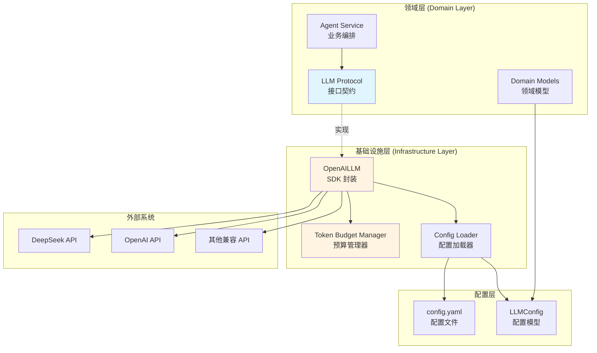
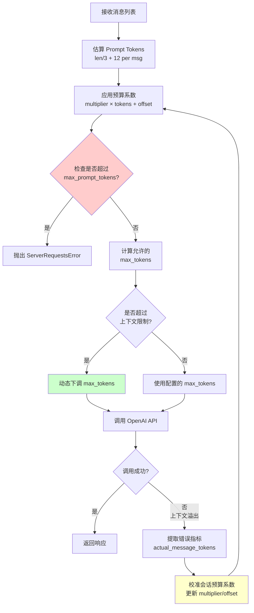

MultiGen 采用**领域驱动设计（DDD）** 构建了高度解耦的 LLM 集成架构，通过协议抽象层实现多模型统一接入，并内置智能 Token 预算管理机制，支持 DeepSeek、OpenAI 等兼容接口的大语言模型。核心设计理念是将 LLM 视为**领域外部依赖**，在领域层定义协议契约，在基础设施层提供具体实现，确保业务逻辑与技术选型的完全隔离。

Sources: [llm.py](api/app/domain/external/llm.py#L1-L39), [openai_llm.py](api/app/infrastructure/external/llm/openai_llm.py#L1-L50)

## 架构设计概览

LLM 集成遵循**六边形架构**原则，领域层通过 `Protocol` 定义标准化接口，基础设施层提供基于 OpenAI SDK 的具体实现。这种设计使得系统具备**零改造成本切换 LLM 提供商**的能力，同时支持在运行时通过配置注入不同的模型实现。架构层次清晰分为：**领域协议层**（定义交互契约）、**配置模型层**（封装配置参数）、**基础设施实现层**（处理实际 API 调用）、**应用服务层**（编排业务逻辑）。



Sources: [llm.py](api/app/domain/external/llm.py#L1-L39), [openai_llm.py](api/app/infrastructure/external/llm/openai_llm.py#L1-L100)

## 核心协议定义

领域层通过 `Protocol` 定义了 `LLM` 接口协议，这是整个 LLM 集成的**核心契约**。协议规定了调用方法、只读属性和 Token 预算查询接口，确保所有实现类都遵循统一的交互模式。`invoke` 方法作为主入口，接收消息列表、工具定义、响应格式和工具选择策略等参数，返回标准的字典结构，支持**阻塞响应模式**（可扩展为流式响应）。协议的设计充分考虑了 Agent 场景的特殊需求，特别是会话级别的 Token 预算控制。

| 协议成员 | 类型 | 用途 |
|---------|------|------|
| `invoke()` | 异步方法 | 核心调用接口，支持消息、工具、响应格式、工具选择策略 |
| `model_name` | 只读属性 | 返回模型标识符，用于日志和监控 |
| `temperature` | 只读属性 | 返回生成温度参数，控制输出随机性 |
| `max_tokens` | 只读属性 | 返回最大生成 Token 数，控制输出长度 |
| `max_prompt_tokens` | 只读属性 | 返回最大提示 Token 数，控制输入长度 |
| `get_safe_prompt_token_limit()` | 方法 | 计算安全的提示 Token 上限，预留预算缓冲 |

Sources: [llm.py](api/app/domain/external/llm.py#L1-L39)

## OpenAI 兼容实现

`OpenAILLM` 类是协议的核心实现，基于**异步 OpenAI SDK** 构建，支持所有兼容 OpenAI API 格式的模型服务。实现层不仅完成了基础的 API 调用功能，还集成了**自适应 Token 预算管理**、**上下文溢出恢复**、**会话级别预算校准**等高级特性。构造函数接收 `LLMConfig` 配置对象，初始化异步客户端并设置默认的预算系数（multiplier = 1.15、offset = 512、reserved_tokens = 2048），这些参数用于将估算的 prompt token 数量转换为更保守的实际值，防止上下文超限错误。

```python
# 初始化示例
llm_config = LLMConfig(
    base_url="https://api.deepseek.com/",
    api_key="sk-xxxxx",
    model_name="deepseek-reasoner",
    temperature=0.7,
    max_tokens=8192,
    max_prompt_tokens=131072
)

llm = OpenAILLM(llm_config)
response = await llm.invoke(
    messages=[{"role": "user", "content": "Hello"}],
    tools=[...],  # 可选
    session_id="session-123"  # 支持会话级别预算管理
)
```

Sources: [openai_llm.py](api/app/infrastructure/external/llm/openai_llm.py#L1-L60), [config.yaml](api/config.yaml#L1-L9)

## Token 预算管理机制

Token 预算管理是 LLM 集成的**核心创新点**，采用三层防护策略：**事前估算**、**动态调整**、**事后校准**。系统首先按字符数估算 prompt token（每 3 字符 ≈ 1 token，并有基础开销 12 tokens/消息），然后应用预算系数计算保守估算值。对于 DeepSeek 模型，系统会根据估算的 prompt token 动态下调 `max_tokens` 参数，确保总 token 数不超过上下文限制（默认 131072）。当发生上下文溢出错误时，系统从错误信息中提取真实的 token 使用数据，反向校准会话的预算系数，实现**自适应优化**。

### Token 预算计算流程



Sources: [openai_llm.py](api/app/infrastructure/external/llm/openai_llm.py#L62-L150)

## 配置管理实践

LLM 配置采用 YAML 文件与 Pydantic 模型结合的方式，配置文件位于项目根目录的 `config.yaml`，包含 `llm_config` 节点，配置项包括 `base_url`（API 基础地址）、`api_key`（认证密钥）、`model_name`（模型标识）、`temperature`（生成温度）、`max_tokens`（最大生成 token）、`max_prompt_tokens`（最大提示 token，可选）。配置通过 `LLMConfig` 模型进行类型验证和默认值填充，确保配置的**类型安全**和**完整性**。实际生产环境应将 `api_key` 移至环境变量或密钥管理系统，避免敏感信息硬编码。

| 配置项 | 类型 | 默认值 | 说明 |
|-------|------|-------|------|
| `base_url` | str | 必填 | API 基础地址，支持 OpenAI 兼容接口 |
| `api_key` | str | 必填 | API 认证密钥，生产环境建议用环境变量 |
| `model_name` | str | 必填 | 模型标识，如 `deepseek-reasoner`、`gpt-4` |
| `temperature` | float | 0.7 | 生成温度，范围 [0, 2]，越高越随机 |
| `max_tokens` | int | 8192 | 最大生成 token 数，影响输出长度 |
| `max_prompt_tokens` | int | 131072 | 最大提示 token 数，限制输入上下文 |

Sources: [config.yaml](api/config.yaml#L1-L9), [app_config.py](api/app/domain/models/app_config.py#L1-L50)

## 会话级别预算优化

系统为每个会话维护独立的预算系数覆盖配置（`_session_budget_overrides`），支持会话级别的**Token 预算精细控制**。当某会话触发上下文溢出错误时，系统从错误信息中提取实际 token 使用数据（`actual_message_tokens`、`completion_tokens`），反向计算当前估算偏差，动态调整该会话的 `multiplier`（倍数系数）、`offset`（偏移量）、`reserved_tokens`（预留 token）三个参数。校准后的系数仅作用于该会话的后续请求，避免影响全局配置，实现**问题隔离**和**精准优化**。

Sources: [openai_llm.py](api/app/infrastructure/external/llm/openai_llm.py#L103-L150)

## 工具调用与响应格式

`invoke` 方法原生支持 OpenAI 的**Function Calling** 机制，通过 `tools` 参数传递工具定义列表，`tool_choice` 参数控制工具选择策略（`auto`、`required` 或具体工具名），`response_format` 参数支持 JSON 结构化输出（`{"type": "json_object"}`）。系统在调用前会检查是否启用工具，动态构建请求参数，并将工具定义转换为 OpenAI API 要求的格式。响应结果统一封装为字典结构，包含 `content`、`tool_calls`、`finish_reason` 等字段，便于上层业务逻辑统一处理。

Sources: [openai_llm.py](api/app/infrastructure/external/llm/openai_llm.py#L152-L250)

## 错误处理与恢复策略

系统实现了**多层次的错误处理**机制：在 Token 预算阶段，如果估算的 prompt token 超过预算，抛出 `ServerRequestsError` 并提示用户缩减输入长度；在 API 调用阶段，捕获所有 OpenAI SDK 异常并记录详细日志；在上下文溢出场景，自动提取错误指标并校准会话预算系数，后续请求将使用优化后的参数重试。这种设计确保了**快速失败**（Fail Fast）和**自动恢复**（Self-Healing）的平衡，既避免无效重试浪费资源,又能适应实际运行时的 token 使用情况。

Sources: [openai_llm.py](api/app/infrastructure/external/llm/openai_llm.py#L200-L281), [exceptions.py](api/app/application/errors/exceptions.py#L1-L50)

## 扩展与定制指南

系统的**协议驱动设计**使得扩展新 LLM 提供商极为简单：只需实现 `LLM` 协议定义的所有方法和属性，即可无缝接入现有架构。推荐实践是创建新的实现类（如 `ClaudeLLM`、`GeminiLLM`），在基础设施层统一管理，通过配置文件切换具体实现。对于特殊需求（如流式响应、多模态输入），可在协议中扩展新方法，保持向后兼容性。现有的 Token 预算管理机制可复用至新实现，只需实现 `get_safe_prompt_token_limit` 方法即可接入自适应预算系统。

Sources: [llm.py](api/app/domain/external/llm.py#L1-L39)

## 相关配置示例

实际配置应结合环境变量和配置文件，推荐在 `.env` 文件中定义敏感信息，在 `config.yaml` 中引用环境变量。以下展示生产环境的标准配置模式，配置项通过 Pydantic 模型进行类型验证，确保配置错误在启动阶段被捕获。系统同时支持 Agent 配置（最大迭代次数、重试次数、搜索结果数）和 MCP 配置（工具服务器地址），形成完整的 AI 服务配置体系。

```yaml
# config.yaml 生产环境配置示例
llm_config:
  base_url: ${LLM_BASE_URL}
  api_key: ${LLM_API_KEY}
  model_name: ${LLM_MODEL_NAME}
  temperature: ${LLM_TEMPERATURE:-0.7}
  max_tokens: ${LLM_MAX_TOKENS:-8192}
  max_prompt_tokens: ${LLM_MAX_PROMPT_TOKENS:-131072}

agent_config:
  max_iterations: ${AGENT_MAX_ITERATIONS:-10000}
  max_retries: ${AGENT_MAX_RETRIES:-3}
```