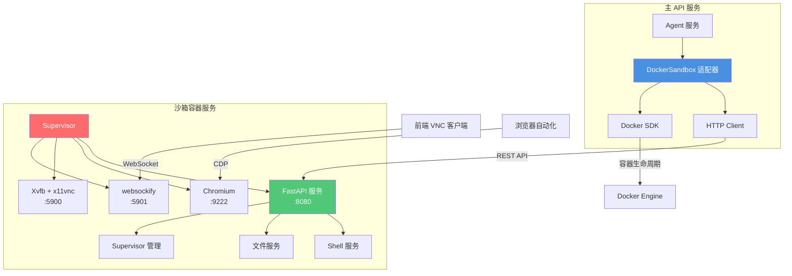

MultiGen 系统通过**沙箱服务集成**实现隔离的代码执行环境，为 Agent 提供安全的 Shell 命令执行、文件操作和浏览器自动化能力。沙箱基于 Docker 容器技术构建，采用独立的微服务架构，通过 HTTP API 与主服务通信，既保证了环境隔离性，又实现了资源弹性管理。

## 架构概览

沙箱服务采用**双层架构设计**：底层为独立的沙箱容器服务，上层为主 API 服务的集成客户端。沙箱容器作为独立进程运行，预装 Ubuntu 22.04、Python 3.10、Node.js 24 和 Chromium 浏览器，通过 Supervisor 管理多个系统进程；主 API 服务通过 `DockerSandbox` 适配器与沙箱通信，实现统一的资源管理接口。



沙箱服务的部署模式支持**固定容器**和**动态创建**两种策略：生产环境通过 `SANDBOX_ADDRESS` 配置项连接预部署的固定沙箱容器，简化运维管理；开发环境可通过 Docker SDK 动态创建临时容器，每次会话独立隔离。该设计使系统能够灵活适应不同的部署场景，同时保证 Agent 执行环境的安全性和可重现性。Sources: [docker_sandbox.py](api/app/infrastructure/external/sandbox/docker_sandbox.py#L1-L200), [README.md](sandbox/README.md#L1-L76)

## 沙箱容器服务实现

沙箱容器服务基于 FastAPI 框架构建，提供三大核心功能模块：**Shell 执行**、**文件管理**和**进程监控**。服务通过 `Supervisor` 管理多个系统进程，包括 FastAPI 应用本身、Chromium 浏览器实例、虚拟显示器 Xvfb 和 VNC 服务，确保各组件协同工作并具备自动重启能力。

### 服务启动与进程管理

沙箱服务启动时首先初始化日志系统，配置统一的日志格式和输出级别，然后创建 FastAPI 应用实例并注册三个功能模块的路由：文件模块处理文件读写、上传下载操作；Shell 模块负责命令执行和输出获取；Supervisor 模块提供进程状态查询和管理接口。应用启用 CORS 中间件支持跨域访问，并实现自动超时扩展中间件，防止长时间任务被强制中断。

```python
# FastAPI 应用实例化与路由集成
app = FastAPI(
    title="MultiGen沙箱系统",
    description="预装Chrome、Python、Node.js，支持Shell命令、文件管理",
    openapi_tags=openapi_tags,
    lifespan=lifespan,
)

app.include_router(router, prefix="/api")
```

Supervisor 作为进程管理器监控沙箱内的所有关键服务，其配置文件定义了四个核心进程：`fastapi` 服务监听 8080 端口提供 REST API；`chrome` 进程启动 Chromium 浏览器并开放 9222 端口用于远程调试；`xvfb` 创建虚拟显示器 :1 供浏览器使用；`x11vnc` 和 `websockify` 组合提供基于 WebSocket 的 VNC 远程桌面访问能力。该架构使沙箱既支持自动化操作，又允许开发者通过 noVNC 实时查看执行过程。Sources: [main.py](sandbox/app/main.py#L1-L101), [routes.py](sandbox/app/interfaces/endpoints/routes.py#L1-L20)

### Shell 执行服务

Shell 服务是沙箱的核心功能模块，通过 `ShellService` 类实现异步命令执行、输出流管理和会话生命周期控制。服务采用 **会话解耦设计**：每个 Shell 会话拥有独立的 `session_id`、工作目录、进程实例和输出缓冲区，支持多个并发会话同时运行，互不干扰。

Shell 执行流程遵循**异步流式处理模式**：首先根据命令和工作目录创建 `asyncio.subprocess.Process` 子进程，将标准错误重定向到标准输出实现统一捕获；然后启动独立协程 `_start_output_reader` 持续读取进程输出，通过增量解码器处理 UTF-8 编码的字节流边界问题；最后将输出累积存储在 `Shell` 会话对象中，供客户端分批获取。

```python
async def _create_process(cls, exec_dir: str, command: str) -> asyncio.subprocess.Process:
    """创建异步子进程执行Shell命令"""
    return await asyncio.create_subprocess_shell(
        command,
        executable="/bin/bash",
        cwd=exec_dir,
        stdout=asyncio.subprocess.PIPE,
        stderr=asyncio.subprocess.STDOUT,  # 错误重定向到标准输出
        stdin=asyncio.subprocess.PIPE,
        limit=1024 * 1024,  # 1MB 缓冲区
    )
```

输出处理采用**控制台记录模式**，每个命令执行生成一条 `ConsoleRecord`，包含命令提示符 `ps1`、执行的命令文本和本次输出的内容。该设计模仿真实的终端交互体验，使 Agent 能够像人类用户一样理解命令执行的上下文。服务还提供 ANSI 转义码清理功能，移除终端颜色控制字符，确保输出内容纯净可解析。Sources: [shell.py](sandbox/app/services/shell.py#L1-L200)

### 文件管理服务

文件服务提供完整的文件系统操作能力，支持文件读写、上传下载、目录遍历等操作。服务对路径进行规范化处理，支持相对路径和绝对路径转换，并实现权限检查防止越权访问。上传文件通过 multipart/form-data 协议接收，下载文件使用 StreamingResponse 实现大文件的流式传输，避免内存溢出风险。

文件操作的设计原则是**最小权限原则**：沙箱容器以非 root 用户运行（生产环境），限制可访问的目录范围；API 接口对文件路径进行安全校验，禁止访问敏感系统文件；临时文件使用 UUID 命名防止冲突。该设计确保即使沙箱被攻破，攻击者也无法轻易逃逸到宿主系统。Sources: [README.md](sandbox/README.md#L38-L45)

## DockerSandbox 适配器实现

`DockerSandbox` 类是主 API 服务集成沙箱的适配器，实现了领域层的 `Sandbox` 接口，封装了容器生命周期管理、HTTP 通信和地址解析等底层细节。适配器支持两种运行模式：**固定模式**连接预存在的沙箱容器，适用于生产环境的长期运行；**动态模式**按需创建临时容器，适用于测试环境的隔离性保障。

### 容器创建与地址解析

动态创建容器时，`DockerSandbox` 通过 Docker SDK 配置容器参数，包括镜像名称、容器命名、网络配置和环境变量注入。环境变量传递服务超时时间、Chrome 启动参数和代理配置，使沙箱容器能够适应不同的网络环境和性能要求。容器创建后，适配器通过 `_get_container_ip` 方法从 Docker 网络配置中提取容器 IP 地址，用于后续的 HTTP 通信。

```python
@classmethod
def _create_task(cls) -> Self:
    """创建沙箱容器实例"""
    container_config = {
        "image": settings.sandbox_image,
        "name": f"{settings.sandbox_name_prefix}-{uuid.uuid4()[:8]}",
        "detach": True,
        "remove": True,
        "environment": {
            "SERVICE_TIMEOUT_MINUTES": settings.sandbox_ttl_minutes,
            "CHROME_ARGS": settings.sandbox_chrome_args,
            "HTTPS_PROXY": settings.sandbox_https_proxy,
        }
    }
    container = docker_client.containers.run(**container_config)
    return DockerSandbox(ip=cls._get_container_ip(container), container_name=container_name)
```

固定模式下，适配器需处理主机名到 IP 地址的解析：首先尝试直接解析为 IPv4 地址，若失败则通过 `socket.getaddrinfo` 查询 DNS 记录。该设计支持 Docker 容器名、主机名和 IP 地址等多种输入形式，使配置更加灵活。例如配置 `SANDBOX_ADDRESS=manus-sandbox` 时，适配器会自动解析 Docker 网络中的容器 IP。Sources: [docker_sandbox.py](api/app/infrastructure/external/sandbox/docker_sandbox.py#L55-L130)

### HTTP API 集成

适配器通过 `httpx.AsyncClient` 与沙箱 REST API 通信，设置 600 秒超时以支持长时间运行的任务。所有 API 调用均采用异步模式，避免阻塞事件循环。核心方法包括文件读写、Shell 命令执行、会话创建和销毁等，每个方法构造请求参数、发送 HTTP 请求、解析响应并转换为领域模型。

| 方法 | HTTP 端点 | 功能描述 |
|------|-----------|----------|
| `read_file` | POST `/api/file/read-file` | 读取沙箱文件内容 |
| `write_file` | POST `/api/file/write-file` | 写入内容到沙箱文件 |
| `exec_command` | POST `/api/shell/exec-command` | 在指定会话执行命令 |
| `read_shell_output` | POST `/api/shell/read-shell-output` | 获取命令执行输出 |
| `destroy` | - | 关闭客户端并移除容器 |

错误处理遵循**异常转换模式**：`DockerSandbox` 捕获底层异常（如 Docker API 错误、网络超时）并转换为领域层异常（如 `SandboxException`），确保上层服务不依赖具体实现。该设计符合六边形架构原则，使沙箱实现可以灵活替换（例如替换为 gVisor 或 Firecracker）。Sources: [docker_sandbox.py](api/app/infrastructure/external/sandbox/docker_sandbox.py#L1-L200)

### 生命周期管理

沙箱生命周期由会话服务协调管理：新会话创建时调用 `DockerSandbox.create()` 获取沙箱实例并绑定到会话；会话结束时调用 `destroy()` 清理资源。固定模式下 `destroy()` 仅关闭 HTTP 客户端，容器继续运行供其他会话使用；动态模式下 `destroy()` 强制移除容器，释放所有资源。

生命周期管理的关键挑战是**异常情况下的资源泄漏**：应用崩溃可能导致容器残留。解决方案包括：容器启动时设置 `auto_remove=True` 参数，使容器在退出时自动清理；定期执行 Docker 清理任务移除孤儿容器；配置容器的 TTL 超时机制，沙箱内部服务在超时后自动终止。该组合策略确保系统长期运行不会积累僵尸容器。Sources: [docker_sandbox.py](api/app/infrastructure/external/sandbox/docker_sandbox.py#L131-L180)

## 部署配置

沙箱服务的部署配置通过环境变量和配置文件管理，分为沙箱容器配置和主服务集成配置两部分。生产环境推荐使用 **Docker Compose 统一部署**，沙箱容器与主 API 服务处于同一 Docker 网络，通过容器名访问，网络延迟低且安全性高。

### 容器镜像构建

沙箱镜像基于 `Ubuntu 22.04` 构建，Dockerfile 分为三个阶段：首先安装系统依赖包括 Python 3.10、Node.js 24、Chromium、Xvfb、x11vnc 和 Supervisor；然后复制应用代码和配置文件；最后配置入口点启动 Supervisor。镜像构建时需注意清理 APT 缓存和临时文件，减小镜像体积；设置适当的文件权限，避免权限冲突。

```bash
# 关键依赖安装示例
RUN apt-get update && apt-get install -y \
    python3.10 python3-pip \
    nodejs npm \
    chromium-browser \
    xvfb x11vnc websockify \
    supervisor \
    && rm -rf /var/lib/apt/lists/*
```

镜像构建过程中还注入预配置项：创建非 root 用户运行服务、配置 Chrome 无头模式和远程调试参数、设置 Supervisor 配置文件的自动加载路径。这些预配置使容器启动后无需额外初始化即可提供服务，实现 **零配置启动**。Sources: [Dockerfile](sandbox/Dockerfile#L1-L1), [supervisord.conf](sandbox/supervisord.conf#L1-L1)

### 网络与端口配置

沙箱容器暴露四个关键端口，但在 Docker Compose 部署中这些端口**不对外发布**，仅在容器网络内部可访问，增强了安全性：8080 端口提供 REST API 服务；9222 端口提供 Chrome DevTools Protocol 接口用于浏览器自动化；5900 端口提供 VNC RFB 协议接口；5901 端口提供 WebSocket VNC 代理，主 API 服务通过该端口将 VNC 流代理到前端。

主服务集成配置通过环境变量控制是否使用固定沙箱：设置 `SANDBOX_ADDRESS=manus-sandbox` 时，所有会话共享同一沙箱容器；不设置该变量时，每个会话创建独立的临时容器。固定模式适合生产环境的长会话场景，动态模式适合开发环境的短任务测试。Sources: [README.md](sandbox/README.md#L63-L76), [docker-compose.yml](docker-compose.yml#L1-L1)

### 性能与安全调优

沙箱服务的性能调优主要关注**进程并发数**和**资源限制**：通过 Supervisor 配置限制 Chrome 进程的数量，防止内存耗尽；通过 Docker 的 `mem_limit` 和 `cpu_quota` 参数限制容器资源使用；配置 `SERVICE_TIMEOUT_MINUTES` 环境变量实现空闲超时自动清理。

安全保障采用**多层防御策略**：容器层面使用 Docker 的隔离能力，限制系统调用和网络访问；应用层面验证所有输入参数，防止命令注入和路径遍历攻击；网络层面禁用不必要的端口发布，仅允许受信任的服务访问。该架构确保即使 Agent 执行恶意代码，影响范围也被限制在沙箱容器内，无法威胁宿主系统和其他租户。Sources: [README.md](sandbox/README.md#L48-L61)

## 监控与调试

沙箱服务提供多种监控和调试手段：Supervisor 的 HTTP 接口（内部）展示各进程的运行状态；FastAPI 的 `/api/supervisor/status` 端点返回聚合的进程信息；VNC 远程桌面允许开发者实时观察沙箱内的图形界面操作。日志系统统一输出到标准输出，由 Docker 的日志驱动收集，可通过 `docker logs` 命令查看。

调试 Shell 执行问题时，可通过 `read_shell_output` 接口获取完整的命令历史和输出记录；排查文件操作异常时，可在沙箱内执行 `ls`、`cat` 等命令验证文件状态；浏览器自动化失败时，可检查 Chrome 的调试日志和进程状态。该多层次的可观测性设计使开发者能够快速定位问题根源。Sources: [README.md](sandbox/README.md#L38-L45)

## 扩展方向

当前沙箱集成的实现已满足基础需求，但仍可从以下方向增强：**资源隔离增强**集成 cgroups v2 实现更细粒度的 CPU 和内存限制；**安全增强**引入 gVisor 或 Firecracker 提供更强的容器隔离；**镜像缓存优化**实现增量构建和分层缓存，加快镜像更新速度；**多沙箱调度**引入调度器管理沙箱池，支持大规模并发会话。

对于需要深入了解 Agent 如何使用沙箱执行工具的开发者，建议继续阅读 [Agent 服务实现](13-agent-fu-wu-shi-xian) 和 [任务执行流程](9-ren-wu-zhi-xing-liu-cheng)，了解沙箱在完整任务流程中的作用。如需了解浏览器自动化功能的实现细节，可参考相关的 Playwright 集成文档。Sources: [docker_sandbox.py](api/app/infrastructure/external/sandbox/docker_sandbox.py#L1-L200)