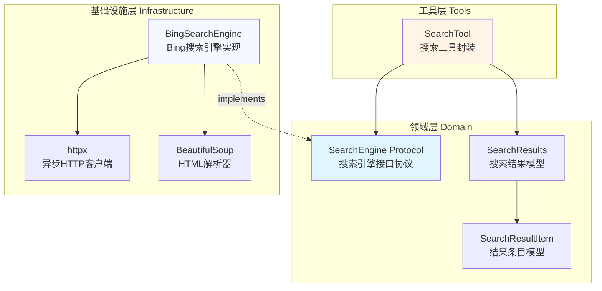

搜索引擎集成模块为 MultiGen 系统提供了实时信息获取能力，使 Agent 能够检索最新新闻、天气、股价等动态数据，突破了静态知识库的限制。该模块采用**协议导向设计**，通过领域层的抽象接口与基础设施层的具体实现分离，实现了搜索引擎的可插拔架构，目前默认实现了 Bing 搜索引擎。

## 架构设计概览

搜索引擎集成遵循系统的分层架构原则，从领域模型的定义到基础设施的实现，再到工具层的封装，形成了完整的垂直切分。核心设计理念是通过 `Protocol` 接口定义搜索引擎的契约，使不同搜索引擎实现可以无缝替换，同时为 Agent 提供统一的工具调用接口。

Sources: [search.py](api/app/domain/external/search.py#L1-L13), [search.py](api/app/domain/models/search.py#L1-L19), [bing_search.py](api/app/infrastructure/external/search/bing_search.py#L1-L23), [search.py](api/app/domain/services/tools/search.py#L1-L37)

## 核心组件详解

### 领域模型定义

搜索引擎的领域模型位于 `app/domain/models/search.py`，定义了两个核心数据结构：`SearchResultItem` 表示单个搜索结果条目，包含 URL、标题和摘要信息；`SearchResults` 则聚合了完整的搜索结果集，记录查询词、时间范围过滤条件、总结果数和结果列表。这种设计遵循了**值对象模式**，每个字段都通过 Pydantic 进行类型验证，确保数据在传递过程中的类型安全。

**SearchResultItem** 模型捕获了网页搜索结果的核心属性：`url` 字段存储可访问的链接地址，`title` 字段保存页面标题用于快速识别，`snippet` 字段则提取页面摘要帮助用户预判内容相关性。**SearchResults** 模型则作为聚合根，不仅包含结果列表，还保留了原始查询词 `query` 和时间过滤参数 `date_range`，便于结果追溯和调试。

Sources: [search.py](api/app/domain/models/search.py#L1-L19)

### 搜索引擎接口协议

领域层的 `SearchEngine` 协议定义了搜索引擎的标准契约，采用 Python 的 `Protocol` 类型进行接口抽象。该协议仅定义了一个异步方法 `invoke`，接收查询字符串和可选的日期范围参数，返回封装在 `ToolResult` 中的 `SearchResults` 对象。这种极简接口设计降低了实现者的负担，同时明确了搜索引擎的核心职责：**接收查询 → 执行搜索 → 返回结构化结果**。

协议的设计遵循了**依赖倒置原则**，高层模块（如 Agent 服务）依赖抽象接口而非具体实现，使得搜索引擎的替换不影响上层业务逻辑。`date_range` 参数的支持使搜索引擎具备了时间维度的过滤能力，满足用户对时效性信息的需求。

Sources: [search.py](api/app/domain/external/search.py#L1-L13)

### Bing 搜索引擎实现

基础设施层的 `BingSearchEngine` 是 `SearchEngine` 协议的具体实现，通过 **httpx** 异步客户端和 **BeautifulSoup** HTML 解析器，实现了对 Bing 搜索结果的抓取与解析。实现过程分为三个核心阶段：**请求构建 → 响应解析 → 结果提取**，每个阶段都包含了健壮的错误处理机制。

#### 请求构建与参数映射

请求构建阶段负责组装 HTTP 请求的各个组成部分，包括基础 URL、请求头、Cookies 和查询参数。为了模拟真实浏览器行为，构造函数初始化了完整的浏览器标识信息，设置 `User-Agent` 为 Microsoft Edge 浏览器，并配置了标准化的 `Accept` 和 `Accept-Language` 头部，这些配置对于绕过反爬虫检测至关重要。日期范围过滤通过 `filters` 参数实现，`BingSearchEngine` 将高层语义（如 `past_day`、`past_week`）转换为 Bing 的内部格式编码。

**日期过滤器映射规则**遵循 Bing 的特殊编码格式：`past_hour` 和 `past_day` 映射为 `"ex1%3a\"ez1\""`，`past_week` 映射为 `"ex1%3a\"ez2\""`，`past_month` 映射为 `"ex1%3a\"ez3\""`。对于 `past_year`，则需要计算距离 Unix 纪元的天数，动态生成时间范围编码，例如 `"ex1%3a\"ez5_{start}_{end}\""`，其中 `start` 和 `end` 是具体的天数。

Sources: [bing_search.py](api/app/infrastructure/external/search/bing_search.py#L14-L47)

#### HTML 解析与结果提取

响应解析阶段使用 BeautifulSoup 解析返回的 HTML 文档，定位搜索结果的核心 DOM 结构。Bing 的搜索结果位于 `<li class="b_algo">` 元素内，每个 `li` 标签对应一个搜索条目。解析逻辑设计了**三重降级策略**：首先尝试从 `<h2>` 标签内的 `<a>` 标签提取标题和链接；若失败则遍历所有 `<a>` 标签，筛选长度超过 10 且不以 `http` 开头的文本；若仍未找到标题则跳过该条目。

摘要信息的提取同样采用了多层级降级逻辑：优先查找带有 `b_lineclamp`、`b_descript`、`b_caption` 类名的 `
` 或 `
` 标签；若无匹配则遍历所有 `
` 标签提取长度超过 20 的文本；最后尝试将整个条目的文本按句号、感叹号等分隔符切分，筛选出符合条件的句子作为摘要。这种多层保障机制确保了即使在页面结构变化时，仍能提取到基本的有用信息。

Sources: [bing_search.py](api/app/infrastructure/external/search/bing_search.py#L73-L162)

#### 结果统计与错误处理

`BingSearchEngine` 还实现了搜索结果总数的提取，通过正则表达式匹配页面中的 `"X,XXX results"` 文本，并提供了备用查找逻辑针对不同的页面结构。错误处理机制捕获所有异常，在发生网络错误或解析失败时，返回 `success=False` 的 `ToolResult`，同时保留空的 `SearchResults` 对象以保持接口一致性，避免调用方出现空指针异常。

Sources: [bing_search.py](api/app/infrastructure/external/search/bing_search.py#L163-L215)

### 搜索工具封装

`SearchTool` 位于工具层，将 `SearchEngine` 协议封装为 Agent 可调用的工具函数。该工具通过 `@tool` 装饰器声明了工具名称 `search_web`，并提供了详细的描述信息和使用指南，这些元数据会被 LLM 用于工具选择决策。工具的参数定义遵循 JSON Schema 规范，`query` 参数提示 Agent 将自然语言问句转换为关键词组合，`date_range` 参数则列出所有可选的时间范围选项。

**工具设计的核心优势**在于将搜索引擎的技术复杂性隐藏在简洁的接口之后。Agent 无需关心 HTTP 请求细节、HTML 解析逻辑或错误重试机制，只需传递查询词和可选的时间范围，即可获得结构化的搜索结果。`SearchTool` 的构造函数接收 `SearchEngine` 协议实例，通过依赖注入实现了解耦，使得单元测试时可以轻松注入 Mock 对象。

Sources: [search.py](api/app/domain/services/tools/search.py#L1-L37)

## 依赖注入与服务组装

搜索引擎的实例化与注入发生在 `service_dependencies.py` 中，该模块负责组装 Agent 服务所需的所有依赖项。在 `get_agent_service` 函数中，`BingSearchEngine` 被直接实例化并传递给 `AgentService` 构造函数，与其他依赖项（如 LLM、文件存储、沙箱环境）一起完成服务的初始化。这种**构造函数注入**模式确保了 Agent 服务在创建时就拥有所有必需的依赖，避免了运行时的依赖缺失问题。

当前的实现采用了**硬编码实例化**方式，直接在依赖注入函数中创建 `BingSearchEngine()` 实例。这种设计适用于单搜索引擎场景，未来若需支持多搜索引擎切换，可通过配置文件指定搜索引擎类型，并使用工厂模式动态创建实例。依赖注入的显式声明也便于在开发环境替换为 Mock 搜索引擎，加速测试迭代。

Sources: [service_dependencies.py](api/app/interfaces/service_dependencies.py#L72-L100)

## 使用流程与参数配置

### 搜索工具调用参数表

| 参数名 | 类型 | 必填 | 可选值 | 说明 |
|--------|------|------|--------|------|
| query | string | 是 | - | 针对搜索引擎优化的查询字符串，需提取核心关键词（3-5个），避免完整自然语言问句 |
| date_range | string | 否 | all, past_hour, past_day, past_week, past_month, past_year | 搜索结果的时间范围过滤，用于获取特定时效性信息，默认为 all |

Sources: [search.py](api/app/domain/services/tools/search.py#L17-L25)

### 日期过滤功能详解

日期过滤是搜索引擎集成的重要特性，使得 Agent 能够获取时效性强的信息。系统支持六种预设时间范围，覆盖从最近一小时到全历史的不同粒度需求：

- **past_hour**: 获取最近1小时的搜索结果，适用于突发新闻监控
- **past_day**: 获取最近24小时的搜索结果，适用于每日热点追踪
- **past_week**: 获取最近一周的搜索结果，适用于短期趋势分析
- **past_month**: 获取最近一个月的搜索结果，适用于月中总结报告
- **past_year**: 获取最近一年的搜索结果，适用于年度事件回顾
- **all**: 不限时间范围，获取所有历史结果（默认值）

Sources: [bing_search.py](api/app/infrastructure/external/search/bing_search.py#L29-L46)

## 技术特性与设计优势

搜索引擎集成模块的设计体现了多项工程化最佳实践，确保了系统的**可维护性**、**可测试性**和**可扩展性**。分层架构将接口定义与实现细节分离，协议接口的引入实现了依赖倒置，工具封装则简化了 Agent 的调用复杂度。以下是核心设计优势的对比分析：

| 设计特性 | 实现方式 | 优势说明 |
|---------|---------|---------|
| **协议接口** | Python Protocol 类型 | 定义清晰契约，支持静态类型检查，便于实现替换 |
| **依赖注入** | 构造函数注入 | 降低组件耦合度，便于单元测试时注入 Mock 对象 |
| **异步处理** | async/await + httpx | 非阻塞 IO 操作，提升并发性能，避免线程池开销 |
| **结果降级** | 多层级提取策略 | 增强解析健壮性，应对页面结构变化，提高成功率 |
| **错误隔离** | ToolResult 封装 | 统一错误处理，避免异常传播，保持接口一致性 |

Sources: [search.py](api/app/domain/external/search.py#L1-L13), [bing_search.py](api/app/infrastructure/external/search/bing_search.py#L48-L71), [search.py](api/app/domain/models/tool_result.py#L1-L30)

## 扩展与定制指南

搜索引擎模块的协议导向设计为扩展提供了便利路径。若需集成其他搜索引擎（如 Google、DuckDuckGo），只需实现 `SearchEngine` 协议的 `invoke` 方法，然后在依赖注入配置中替换实例即可。扩展实现需注意以下要点：

**实现新搜索引擎**时，建议复用现有的 `SearchResults` 和 `SearchResultItem` 模型，保持数据结构一致性。HTTP 请求部分可根据目标搜索引擎的特点调整请求头和 Cookie 策略，HTML 解析逻辑则需要针对目标页面的 DOM 结构专门设计。**日期过滤功能**的实现可选，若目标搜索引擎不支持时间范围过滤，可在 `invoke` 方法中忽略 `date_range` 参数。

**性能优化方向**包括引入连接池复用 HTTP 客户端、添加结果缓存减少重复查询、实现请求限流避免被封禁等。**监控与告警**层面可添加搜索成功率的指标统计、响应时间的分布监控、错误日志的聚合分析，及时发现并处理异常情况。

Sources: [search.py](api/app/domain/external/search.py#L1-L13), [service_dependencies.py](api/app/interfaces/service_dependencies.py#L90-L91)

## 相关主题

搜索引擎集成作为外部集成模块的一部分，与系统的其他组件紧密协作。了解 [沙箱服务集成](18-sha-xiang-fu-wu-ji-cheng) 如何为搜索结果的后续处理提供安全执行环境，或深入 [LLM 集成](17-llm-ji-cheng) 探索 LLM 如何根据搜索结果生成回答。若需了解 Agent 如何协调使用这些工具，请参考 [Agent 服务实现](13-agent-fu-wu-shi-xian) 和 [任务执行流程](9-ren-wu-zhi-xing-liu-cheng) 文档。