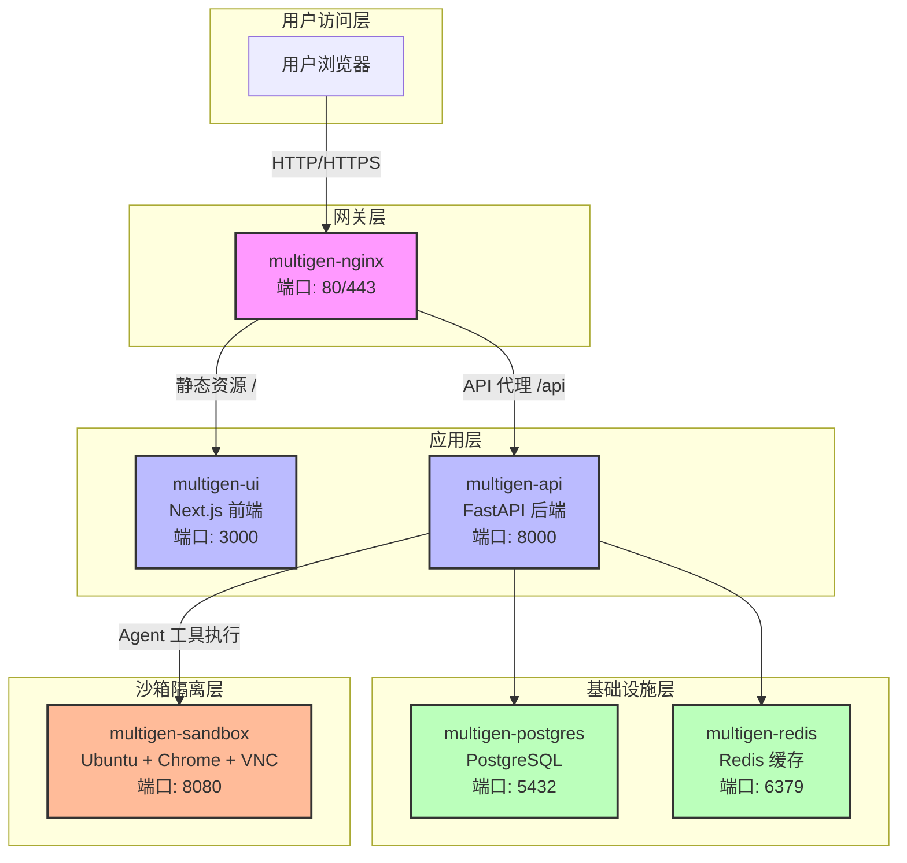
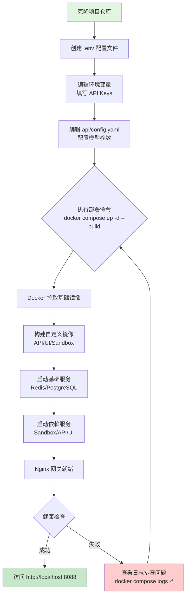

本文档将引导你从零开始部署 MultiGen 系统。你将了解系统的核心组件架构、掌握环境配置要点、并通过 Docker Compose 实现一键部署。完成本指南后，你将能够访问完整的 AI Agent 系统并开始探索其功能特性。

## 系统架构概览

MultiGen 采用微服务架构，通过 Docker Compose 编排六个核心服务容器。Nginx 作为唯一对外暴露的网关，将请求路由至前端 UI（Next.js）或后端 API（FastAPI），后者进一步协调数据库、缓存和沙箱服务完成复杂的 Agent 任务执行。



系统通过分层隔离实现了清晰的职责边界，Nginx 网关统一处理外部流量，应用层专注业务逻辑，基础设施层提供数据持久化支撑，而沙箱层则确保 Agent 工具执行的安全隔离。这种架构设计既简化了本地开发环境的搭建，又为生产环境部署提供了灵活的扩展能力。

Sources: [docker-compose.yml](docker-compose.yml#L1-L154)

## 环境准备

在开始部署之前，请确保你的开发环境满足以下最低要求。这些前置条件是系统正常运行的基础，务必在继续之前完成安装和验证。

| 工具组件 | 最低版本 | 用途说明 | 验证命令 |
|---------|---------|---------|---------|
| Docker | 20.10+ | 容器运行时引擎 | `docker --version` |
| Docker Compose | 2.0+ | 多容器编排工具 | `docker compose version` |
| Git | 任意版本 | 代码仓库克隆（可选） | `git --version` |
| 磁盘空间 | 8GB+ | 镜像与数据卷存储 | `df -h` |
| 内存 | 4GB+ | 容器运行内存需求 | 系统监控工具 |

**关键提示**：由于沙箱服务需要运行 Chrome 浏览器和 VNC 服务，建议主机内存至少保留 4GB 可用空间。如果你的系统资源有限，可以通过修改 `docker-compose.yml` 调整容器的内存限制参数。

Sources: [README.md](README.md#L41-L45)

## 配置环境变量

环境变量配置是系统部署的核心环节。MultiGen 将所有配置集中管理在项目根目录的 `.env` 文件中，通过环境变量注入机制实现配置与代码的分离。

### 创建配置文件

首先，从示例文件创建你的环境配置：

```bash
# 在项目根目录执行
cp .env.example .env
```

### 核心配置项说明

以下表格列出了必须或重要的配置项及其作用。**带 ⚠️ 标记的配置项必须正确填写，否则系统无法正常启动**。

| 配置项 | 是否必填 | 默认值 | 说明 |
|-------|---------|--------|------|
| ⚠️ `LLM_PROVIDER` | 是 | `volcano` | LLM 提供商选择（volcano/siliconflow/deepseek） |
| ⚠️ `OPENAI_API_KEY` | 条件必填 | - | 当 LLM_PROVIDER=siliconflow 时必须配置 |
| ⚠️ `VOLCANO_API_KEY` | 条件必填 | - | 当 LLM_PROVIDER=volcano 时必须配置 |
| ⚠️ `VOLCANO_MODEL_NAME` | 条件必填 | - | 火山引擎 LLM 模型名称 |
| `POSTGRES_PASSWORD` | 否 | `postgres` | PostgreSQL 数据库密码 |
| `NGINX_PORT` | 否 | `80` | Nginx 对外访问端口 |
| `LOG_LEVEL` | 否 | `DEBUG` | 日志级别 |

**完整配置示例**（以火山引擎为例）：

```bash
# LLM 提供商配置
LLM_PROVIDER=volcano

# 火山引擎配置
VOLCANO_API_KEY=your_actual_api_key_here
VOLCANO_BASE_URL=https://ark.cn-beijing.volces.com/api/v3
VOLCANO_MODEL_NAME=doubao-seed-2-0-pro-260215
VOLCANO_THINKING_ENABLED=false

# 火山引擎图片生成模型
VOLCANO_IMAGE_MODEL=doubao-seedream-4-5-251128
VOLCANO_VIDEO_MODEL=doubao-seedance-1-5-pro-251215

# 数据库配置（本地部署可使用默认值）
POSTGRES_PASSWORD=postgres
POSTGRES_USER=postgres
POSTGRES_DB=multigen

# 系统配置
NGINX_PORT=8088
LOG_LEVEL=INFO
```

配置文件中的变量将通过 Docker Compose 的 `env_file` 指令自动注入到容器环境中，各个服务会根据变量名进行解析和使用。特别注意 API Key 等敏感信息不要提交到版本控制系统。

Sources: [.env.example](.env.example#L1-L118)

## 配置 AI 模型

除了环境变量，MultiGen 还通过 `api/config.yaml` 文件管理 AI 模型的详细配置，包括模型参数、MCP 服务器连接和 Agent 行为调优。

### LLM 基础配置

打开 `api/config.yaml` 文件，找到 `llm_config` 部分进行修改。以下是一个典型配置示例：

```yaml
llm_config:
  base_url: https://api.deepseek.com/       # API 基础 URL
  api_key: YOUR_DEEPSEEK_API_KEY            # API 密钥
  model_name: deepseek-reasoner             # 模型名称
  temperature: 0.7                          # 生成温度 (0-2)
  max_tokens: 8192                          # 最大生成 token 数
```

### Agent 与 MCP 配置

Agent 配置控制工具调用的行为边界，而 MCP 配置定义了外部工具服务器的连接参数。以下是关键的配置维度：

| 配置项 | 建议值 | 作用说明 |
|-------|--------|---------|
| `agent_config.max_iterations` | 100 | Agent 单次任务最大迭代次数 |
| `agent_config.max_retries` | 3 | API 调用失败重试次数 |
| `agent_config.max_search_results` | 10 | 搜索工具返回结果上限 |
| `mcp_config.mcpServers.*.enabled` | true/false | 启用或禁用特定 MCP 服务器 |
| `mcp_config.mcpServers.*.url` | - | MCP 服务器 HTTP 端点 |

**重要的配置优先级规则**：`.env` 文件中的 `OPENAI_API_KEY`、`VOLCANO_API_KEY` 等变量会覆盖 `config.yaml` 中的 `api_key` 配置。推荐在 `.env` 中管理敏感信息，在 `config.yaml` 中管理模型参数和行为配置。

Sources: [README.md](README.md#L58-L85)

## 一键部署流程

完成配置后，通过以下部署流程启动整个系统。整个过程采用 Docker Compose 自动化编排，无需手动安装任何依赖或数据库。



### 执行部署命令

在项目根目录执行以下命令启动系统：

```bash
# 一键构建并启动所有服务（后台运行）
docker compose up -d --build

# 查看服务启动状态
docker compose ps

# 实时查看所有服务日志
docker compose logs -f

# 查看特定服务日志（API 服务）
docker compose logs -f multigen-api
```

首次启动将涉及镜像拉取和构建，预计耗时 5-15 分钟（取决于网络速度和硬件性能）。当所有容器的状态显示为 `healthy` 或 `running` 时，表示系统已成功启动。

Sources: [docker-compose.yml](docker-compose.yml#L93-L152)

## 验证部署结果

系统启动后，通过以下方式进行功能验证，确保各服务组件正常工作。

### 服务健康检查

| 检查项 | 访问地址 | 预期结果 |
|-------|---------|---------|
| Web UI | `http://localhost:8088` | 显示系统首页界面 |
| API 健康检查 | `http://localhost:8088/api/status` | 返回 `{"status": "ok"}` JSON 响应 |
| 容器健康状态 | `docker compose ps` | 所有服务状态为 `healthy` |

### 常见启动问题排查

如遇服务无法正常启动，请按以下顺序排查：

1. **端口冲突**：检查 `NGINX_PORT` 是否被占用（`lsof -i :8088`）
2. **API Key 无效**：验证 `.env` 中的 API Key 是否正确配置
3. **数据卷权限**：确保 `./logs` 目录有写入权限
4. **镜像构建失败**：查看构建日志定位 Dockerfile 错误

**重置环境**（谨慎操作）：

```bash
# 停止所有服务并删除数据卷（会清除所有数据）
docker compose down -v

# 重新启动
docker compose up -d --build
```

Sources: [README.md](README.md#L112-L138)

## 项目目录结构

了解项目的目录组织有助于后续的开发和定制工作。以下是核心目录的功能说明：

```
MultiGen/
├── api/                    # 后端 API 服务
│   ├── app/                # FastAPI 应用核心代码
│   ├── core/               # 配置管理模块
│   ├── tests/              # 单元测试
│   └── config.yaml         # AI 模型配置文件
├── ui/                     # 前端 UI 服务
│   ├── src/                # Next.js 源代码
│   │   ├── app/            # 页面路由
│   │   ├── components/     # React 组件
│   │   └── providers/      # Context Providers
│   └── public/             # 静态资源
├── sandbox/                # 沙箱服务
│   └── app/                # 沙箱运行时代码
├── nginx/                  # Nginx 配置
│   ├── nginx.conf          # 主配置文件
│   ├── conf.d/             # 站点配置
│   └── ssl/                # SSL 证书目录
├── docker-compose.yml      # 容器编排配置
├── .env                    # 环境变量配置（需创建）
└── .env.example            # 环境变量示例
```

Sources: [README.md](README.md#L19-L37)

## 下一步学习路径

完成快速部署后，建议按以下顺序深入学习系统架构和配置细节：

1. **[系统架构](3-xi-tong-jia-gou)** - 理解 Agent 系统的分层设计和数据流转机制
2. **[环境变量配置](4-huan-jing-bian-liang-pei-zhi)** - 掌握所有配置项的详细含义和最佳实践
3. **[AI 模型配置](5-ai-mo-xing-pei-zhi)** - 深入了解不同 LLM 提供商的配置方法和性能调优

通过系统化的学习路径，你将能够充分理解 MultiGen 的架构设计思想，并为后续的定制开发和生产环境部署打下坚实基础。