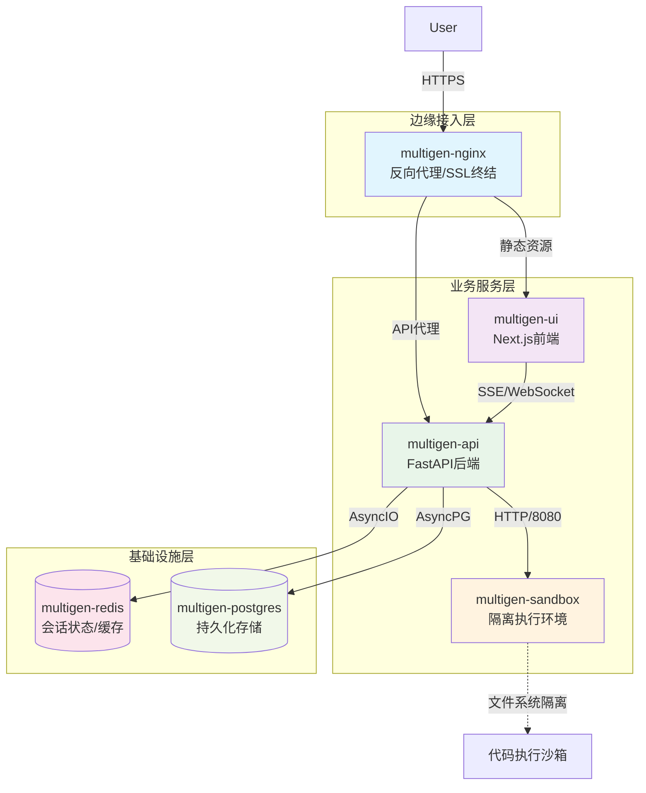
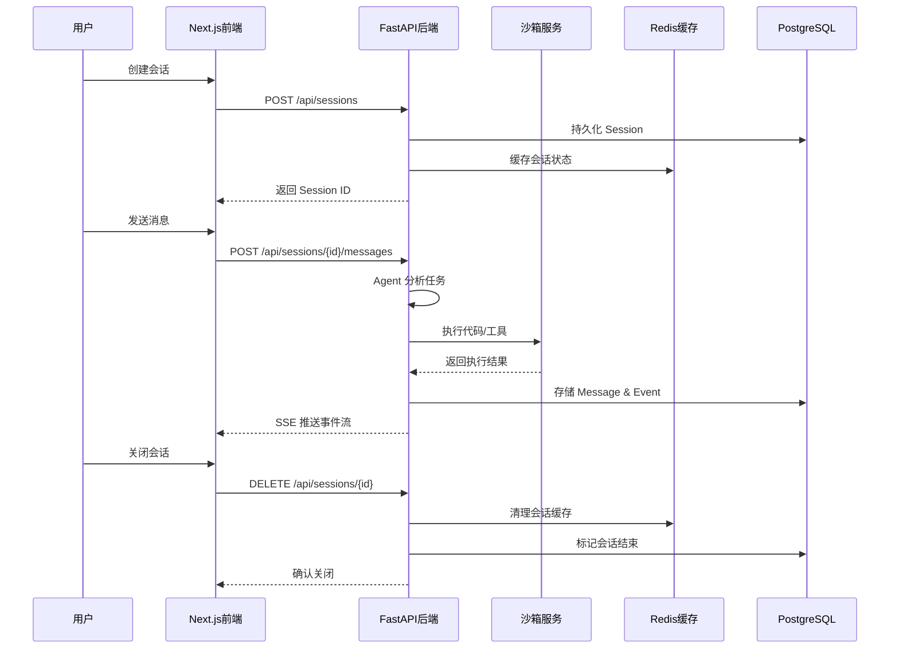

MultiGen 是一个**微服务架构的多智能体系统**，采用前后端分离设计，通过容器化部署实现 Agent 编排、沙箱执行和会话管理的完整闭环。系统核心定位为私有化部署的通用 AI Agent 平台，支持 A2A（Agent-to-Agent）和 MCP（Model Context Protocol）协议，提供安全的代码执行环境与多模型编排能力。

## 服务拓扑与部署架构
系统由六大服务组件构成，通过 Docker Compose 编排形成完整的业务闭环。基础设施层提供持久化存储和状态同步能力，业务服务层实现核心 Agent 编排和沙箱执行，边缘接入层负责流量路由和请求协议转换。每个服务通过健康检查机制保证高可用性，依赖关系形成从基础设施到业务应用到接入网关的清晰分层。



服务依赖链路遵循**健康检查约束**，redis 和 postgres 必须先通过健康检查，sandbox 才能启动，API 依赖全部基础设施就绪后启动，最后 Nginx 作为流量入口完成系统初始化。这种设计确保系统启动顺序的可控性和运行时稳定性。

Sources: [docker-compose.yml](docker-compose.yml#L1-L154)

## 后端分层架构设计
API 服务采用**领域驱动设计**的四层架构模式，实现业务逻辑与技术实现的解耦。从外向内依次为接口层、应用层、领域层和基础设施层，每层职责明确，依赖关系单向流动，保证代码的可测试性和可维护性。

**接口层** 负责协议适配和请求验证，包含 FastAPI 路由定义、RESTful 端点、SSE 事件流和中间件配置。该层处理 HTTP 请求的序列化/反序列化、权限校验和错误响应格式化，不包含业务逻辑。

Sources: [api/app/interfaces/](api/app/interfaces)

**应用层** 编排业务用例和服务协作，包含五个核心服务：AgentService（智能体编排）、SessionService（会话管理）、FileService（文件管理）、AppConfigService（应用配置）、StatusService（状态监控）。该层协调领域对象完成业务流程，管理事务边界和并发控制。

Sources: [api/app/application/services/](api/app/application/services)

**领域层** 封装核心业务规则，包含领域模型、领域服务和仓储接口三部分。领域模型定义了 Session、Message、Plan、Event 等核心实体；领域服务实现了 Agent 任务执行器和各类工具集成；仓储接口抽象了数据访问契约，实现依赖倒置。

Sources: [api/app/domain/](api/app/domain)

**基础设施层** 提供技术实现细节，包含外部服务适配器、持久化机制和日志系统等。该层实现了仓储接口的具体方案（Postgres、Redis）、LLM 提供者集成、沙箱客户端封装、搜索引擎对接等。通过依赖注入机制，基础设施实现可被领域层透明调用。

Sources: [api/app/infrastructure/](api/app/infrastructure)

```
┌─────────────────────────────────────────────────────┐
│              Interfaces Layer (接口层)               │
│  Routes, Schemas, Middleware, Exception Handlers    │
└───────────────────────┬─────────────────────────────┘
                        │ Request/Response
┌───────────────────────┴─────────────────────────────┐
│            Application Layer (应用层)                │
│  AgentService, SessionService, FileService...      │
└───────────────────────┬─────────────────────────────┘
                        │ Domain Objects
┌───────────────────────┴─────────────────────────────┐
│              Domain Layer (领域层)                   │
│  Models, Domain Services, Repository Interfaces    │
└───────────────────────┬─────────────────────────────┘
                        │ Dependency Injection
┌───────────────────────┴─────────────────────────────┐
│          Infrastructure Layer (基础设施层)           │
│  DB Repositories, External Clients, Storage, Log    │
└─────────────────────────────────────────────────────┘
```

启动流程通过 lifespan 上下文管理器编排初始化顺序：首先运行 Alembic 数据库迁移，确保 Schema 同步；然后依次初始化 Redis、PostgreSQL 和 COS 客户端；应用启动后注册清理逻辑，确保 Agent 服务优雅关闭，避免任务中断。这种设计实现了**声明式生命周期管理**。

Sources: [api/app/main.py](api/app/main.py#L37-L75)

## 沙箱隔离执行环境
Sandbox 服务是系统的**代码执行隔离层**，提供可控的 Shell 命令执行和文件管理能力，预装 Chrome、Python、Node.js 等运行时环境，支持 Agent 动态生成和执行代码。该服务独立部署在隔离容器中，通过网络接口与主服务通信，避免恶意代码影响核心系统。

**服务能力**包括三个核心模块：文件模块（增删改查、上传下载）、Shell 模块（命令执行、进程管理）、Supervisor 模块（进程守护、状态监控）。通过 FastAPI 暴露 RESTful 接口，支持跨平台调用。自动扩展超时中间件确保长时间执行的任务不被中断。

Sources: [sandbox/app/main.py](sandbox/app/main.py#L61-L84)

**安全机制**体现在三层隔离：容器级别通过 Docker 网络命名空间隔离网络栈；文件系统级别通过只读挂载和临时卷限制写入范围；进程级别通过 Supervisor 管理子进程生命周期，防止僵尸进程。API 服务通过挂载 Docker Socket 具备动态创建沙箱容器的能力。

Sources: [docker-compose.yml](docker-compose.yml#L70-L71)

## 数据流与通信机制
系统采用**事件驱动的异步通信模型**，前端通过 SSE（Server-Sent Events）订阅后端事件流，后端通过消息队列和 Redis 实现跨服务的任务协调。会话状态实时持久化到数据库，临时计算结果缓存到 Redis，文件资产存储到对象存储或本地存储卷。



**状态管理策略**采用分层存储：热数据（活跃会话状态、任务队列）存 Redis，支持毫秒级读写；温数据（会话历史、消息记录）存 PostgreSQL，支持复杂查询和关联；冷数据（文件资产、日志归档）存对象存储或持久化卷。这种分级策略平衡性能和成本。

Sources: [api/app/infrastructure/storage/](api/app/infrastructure/storage)

## 网络拓扑与安全策略
系统定义专用桥接网络 multigen-network，所有服务接入同一网络平面，通过容器名实现服务发现。Nginx 作为唯一外部入口，监听 80/443 端口，SSL 证书通过卷挂载注入，实现 HTTPS 终结和证书集中管理。

**网络隔离策略**确保沙箱服务不暴露到宿主机端口，仅允许 API 服务通过内部网络访问，降低攻击面。API 服务挂载 Docker Socket 具备容器编排能力，这要求在生产环境中严格控制容器权限和镜像来源，防止容器逃逸风险。

Sources: [docker-compose.yml](docker-compose.yml#L149-L153), [nginx/nginx.conf](nginx/nginx.conf)

## 扩展性设计
系统在三个维度预留扩展能力：**Agent 扩展**通过领域服务层定义标准接口，支持自定义 Tool、Prompt 模板和编排逻辑；**模型扩展**通过 LLM 抽象层支持多供应商切换，配置层统一管理模型参数；**存储扩展**通过仓储模式隔离持久化细节，可替换数据库或对象存储实现而不影响业务代码。

这种架构设计在**业务复杂度与系统复杂度间取得平衡**：DDD 分层保证业务逻辑的清晰性，微服务架构支持独立扩展和演进，容器化部署简化环境管理和运维成本。适合私有化部署场景下的定制化需求和数据安全要求。

Sources: [api/app/domain/services/](api/app/domain/services), [api/app/domain/external/](api/app/domain/external)

## 推荐阅读路径
建议按照以下顺序深入学习系统架构：先掌握 [分层架构设计](10-fen-ceng-jia-gou-she-ji) 理解代码组织方式，再学习 [领域模型定义](11-ling-yu-mo-xing-ding-yi) 了解业务实体设计，随后研究 [Agent 服务实现](13-agent-fu-wu-shi-xian) 掌握核心编排逻辑，最后探索 [沙箱服务集成](18-sha-xiang-fu-wu-ji-cheng) 理解隔离执行机制。每篇文档聚焦特定架构层次，形成完整的知识体系。