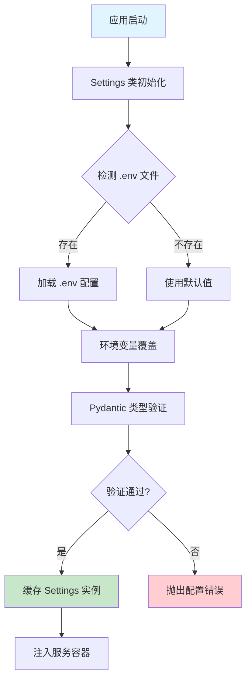
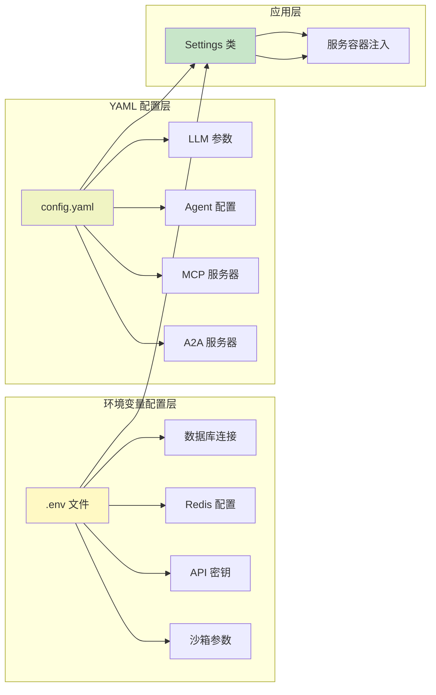

MultiGen 项目采用**多层次配置架构**，通过环境变量与 YAML 文件的组合实现灵活的配置管理。该架构支持开发、测试、生产多种环境切换，并提供完善的敏感信息隔离机制。配置系统以 `.env` 文件为主要载体，由 Pydantic Settings 库提供类型安全的自动加载能力，确保配置值在应用启动时完成验证与注入。

## 配置架构设计

MultiGen 的配置加载遵循**分层覆盖原则**：系统默认值 → `.env` 文件 → 环境变量 → Docker Compose 覆盖，后者优先级递增。这种设计允许开发者通过 `.env` 文件维护本地配置，而在生产环境通过容器环境变量实现差异化部署。所有配置通过 `Settings` 单例类统一管理，利用 LRU 缓存机制避免重复 I/O 操作。

配置类继承自 `BaseSettings`，在 `model_config` 中声明 `.env` 文件路径与编码格式，并通过 `extra="ignore"` 参数忽略未定义的环境变量，避免因多余配置项导致启动失败。这种宽松解析策略在多环境部署场景中尤为重要，允许不同服务共享同一份 `.env.example` 模板而无需完全填充所有字段。

Sources: [config.py](api/core/config.py#L1-L60)

## 项目基础配置

基础配置项控制应用运行模式与日志行为，是所有服务的必填参数。`ENV` 变量区分开发与生产环境，影响错误详情展示与调试工具启用状态；`LOG_LEVEL` 采用标准 Python 日志层级（DEBUG/INFO/WARNING/ERROR/CRITICAL），在生产环境建议设置为 INFO 或 WARNING。

| 变量名 | 类型 | 默认值 | 说明 |
|--------|------|--------|------|
| `ENV` | string | development | 运行环境标识 |
| `LOG_LEVEL` | string | INFO | 日志输出级别，DEBUG 开发期间推荐 |
| `APP_CONFIG_FILEPATH` | string | config.yaml | 配置文件相对路径，相对于应用根目录 |
| `ADMIN_AUTH_REQUIRED` | bool | false | 是否启用管理接口认证 |
| `ADMIN_API_KEY` | string | - | 管理员 API 密钥，认证启用后必须设置 |

认证配置为前后端分离设计：后端通过 `ADMIN_AUTH_REQUIRED` 与 `ADMIN_API_KEY` 实现服务端鉴权，前端对应配置 `NEXT_PUBLIC_ADMIN_LOGIN_REQUIRED` 与 `NEXT_PUBLIC_ADMIN_PASSWORD` 控制登录页面展示。这种双端配置机制允许在演示环境中禁用认证，而在生产环境快速启用完整安全防护。

Sources: [.env.example](.env.example#L1-L9), [config.py](api/core/config.py#L14-L17)

## 数据库与缓存配置

MultiGen 采用 PostgreSQL 作为持久化存储，Redis 作为缓存与会话管理中间件。数据库连接串遵循 SQLAlchemy 异步格式：`postgresql+asyncpg://用户名:密码@主机:端口/数据库名`，在 Docker 部署时主机名替换为容器服务名。

| 变量名 | 类型 | 默认值 | 说明 |
|--------|------|--------|------|
| `SQLALCHEMY_DATABASE_URI` | string | postgresql+asyncpg://... | 异步 PostgreSQL 连接串 |
| `REDIS_HOST` | string | localhost | Redis 服务主机地址 |
| `REDIS_PORT` | int | 6379 | Redis 服务端口 |
| `REDIS_DB` | int | 0 | Redis 数据库编号（0-15） |
| `REDIS_PASSWORD` | string | - | Redis 访问密码，无密码时留空 |

Docker Compose 部署时，数据库与缓存配置通过 `environment` 字段动态覆盖。`docker-compose.yml` 中 `${POSTGRES_USER:-postgres}` 语法的含义是：优先读取环境变量 `POSTGRES_USER`，未定义时使用默认值 `postgres`。这种参数化设计允许通过宿主机环境变量定制容器初始化行为，同时保留合理的默认值兜底。

Sources: [.env.example](.env.example#L11-L19), [docker-compose.yml](docker-compose.yml#L13-L26), [config.py](api/core/config.py#L19-L25)

## 沙箱服务配置

沙箱服务是 MultiGen 执行动态任务的核心组件，为 AI Agent 提供隔离的代码运行环境与浏览器自动化能力。配置涵盖容器生命周期管理（镜像、TTL、网络）与运行时参数（代理、Chrome 参数），在 Docker 环境中通过挂载 `/var/run/docker.sock` 实现容器嵌套创建。

| 变量名 | 类型 | 默认值 | 说明 |
|--------|------|--------|------|
| `SANDBOX_ADDRESS` | string | - | 沙箱服务地址（格式：host:port） |
| `SANDBOX_IMAGE` | string | - | 沙箱容器使用的 Docker 镜像名 |
| `SANDBOX_NAME_PREFIX` | string | - | 动态创建容器的名称前缀 |
| `SANDBOX_TTL_MINUTES` | int | 60 | 沙箱实例存活时长（分钟） |
| `SANDBOX_NETWORK` | string | - | 沙箱容器加入的 Docker 网络 |
| `SANDBOX_CHROME_ARGS` | string | - | Chrome 浏览器启动参数 |
| `SANDBOX_HTTPS_PROXY` | string | - | HTTPS 代理地址 |
| `SANDBOX_HTTP_PROXY` | string | - | HTTP 代理地址 |
| `SANDBOX_NO_PROXY` | string | - | 不走代理的地址列表 |

沙箱代理配置支持企业内网环境下的外网访问需求。`SANDBOX_NO_PROXY` 采用逗号分隔格式指定直连域名或 IP，常用于访问内网服务时绕过代理。容器网络隔离通过 `SANDBOX_NETWORK` 参数保证沙箱实例与主服务在同一 Docker 网络中，实现相互通信而无需暴露端口到宿主机。

Sources: [.env.example](.env.example#L24-L37), [config.py](api/core/config.py#L35-L44), [docker-compose.yml](docker-compose.yml#L28-L41)

## 对象存储配置

腾讯云 COS（Cloud Object Storage）用于存储 AI 生成的图片、视频、3D 模型等媒体文件。配置包含访问凭证（Secret ID/Key）、地域参数与存储桶信息，所有字段均需在控制台创建存储桶后填写。

| 变量名 | 类型 | 默认值 | 说明 |
|--------|------|--------|------|
| `COS_SECRET_ID` | string | - | 腾讯云 API 密钥 ID |
| `COS_SECRET_KEY` | string | - | 腾讯云 API 密钥 |
| `COS_REGION` | string | ap-beijing | 存储桶所在地域 |
| `COS_SCHEME` | string | https | 访问协议（https/http） |
| `COS_BUCKET` | string | - | 存储桶名称（含 APPID） |
| `COS_DOMAIN` | string | - | 自定义 CDN 加速域名 |

`COS_DOMAIN` 配置项支持 CDN 加速场景。当配置了自定义域名并开启 CDN 加速后，系统生成的文件 URL 将使用该域名替换默认的 COS 域名，显著提升大文件访问速度。地域参数 `COS_REGION` 需与创建存储桶时选择的地域一致，常见值包括 `ap-beijing`、`ap-shanghai`、`ap-guangzhou` 等。

Sources: [.env.example](.env.example#L21-L22), [config.py](api/core/config.py#L27-L33)

## LLM 服务配置

MultiGen 支持多 LLM 提供商切换，通过 `LLM_PROVIDER` 变量控制当前使用的模型服务来源。当前支持火山引擎与 SiliconFlow 两种提供商，各自拥有独立的参数命名空间，方便在不同云服务间快速迁移。

### 提供商选择与基础配置

| 变量名 | 类型 | 默认值 | 说明 |
|--------|------|--------|------|
| `LLM_PROVIDER` | string | volcano | LLM 提供商：volcano 或 siliconflow |
| `RECURSION_LIMIT` | int | 200 | LangGraph 多步推理递归上限 |

### 火山引擎配置

火山引擎是字节跳动旗下的 AI 云服务平台，提供 Doubao 系列大模型与多模态生成能力。API Key 从控制台获取后直接设置到 `VOLCANO_API_KEY`，模型名称使用平台提供的模型标识符。

| 变量名 | 类型 | 说明 |
|--------|------|------|
| `VOLCANO_API_KEY` | string | 火山引擎 API 密钥 |
| `VOLCANO_BASE_URL` | string | API 基础 URL（https://ark.cn-beijing.volces.com/api/v3） |
| `VOLCANO_MODEL_NAME` | string | LLM 模型标识（如 doubao-seed-2-0-pro-260215） |
| `VOLCANO_IMAGE_MODEL` | string | 图片生成模型标识 |
| `VOLCANO_EDIT_MODEL` | string | 图片编辑模型标识 |
| `VOLCANO_VIDEO_MODEL` | string | 视频生成模型标识 |
| `VOLCANO_THINKING_ENABLED` | bool | 是否启用深度思考能力 |

`VOLCANO_THINKING_ENABLED` 控制是否启用模型的深度推理能力。当设置为 `true` 时，模型会在生成最终回答前先输出思考过程，适合需要复杂逻辑推理的任务场景，但会增加响应延迟与 Token 消耗。

Sources: [.env.example](.env.example#L43-L80), [config.yaml](api/config.yaml#L1-L7)

### SiliconFlow 配置

SiliconFlow 是兼容 OpenAI API 格式的模型服务商，支持 DeepSeek、Qwen 等开源大模型。配置方式与 OpenAI 标准接口一致，通过 `OPENAI_API_KEY` 与 `OPENAI_BASE_URL` 连接服务。

| 变量名 | 类型 | 说明 |
|--------|------|------|
| `OPENAI_API_KEY` | string | SiliconFlow API 密钥 |
| `OPENAI_BASE_URL` | string | API 基础 URL（https://api.siliconflow.cn/v1） |
| `MODEL_NAME` | string | LLM 模型标识（如 deepseek-ai/DeepSeek-V3.1-Terminus） |
| `IMAGE_MODEL_NAME` | string | 图片生成模型标识 |
| `EDIT_IMAGE_MODEL_NAME` | string | 图片编辑模型标识 |
| `BASE_URL` | string | 本地服务器地址，用于图片编辑接口拼接 URL |

`BASE_URL` 配置项在图片编辑功能中至关重要：编辑模型需要通过 HTTP URL 访问原始图片，该变量告诉系统如何将本地 `/storage/` 路径转换为可访问的完整 URL。在本地开发环境设置为 `http://localhost:8000`，生产环境则配置为实际部署域名。

Sources: [.env.example](.env.example#L45-L54)

## 多模态服务配置

除了核心 LLM 服务，MultiGen 集成了腾讯 AI3D、阿里百炼 TTS、ComfyUI 等专业多模态服务，各自拥有独立的配置命名空间。这些服务按需启用，未配置时相关功能自动降级或禁用。

### 腾讯 AI3D 配置

腾讯云混元生 3D API 用于从文本或图片生成三维模型，需在腾讯云控制台开通服务并获取 API Key。

| 变量名 | 类型 | 说明 |
|--------|------|------|
| `TENCENT_AI3D_API_KEY` | string | 腾讯 AI3D API 密钥 |
| `TENCENT_AI3D_BASE_URL` | string | API 地址（https://api.ai3d.cloud.tencent.com） |

### 阿里百炼 TTS 配置

阿里百炼提供 Qwen-TTS 文本转语音服务，支持中英文语音合成。国内版与国际版使用不同的 `BASE_URL`，选择时需考虑访问延迟与合规要求。

| 变量名 | 类型 | 说明 |
|--------|------|------|
| `DASHSCOPE_API_KEY` | string | 阿里云 DashScope API 密钥 |
| `DASHSCOPE_BASE_URL` | string | 国内版或国际版 API 地址 |

### ComfyUI 虚拟人生成配置

ComfyUI 是基于节点的 Stable Diffusion 图形化工具，通过自定义工作流实现虚拟人生成。配置包含服务器地址与工作流 JSON 文件路径，工作流文件可通过工具参数动态传入。

| 变量名 | 类型 | 说明 |
|--------|------|------|
| `COMFYUI_SERVER_ADDRESS` | string | ComfyUI 服务地址（支持域名或完整 URL） |
| `COMFYUI_WORKFLOW_PATH` | string | 工作流 JSON 文件路径（可选） |

Sources: [.env.example](.env.example#L82-L103)

## 调试与 Mock 模式

Mock 模式为开发调试提供离线环境支持，当 `MOCK_MODE` 设置为 `true` 时，所有生成类接口返回预设的静态资源而非调用真实 API。该机制在 CI/CD 流水线、前端开发、API 穷尽测试等场景中尤为实用。

| 变量名 | 类型 | 说明 |
|--------|------|------|
| `MOCK_MODE` | bool | 是否启用 Mock 模式 |
| `MOCK_IMAGE_PATH` | string | Mock 图片路径 |
| `MOCK_VIDEO_PATH` | string | Mock 视频路径 |
| `MOCK_MODEL_PATH` | string | Mock 3D 模型目录路径 |

Mock 资源路径必须位于 `/storage/` 目录下的对应子目录中，确保文件访问权限正常。启用 Mock 模式时，三个路径配置项必须完整填写，否则在相关功能调用时将抛出配置错误异常。

Sources: [.env.example](.env.example#L105-L118)

## 配置文件层次关系

MultiGen 的配置系统由两层文件构成：`.env` 文件管理环境变量形式的敏感配置，`config.yaml` 文件管理结构化的业务配置。两者通过 `APP_CONFIG_FILEPATH` 变量建立关联，应用启动时先加载 `.env`，再根据其中的路径提示加载 YAML 配置。

`config.yaml` 文件包含的配置项多为非敏感参数，如模型温度、最大迭代次数、MCP 服务器列表等。该文件适合纳入版本控制系统，便于团队共享业务配置。而 `.env` 文件因包含密钥信息，应添加到 `.gitignore` 避免泄露风险，仅提供 `.env.example` 作为配置模板。

Sources: [config.yaml](api/config.yaml#L1-L34), [config.py](api/core/config.py#L14-L17)

## 部署环境配置实践

Docker Compose 部署时，环境变量通过三种方式注入：`env_file` 指定文件、`environment` 显式声明、构建参数 `args` 传递。`docker-compose.yml` 中 API 服务使用 `env_file: - .env` 加载完整配置文件，同时通过 `environment` 字段覆盖网络相关变量，使容器内服务能够通过 Docker 网络别名相互访问。

网络配置覆盖是容器化部署的关键技术点：`.env` 文件中的 `REDIS_HOST=localhost` 适用于本地开发，但在 Docker 环境下必须覆盖为 `REDIS_HOST=multigen-redis`（容器服务名）。同理，数据库连接串中的主机名从 `localhost` 变更为 `multigen-postgres`，沙箱地址从本地变更为 `multigen-sandbox:8080`。这种覆盖机制在 `docker-compose.yml` 中统一完成，开发者无需维护多份配置文件。

Sources: [docker-compose.yml](docker-compose.yml#L43-L62)

## 后续配置步骤

完成环境变量配置后，您需要根据选择的 LLM 提供商进行详细的模型参数调整。配置指南请参阅 [AI 模型配置](5-ai-mo-xing-pei-zhi)，其中包含各提供商的模型选型建议、参数调优策略以及多模态模型的联动配置方法。若需了解配置如何在系统架构中发挥作用，建议阅读 [系统架构](3-xi-tong-jia-gou) 掌握全局视角。