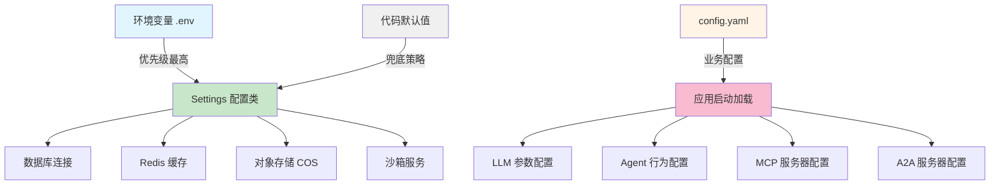
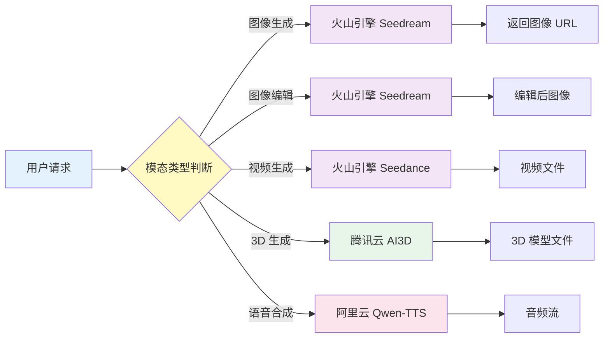

MultiGen 采用**多提供商架构**，支持火山引擎、SiliconFlow、DeepSeek 等多种 AI 服务商，通过配置文件和环境变量实现灵活切换。系统将 AI 能力分为**语言模型**、**图像生成**、**视频生成**、**3D 生成**和**语音合成**五大模块，每个模块均可独立配置，满足不同场景的算力需求与成本优化策略。

Sources: [config.yaml](api/config.yaml#L1-L34), [.env.example](.env.example#L1-L118), [config.py](api/core/config.py#L1-L60)

## 配置架构设计

MultiGen 的配置系统采用**三层加载机制**：环境变量 → YAML 配置文件 → 代码默认值，优先级依次递减。核心配置通过 `core/config.py` 中的 `Settings` 类统一管理，使用 Pydantic V2 的 `BaseSettings` 实现类型安全的环境变量绑定，同时通过 `config.yaml` 文件存储 LLM 模型参数、Agent 行为配置和 MCP/A2A 服务器连接信息。这种设计实现了**敏感信息与业务配置分离**：API Key、数据库密码等通过 `.env` 文件管理，而模型温度参数、最大迭代次数等业务逻辑配置则由 YAML 文件控制，便于不同环境的差异化部署。

Sources: [config.py](api/core/config.py#L11-L50), [config.yaml](api/config.yaml#L1-L34)



## 语言模型配置

系统通过 `LLM_PROVIDER` 环境变量实现**提供商热切换**，当前支持 volcano（火山引擎）和 siliconflow（SiliconFlow）两种模式。每种提供商对应不同的模型体系和 API 端点，但保持统一的调用接口。火山引擎默认使用 `doubao-seed-2-0-pro-260215` 模型，支持深度思考能力的开启（`VOLCANO_THINKING_ENABLED`），适用于复杂推理任务；SiliconFlow 则深度集成 DeepSeek-V3.1-Terminus，提供更高性价比的通用对话能力。配置时需要注意**API Key 保密**和**区域选择**：火山引擎使用国内 `ark.cn-beijing.volces.com` 端点，而 SiliconFlow 的国际版提供更高可用性。

Sources: [.env.example](.env.example#L25-L53), [config.yaml](api/config.yaml#L2-L8)

| 配置项 | 火山引擎（Volcano） | SiliconFlow | 说明 |
|--------|---------------------|-------------|------|
| **提供商标识** | `volcano` | `siliconflow` | 通过 `LLM_PROVIDER` 设置 |
| **API 端点** | `https://ark.cn-beijing.volces.com/api/v3` | `https://api.siliconflow.cn/v1` | 区域化部署支持 |
| **默认模型** | `doubao-seed-2-0-pro-260215` | `deepseek-ai/DeepSeek-V3.1-Terminus` | 支持多模型切换 |
| **推理增强** | `VOLCANO_THINKING_ENABLED` | 不支持 | 火山引擎独有深度思考 |
| **配置文件模型** | `deepseek-reasoner` | - | YAML 文件独立配置 |
| **温度参数** | `0.7` | `0.7` | 控制输出随机性 |
| **最大令牌** | `8192` | 间接控制 | 限制响应长度 |

**配置示例（火山引擎模式）**：
```bash
# .env 文件配置
LLM_PROVIDER=volcano
VOLCANO_API_KEY=your_api_key_here
VOLCANO_BASE_URL=https://ark.cn-beijing.volces.com/api/v3
VOLCANO_MODEL_NAME=doubao-seed-2-0-pro-260215
VOLCANO_THINKING_ENABLED=true
```

Sources: [.env.example](.env.example#L37-L45)

**配置示例（SiliconFlow 模式）**：
```bash
# .env 文件配置
LLM_PROVIDER=siliconflow
OPENAI_API_KEY=your_api_key_here
OPENAI_BASE_URL=https://api.siliconflow.cn/v1
MODEL_NAME=deepseek-ai/DeepSeek-V3.1-Terminus
```

Sources: [.env.example](.env.example#L26-L31)

## 多模态生成配置

MultiGen 的核心优势在于**统一的多模态生成管道**，涵盖图像、视频、3D 模型和语音合成四大能力。图像生成采用火山引擎 `doubao-seedream-4-5-251128` 模型，同时支持文生图和图像编辑功能；视频生成使用最新的 `doubao-seedance-1-5-pro-251215` 模型，支持文生视频、图生视频-首帧、首尾帧三种模式；3D 生成集成腾讯云 AI3D 服务，提供高质量的三维模型生成能力；语音合成则接入阿里云百炼 Qwen-TTS，支持多语种和多音色选择。所有生成服务均通过环境变量独立配置，便于按需启用或替换服务商。

Sources: [.env.example](.env.example#L47-L75)



### 图像与视频生成配置

火山引擎的图像生成服务通过两个模型实现：`VOLCANO_IMAGE_MODEL` 用于文生图场景，`VOLCANO_EDIT_MODEL` 用于图像编辑（如局部重绘、风格迁移）。视频生成则使用 `VOLCANO_VIDEO_MODEL`，该模型支持**三种子模式**：纯文本描述生成视频（文生视频）、基于首帧图像生成视频（图生视频-首帧）、基于首尾帧图像生成过渡视频（首尾帧模式）。配置时需要注意 `BASE_URL` 参数的正确设置，该参数用于将本地存储路径转换为可访问的完整 URL，确保图像编辑服务能够正确读取和写入文件。

Sources: [.env.example](.env.example#L47-L59)

| 功能模块 | 环境变量 | 默认模型 | 支持能力 |
|----------|----------|----------|----------|
| **图像生成** | `VOLCANO_IMAGE_MODEL` | `doubao-seedream-4-5-251128` | 文生图、风格控制 |
| **图像编辑** | `VOLCANO_EDIT_MODEL` | `doubao-seedream-4-5-251128` | 局部重绘、风格迁移 |
| **视频生成** | `VOLCANO_VIDEO_MODEL` | `doubao-seedance-1-5-pro-251215` | 文生视频、图生视频、首尾帧 |
| **SiliconFlow 图像** | `IMAGE_MODEL_NAME` | `Qwen/Qwen-Image` | 备用图像生成方案 |
| **SiliconFlow 编辑** | `EDIT_IMAGE_MODEL_NAME` | `Qwen/Qwen-Image-Edit-2509` | 备用图像编辑方案 |

### 3D 与语音合成配置

腾讯云 AI3D 服务提供**高质量三维模型生成**能力，通过 `TENCENT_AI3D_API_KEY` 和 `TENCENT_AI3D_BASE_URL` 进行认证连接，支持文本描述生成 3D 模型并输出标准格式文件。阿里云百炼 Qwen-TTS 提供**流式语音合成**服务，通过 `DASHSCOPE_API_KEY` 和 `DASHSCOPE_BASE_URL` 连接，支持国内版（北京）和国际版（新加坡）两种端点，`BASE_URL` 选择原则是**就近部署**：国内用户使用 `dashscope.aliyuncs.com`，海外用户使用 `dashscope-intl.aliyuncs.com`，以减少网络延迟并提高稳定性。

Sources: [.env.example](.env.example#L61-L75)

**3D 生成配置示例**：
```bash
TENCENT_AI3D_API_KEY=your_tencent_api_key
TENCENT_AI3D_BASE_URL=https://api.ai3d.cloud.tencent.com
```

**语音合成配置示例**：
```bash
DASHSCOPE_API_KEY=your_dashscope_api_key
DASHSCOPE_BASE_URL=https://dashscope.aliyuncs.com  # 国内版
# DASHSCOPE_BASE_URL=https://dashscope-intl.aliyuncs.com  # 国际版
```

Sources: [.env.example](.env.example#L61-L69)

## Agent 行为配置

Agent 配置通过 `config.yaml` 文件进行管理，包含**迭代控制**、**重试策略**和**搜索限制**三大核心参数。`max_iterations` 设置为 10000 次，为复杂多步骤推理任务提供充足的迭代空间；`max_retries` 设为 3 次，在 API 调用失败时自动重试以提高系统鲁棒性；`max_search_results` 限制搜索引擎返回的最大结果数为 10 条，避免信息过载并提高响应速度。这些参数直接影响 Agent 的**任务执行循环**和**错误恢复能力**，在生产环境调优时需要根据任务复杂度和 API 稳定性进行平衡。

Sources: [config.yaml](api/config.yaml#L9-L13)

| 配置参数 | 默认值 | 作用域 | 调优建议 |
|----------|--------|--------|----------|
| **max_iterations** | 10000 | Agent 推理循环 | 复杂任务可上调至 20000，简单任务降至 5000 |
| **max_retries** | 3 | API 调用失败重试 | 网络不稳定环境可调至 5，稳定环境保持默认 |
| **max_search_results** | 10 | 搜索引擎返回限制 | 信息密集型任务可调至 20，速度优先降至 5 |
| **temperature** | 0.7 | LLM 输出随机性 | 创意生成场景调至 0.9，精确推理降至 0.3 |
| **max_tokens** | 8192 | LLM 响应长度限制 | 长文本生成任务可调至 16000 |

## 外部服务集成配置

MultiGen 通过 **MCP（Model Context Protocol）** 和 **A2A（Agent-to-Agent）** 协议实现外部服务集成。MCP 服务器配置支持 `streamable_http` 传输方式，当前预配置了高德地图（`amap-maps-streamableHTTP`）和 Jina AI（`jina-mcp-server`）两个服务，分别提供地理位置查询和网页内容提取能力。每个 MCP 服务器配置包含 `transport`、`enabled`、`url` 和 `headers` 字段，其中 `headers` 用于传递认证信息（如 Bearer Token）。A2A 服务器配置通过 `a2a_servers` 数组管理，当前为空数组，可按需添加 Agent 间通信节点。

Sources: [config.yaml](api/config.yaml#L14-L34)

**MCP 服务器配置结构**：
```yaml
mcp_config:
  mcpServers:
    amap-maps-streamableHTTP:
      transport: streamable_http    # 传输协议
      enabled: true                 # 启用状态
      url: https://mcp.amap.com/mcp?key=your_key  # 服务端点
      headers: null                 # 认证头信息
    
    jina-mcp-server:
      transport: streamable_http
      enabled: true
      url: https://mcp.jina.ai/v1
      headers:
        Authorization: Bearer your_token  # Bearer 认证
```

Sources: [config.yaml](api/config.yaml#L14-L34)

## 配置最佳实践

**生产环境部署**时应遵循**最小权限原则**和**敏感信息隔离**策略：`.env` 文件仅存储 API Key、数据库密码等机密信息，并通过 `.gitignore` 排除版本控制；`config.yaml` 文件存储业务逻辑参数，可安全提交至代码仓库。多环境部署时建议采用**环境变量覆盖**机制：开发环境使用 `.env.development`，生产环境使用 `.env.production`，通过容器编排系统（如 Kubernetes ConfigMap）动态注入环境变量。调试阶段可启用 `MOCK_MODE=true`，配合 `MOCK_IMAGE_PATH`、`MOCK_VIDEO_PATH`、`MOCK_MODEL_PATH` 参数，在不消耗真实 API 配额的情况下快速验证 Agent 逻辑。

Sources: [.env.example](.env.example#L94-L118), [.gitignore](.gitignore)

**配置验证清单**：
- ✅ `.env` 文件已创建并填写真实 API Key
- ✅ `LLM_PROVIDER` 与对应的 API Key 配置一致
- ✅ `BASE_URL` 已正确设置（图像编辑场景必需）
- ✅ 火山引擎区域端点已根据部署位置选择
- ✅ 环境变量已通过 `Settings` 类正确加载
- ✅ MCP 服务器认证信息已配置
- ✅ 生产环境 `.env` 文件已加入 `.gitignore`

Sources: [config.py](api/core/config.py#L47-L53)

## 延伸阅读

配置完成后，建议按照以下顺序深入理解系统架构：

1. **[环境变量配置](4-huan-jing-bian-liang-pei-zhi)** - 了解完整的 `.env` 文件配置项和数据库、Redis、对象存储等基础服务配置
2. **[LLM 集成](17-llm-ji-cheng)** - 深入理解 LLM 提供商的代码实现和统一调用接口
3. **[Agent 系统设计](6-agent-xi-tong-she-ji)** - 探索 Agent 如何使用这些配置执行复杂推理任务
4. **[MCP 与 A2A 协议](7-a2a-yu-mcp-xie-yi)** - 学习外部服务集成的协议层实现细节