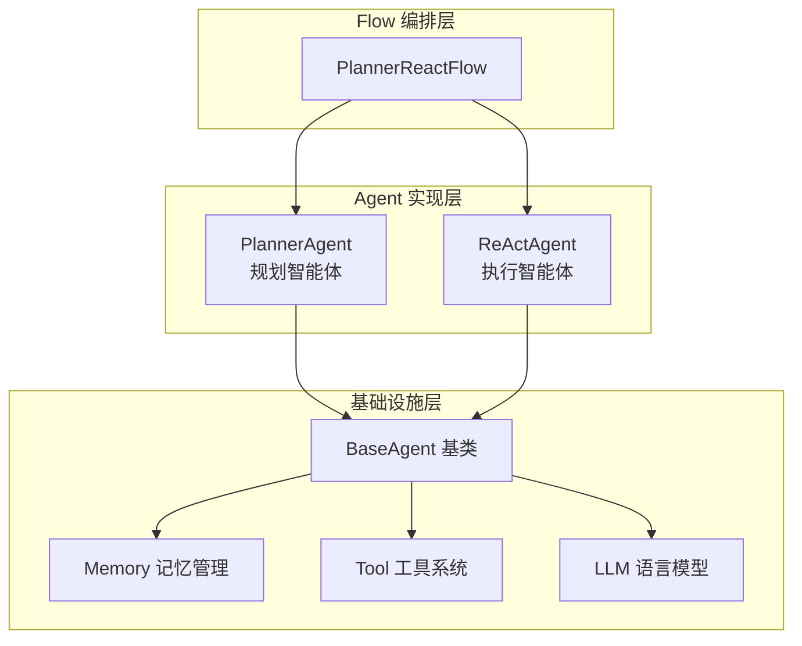
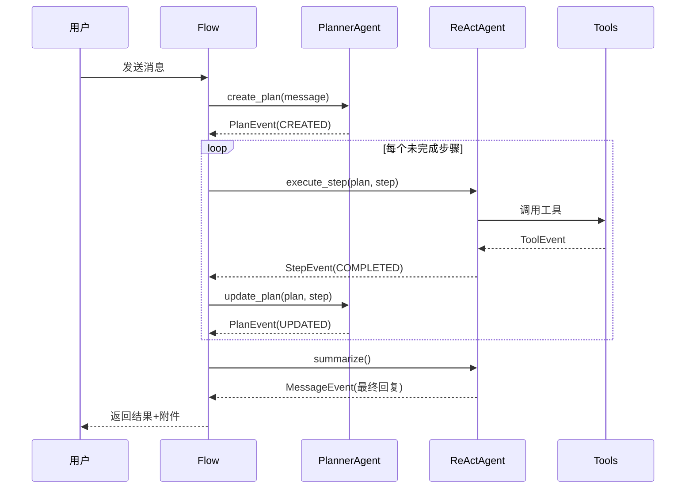

MultiGen 的 Agent 系统采用分层抽象与职责明确的架构设计，将复杂的多模态任务编排为协作式智能体Workflow。系统通过 **BaseAgent 基类** 定义统一执行模型，在 ReActAgent 与 PlannerAgent 两个具体实现中分别承载 **任务执行** 与 **计划编排** 的核心职责，支撑 Planner-Executor 循环的协作流程。

## 架构概览

Agent 系统整体采用 **抽象基类 → 具体实现 → Flow 编排** 的三层结构。BaseAgent 提供记忆管理、LLM 调用、工具解析、事件生成等基础设施；ReActAgent 与 PlannerAgent 在此基础上实现 **步骤执行** 与 **规划更新** 的业务逻辑；PlannerReActFlow 则串联两者形成"规划-执行-更新-执行"的迭代循环，驱动复杂任务的分解与落地。

Sources: [base.py](api/app/domain/services/agents/base.py#L1-L200), [planner.py](api/app/domain/services/agents/planner.py#L39-L114), [react.py](api/app/domain/services/agents/react.py#L25-L124), [base.py](api/app/domain/services/flows/base.py#L1-L1)

## BaseAgent 核心设计

BaseAgent 作为所有智能体的抽象基类，封装了 **记忆管理、LLM 调用、工具解析、错误重试、事件处理** 五大核心职责。其采用依赖注入模式接收 UoW 工厂、会话ID、配置对象、LLM 实例、JSON 解析器与工具列表，在初始化阶段构建完整的执行上下文。关键设计要点包括：

- **记忆管理**：通过 `Memory` 对象维护历史对话，支持上下文窗口溢出时的自动压缩与摘要，确保 LLM 调用的 Token 预算始终在有效范围内
- **LLM 调用包装**：`_invoke_llm` 方法实现了完整的调用-重试-错误处理循环，自动处理空响应、工具调用、DeepSeek 推理模型等兼容性问题
- **工具名称纠错**：通过 `_resolve_tool` 实现基于归一化与模糊匹配的工具名自动纠正，提升系统对 LLM 幻觉工具名的容错性

| 核心属性 | 类型 | 职责说明 |
|---------|------|---------|
| `_memory` | Memory | 会话历史与上下文管理，支持动态压缩 |
| `_llm` | LLM | 语言模型协议实例，支持流式与结构化输出 |
| `_tools` | List[BaseTool] | 工具集合，提供工具 Schema 与执行接口 |
| `_json_parser` | JSONParser | JSON 结构化输出解析器，支持修复模式 |
| `_agent_config` | AgentConfig | 智能体配置对象，控制重试次数与参数阈值 |

Sources: [base.py](api/app/domain/services/agents/base.py#L24-L52), [base.py](api/app/domain/services/agents/base.py#L121-L192), [memory.py](api/app/domain/models/memory.py#L1-L1)

## ReActAgent：执行智能体

ReActAgent 继承 BaseAgent，实现 **基于 ReAct 范式的子任务执行**。其核心方法 `execute_step` 接收 Plan 对象与 Step 对象，通过结构化提示词驱动 LLM 执行具体步骤，迭代返回 ToolEvent、MessageEvent、StepEvent 等事件流。关键特性包括：

- **JSON 结构化输出**：强制 LLM 以 JSON 格式返回执行结果，通过 JSONParser 自动修复格式错误
- **步骤状态追踪**：自动管理 Step 的状态流转（PENDING → RUNNING → COMPLETED/FAILED），并在失败时回填错误信息
- **用户交互暂停**：检测 `message_ask_user` 工具调用，返回 WaitEvent 暂停执行流，等待用户输入后恢复

`summarize` 方法则在所有步骤完成后，将历史执行结果通过 LLM 汇总为最终消息与附件，完成任务的完整交付。

Sources: [react.py](api/app/domain/services/agents/react.py#L25-L124), [react.py](api/app/domain/services/prompts/react.py#L1-L1)

## PlannerAgent：规划智能体

PlannerAgent 负责将用户需求拆解为可执行的子步骤序列。其核心方法 `create_plan` 通过模板提示词驱动 LLM 生成结构化的 Plan 对象，`update_plan` 方法则在 ReActAgent 执行完每个步骤后，根据执行结果动态调整剩余步骤。设计特点包括：

- **无工具调用模式**：设置 `_tool_choice = "none"`，规划阶段专注于推理而非工具执行
- **JSON 结构化输出**：返回 Plan 对象包含步骤列表、语言偏好、任务摘要等字段
- **动态规划更新**：保留历史已完成步骤，仅替换未完成部分的步骤序列，实现增量式规划调整

PlannerAgent 与 ReActAgent 的协作形成 **Plan-Execute-Update 循环**：PlannerAgent 生成初始计划 → ReActAgent 执行第一个步骤 → PlannerAgent 根据执行结果更新计划 → ReActAgent 执行下一步骤 → 循环至所有步骤完成 → ReActAgent 汇总生成最终回复。

Sources: [planner.py](api/app/domain/services/agents/planner.py#L39-L114), [planner.py](api/app/domain/services/prompts/planner.py#L1-L1), [planner.py](api/app/domain/services/agents/planner.py#L17-L34)

## 工具系统与事件流

Agent 系统通过 BaseTool 抽象类定义工具接口，每个工具实例可提供多个工具函数（Schema 声明 + 执行逻辑）。当前系统集成了图像生成、视频生成、音频合成、文件操作、浏览器自动化、搜索引擎等二十余种多模态工具。工具执行产生的 ToolEvent 包含 CALLING 与 CALLED 两个状态，分别表示工具调用开始与完成，Flow 层可据此向用户实时推送进度。

系统通过事件流（AsyncGenerator[BaseEvent]）实现 Agent 与 Flow 的解耦。BaseEvent 作为基类派生出多种事件类型：

| 事件类型 | 携带数据 | 使用场景 |
|---------|---------|---------|
| PlanEvent | Plan 对象 + 状态 | 规划创建与更新通知 |
| StepEvent | Step 对象 + 状态 | 步骤执行状态变更 |
| ToolEvent | 工具名、参数、结果 | 工具调用过程推送 |
| MessageEvent | 消息内容 + 附件 | 中间消息与最终回复 |
| ErrorEvent | 错误信息 | 异常情况通知 |
| WaitEvent | 无 | 标记需要用户输入的暂停点 |

Sources: [base.py](api/app/domain/services/tools/base.py#L1-L1), [event.py](api/app/domain/models/event.py#L1-L1), [tools](api/app/domain/services/tools#L1-L1)

## Agent 服务层集成

应用层通过 AgentService 封装 Agent 系统的实例化与编排。服务层负责注入基础设施依赖（LLM、数据库、消息队列、工具实例），并根据配置动态组装 Agent 与 Flow 对象。关键职责包括：

- **依赖注入编排**：创建 LLM 实例、工具集合、Repository 实例，通过工厂模式传递给 Agent 构造函数
- **会话上下文绑定**：根据 session_id 加载历史记忆，确保 Agent 在正确的会话上下文中执行
- **事件流处理**：订阅 Agent 生成的事件流，根据事件类型执行持久化、推送、日志记录等副作用

Sources: [agent_service.py](api/app/application/services/agent_service.py#L1-L1)

## 扩展性设计

Agent 系统通过以下机制支持功能扩展：

1. **新增 Agent 类型**：继承 BaseAgent 实现 `invoke` 方法，定义专用的系统提示词与输出格式，即可接入 PlannerReActFlow 或独立使用
2. **新增工具能力**：实现 BaseTool 接口，注册到工具集合中，Agent 自动获得工具调用能力
3. **新增 Flow 编排**：继承 BaseFlow，自定义 Agent 调用序列与事件处理逻辑，实现不同范式的任务编排

系统在 [领域模型定义](11-ling-yu-mo-xing-ding-yi) 中定义了 Plan、Step、Memory 等核心数据结构，在 [Agent 服务实现](13-agent-fu-wu-shi-xian) 中详细阐述服务层的依赖注入与编排逻辑，在 [A2A 与 MCP 协议](7-a2a-yu-mcp-xie-yi) 中解析 Agent 间通信与外部协议集成机制。