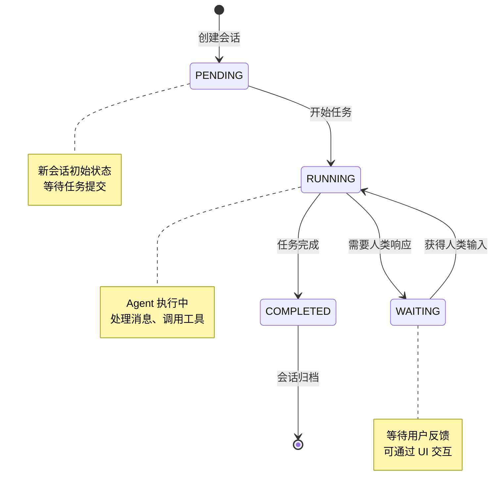
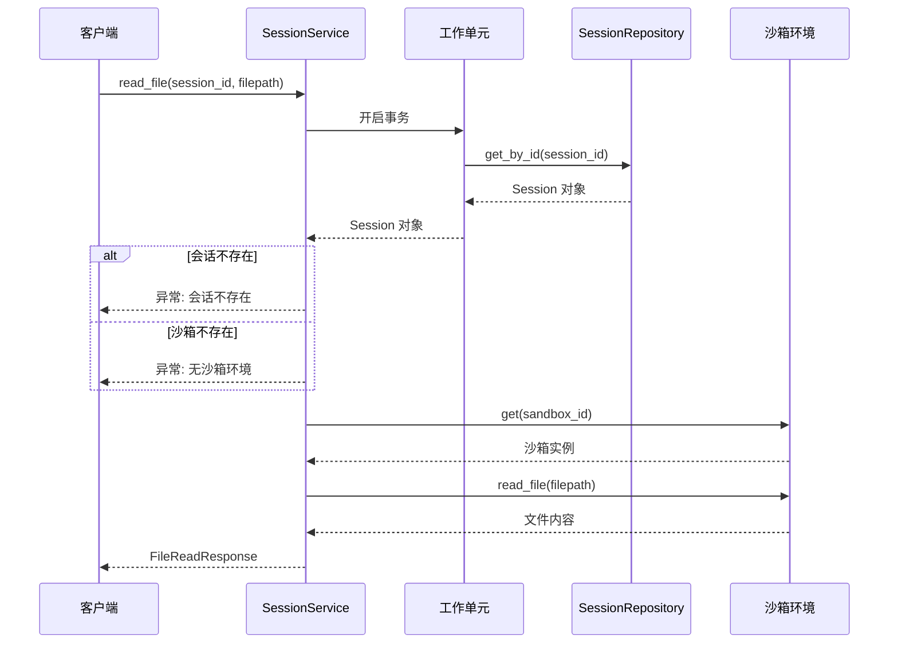

会话管理机制是 MultiGen 系统的核心基础设施，负责维护用户与 Agent 系统之间的交互上下文。该机制采用领域驱动设计（DDD）理念，通过分层架构实现业务逻辑与技术实现的解耦，确保会话状态的一致性、持久化和高效访问。会话不仅是用户请求的容器，更是事件流、文件管理、记忆存储和任务状态的综合载体。

## 会话领域模型

会话领域模型是整个会话管理机制的核心抽象，定义了会话的完整生命周期状态和内部组成结构。**Session 实体**承载着用户与 Agent 系统交互的完整上下文信息，通过枚举类型明确界定会话的四种状态：等待任务（PENDING）、运行中（RUNNING）、等待人类响应（WAITING）和已完成（COMPLETED），为状态机驱动的业务流程提供类型安全保障。

会话模型内部聚合了多个关键组件：**事件列表**记录会话中发生的所有交互事件，**文件列表**管理会话产生的输出文件，**记忆字典**按 Agent 名称存储各智能体的上下文记忆。这种聚合设计使得会话成为系统中的**一致性边界**，所有相关数据的变化都通过会话实体进行协调。模型还包含标题、未读消息计数、最新消息等展示属性，支持前端列表展示和状态更新。

Sources: [session.py](api/app/domain/models/session.py#L1-L47)

### 会话状态流转

会话状态的定义采用 Python 枚举类型，确保状态值的类型安全和代码可读性。每种状态对应着不同的业务场景：PENDING 状态表示新创建的会话尚未开始执行任务；RUNNING 状态标识 Agent 正在执行任务；WAITING 状态表明任务执行过程中需要人类输入或确认；COMPLETED 状态意味着任务已结束。状态流转遵循严格的业务规则，防止非法状态转换。

Sources: [session.py](api/app/domain/models/session.py#L11-L16)

### 会话内部结构

会话模型的字段设计体现了**富领域模型**的设计理念，不仅包含数据属性，还封装了业务行为。`get_latest_plan` 方法展示了这种设计：通过倒序遍历事件列表查找类型为 PlanEvent 的事件，提取最新的执行计划。这种封装避免了业务逻辑泄露到服务层，保持了领域模型的完整性。会话 ID 采用 UUID 生成策略，确保分布式环境下的唯一性。

Sources: [session.py](api/app/domain/models/session.py#L29-L47)

## 会话仓储协议

仓储模式是领域驱动设计中的关键模式，负责抽象数据持久化的技术细节。**SessionRepository 协议**定义了会话持久化的完整契约，包括基本的 CRUD 操作（保存、查询、删除），以及专门的状态更新方法（更新标题、最新消息、未读计数、状态）。这种协议定义使得领域层不依赖具体的数据库实现，便于技术栈的替换和单元测试。

仓储协议还定义了聚合根级别的操作方法：`add_event` 和 `add_file` 方法允许向会话添加事件和文件，`save_memory` 和 `get_memory` 方法管理 Agent 记忆。这些方法体现了**聚合一致性**原则：所有对会话内部集合的修改都必须通过会话仓储进行，确保数据完整性约束不被破坏。仓储方法的设计遵循异步编程模型，适配高并发的 I/O 密集型场景。

Sources: [session_repository.py](api/app/domain/repositories/session_repository.py#L1-L76)

### 仓储方法分类

| 方法类别 | 方法名称 | 功能说明 | 调用场景 |
|---------|---------|---------|---------|
| 基础操作 | `save` | 新增或更新会话 | 创建会话、状态变更 |
| 基础操作 | `get_all` | 获取所有会话列表 | 会话列表展示 |
| 基础操作 | `get_by_id` | 根据 ID 查询会话 | 会话详情查看 |
| 基础操作 | `delete_by_id` | 根据 ID 删除会话 | 会话清理 |
| 状态更新 | `update_title` | 更新会话标题 | 用户重命名 |
| 状态更新 | `update_status` | 更新会话状态 | 任务状态流转 |
| 消息管理 | `update_latest_message` | 更新最新消息 | 新消息到达 |
| 消息管理 | `increment_unread_message_count` | 增加未读计数 | 后台消息推送 |
| 聚合操作 | `add_event` | 添加事件到会话 | 交互事件记录 |
| 聚合操作 | `add_file` | 添加文件到会话 | 文件生成完成 |
| 记忆管理 | `save_memory` | 保存 Agent 记忆 | 对话上下文保存 |

Sources: [session_repository.py](api/app/domain/repositories/session_repository.py#L10-L76)

## 会话服务层

会话服务层是应用层的核心组件，协调领域对象完成具体的业务用例。**SessionService** 类封装了会话管理的完整业务逻辑，通过依赖注入接收工作单元工厂（uow_factory）和沙箱类（sandbox_cls），实现与基础设施层的解耦。服务层的主要职责包括：创建新会话、查询会话列表、管理会话状态、集成沙箱环境、执行权限验证等。

服务层采用**工作单元模式**管理事务边界，每个业务方法通过 `async with self._uow` 上下文管理器开启事务，确保多个仓储操作的原子性。例如 `create_session` 方法：创建 Session 领域对象后，通过工作单元调用仓储的 `save` 方法持久化，事务提交由上下文管理器自动处理。这种设计模式简化了事务管理代码，提高了代码的可维护性。

Sources: [session_service.py](api/app/application/services/session_service.py#L1-L146)

### 会话创建与查询

会话创建流程采用了**工厂方法**模式，通过 Session 的默认工厂函数自动生成 UUID 和初始化时间戳。服务方法 `create_session` 创建标题为"新对话"的空白会话，立即持久化到数据库并返回会话实体。这种设计支持前端在用户尚未输入任务时预先创建会话，优化用户体验。查询方法 `get_all_sessions` 和 `get_session` 提供列表和详情两种视图，通过工作单元调用仓储方法完成数据访问。

Sources: [session_service.py](api/app/application/services/session_service.py#L26-L48)

### 会话删除与权限控制

会话删除方法展示了服务层的**横切关注点**处理能力。删除操作前需要验证管理员权限：检查配置中的 `admin_auth_required` 标志和 `admin_api_key` 参数，确保只有授权用户才能执行删除。权限验证通过后，服务层先查询会话是否存在，再执行删除操作，避免删除不存在的资源引发异常。这种**防御性编程**确保了系统的健壮性和安全性。

Sources: [session_service.py](api/app/application/services/session_service.py#L54-L77)

### 沙箱环境集成

会话服务层承担着**领域对象与外部系统协调**的职责。多个方法涉及沙箱环境的集成：`read_file` 方法根据会话的 `sandbox_id` 获取沙箱实例，调用沙箱的文件读取能力；`read_shell_output` 方法获取 Shell 会话的执行结果；`get_vnc_url` 方法返回远程桌面的访问地址。这种设计将沙箱作为会话的**外部资源**，通过服务层编排两者的交互，保持领域模型的纯净性。

Sources: [session_service.py](api/app/application/services/session_service.py#L94-L146)

## 工作单元模式

工作单元模式是会话管理机制中确保数据一致性的关键设计。**IUnitOfWork 接口**作为事务边界的抽象，封装了多个仓储的协调逻辑。服务层通过工作单元工厂创建工作单元实例，在上下文管理器的作用域内执行多个仓储操作，所有操作要么全部成功提交，要么全部回滚，确保数据库状态的完整性。

工作单元模式的实现通常包含会话仓储、文件仓储等多个聚合根仓储的引用。服务层通过 `self._uow.session` 访问会话仓储，无需直接依赖具体的仓储实现类。这种**依赖倒置**设计使得服务层只依赖于抽象接口，具体的数据库访问逻辑由基础设施层实现，便于切换数据库技术栈或进行单元测试时使用模拟对象。

Sources: [uow.py](api/app/domain/repositories/uow.py#L1)

## 建议阅读顺序

1. **前置知识**：建议先阅读 [分层架构设计](10-fen-ceng-jia-gou-she-ji) 了解系统的整体架构风格，再阅读 [领域模型定义](11-ling-yu-mo-xing-ding-yi) 掌握领域驱动设计的基本概念
2. **深入理解**：阅读 [仓储模式实现](12-cang-chu-mo-shi-shi-xian) 了解工作单元和仓储的具体实现细节，阅读 [会话服务](14-hui-hua-fu-wu) 查看服务层的完整业务逻辑
3. **关联机制**：阅读 [任务执行流程](9-ren-wu-zhi-xing-liu-cheng) 了解会话状态如何随任务执行流转，阅读 [沙箱服务集成](18-sha-xiang-fu-wu-ji-cheng) 理解会话与沙箱环境的协作关系