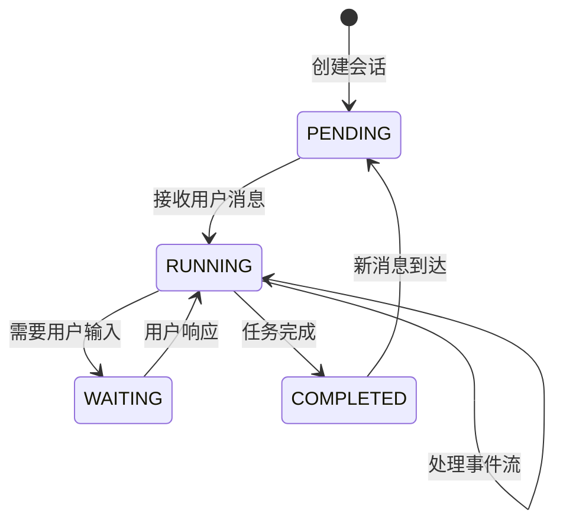
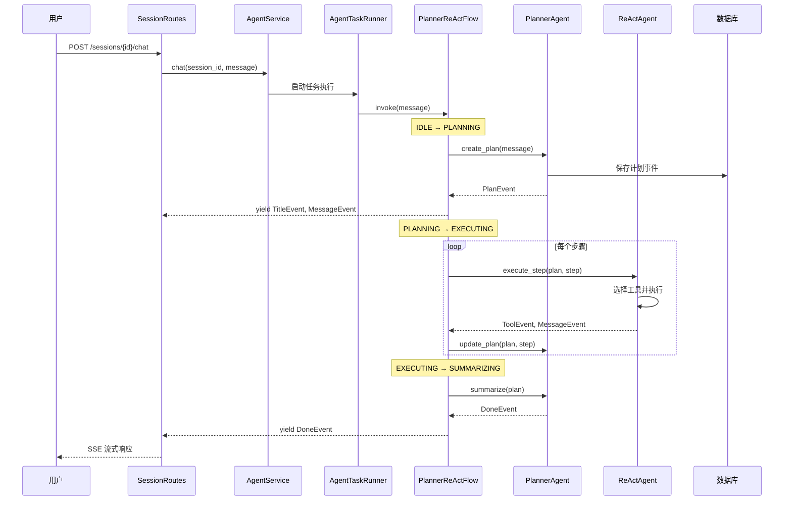

任务执行流程是 MultiGen 系统的核心运行机制，它定义了从用户发送消息到生成多模态内容的完整生命周期。该流程采用事件驱动架构，通过 Planner-ReAct 协作模式实现任务的智能规划与高效执行，支持从简单的文本对话到复杂的多模态内容生成的各类场景。整个流程以会话（Session）为上下文载体，以事件（Event）为通信单元，通过流式响应机制将中间过程实时传递给前端，形成完整的交互闭环。

## 核心架构组件

任务执行流程涉及四个核心组件的协同工作。**会话层**负责任务上下文的持久化，包括事件历史、文件列表、记忆系统等；**服务层**处理业务逻辑编排，协调领域对象完成复杂操作；**Agent 层**实现智能决策能力，分为规划 Agent 与执行 Agent；**工具层**提供原子化执行能力，涵盖文件操作、代码执行、浏览器控制、搜索引擎、多模态生成等多种类型。这种分层设计使得系统具有清晰的职责边界和良好的可扩展性。

Sources: [session.py](api/app/domain/models/session.py#L12-L30) [session_routes.py](api/app/interfaces/endpoints/session_routes.py#L122-L150)

## 状态机模型

任务执行流程通过会话状态机来管理任务生命周期。会话状态包含四个关键阶段：**PENDING** 表示空闲状态，等待用户输入；**RUNNING** 表示任务执行中，Agent 正在处理消息；**WAITING** 表示等待人类响应，需要用户提供确认或补充信息；**COMPLETED** 表示任务已完成。状态转换由 PlannerReActFlow 驱动，确保每个阶段的行为符合预期。

Sources: [session.py](api/app/domain/models/session.py#L8-L11) [planner_react.py](api/app/domain/services/flows/planner_react.py#L61-L72)

## 完整执行流程

任务执行流程遵循严格的六阶段模式，从用户发起请求到最终输出结果，每个阶段都有明确的职责和转换条件。这种设计确保了执行的可预测性和错误恢复能力，使得系统能够处理从简单问答到复杂多步骤任务的各种场景。

Sources: [session_routes.py](api/app/interfaces/endpoints/session_routes.py#L122-L150) [agent_task_runner.py](api/app/domain/services/agent_task_runner.py#L75-L91) [planner_react.py](api/app/domain/services/flows/planner_react.py#L92-L228)

## 阶段一：规划（PLANNING）

规划阶段是任务执行的起点，PlannerAgent 负责分析用户意图并生成结构化的执行计划。该阶段首先检查会话状态，如果会话正在运行则触发回滚机制确保消息历史的正确性；随后调用 LLM 解析任务需求，生成包含标题、描述、步骤列表的 Plan 对象；最后将计划事件持久化并输出会话标题和初始 AI 消息。

**核心技术要点**：Planner 通过系统提示词引导 LLM 使用特定 JSON 格式输出计划；使用 JSONParser 增强结构化输出的可靠性；支持动态工具注入，将文件操作、沙箱执行、多模态生成等工具信息注入提示词；实现记忆压缩机制，在长对话场景下避免上下文长度溢出。

Sources: [planner_react.py](api/app/domain/services/flows/planner_react.py#L95-L133)

## 阶段二：执行（EXECUTING）

执行阶段是任务处理的核心环节，ReActAgent 按照计划步骤依次执行。每个步骤通过工具选择器匹配合适的工具，执行并获得结果，然后更新步骤状态。系统支持浏览器工具、搜索工具、文件工具、Shell 工具、多模态生成工具等多种原子能力，工具执行结果以 ToolEvent 形式返回并添加到会话历史中。

**执行策略**采用了 ReAct（Reasoning and Acting）模式，Agent 在每个步骤都会进行推理-行动循环：首先思考当前步骤应该使用什么工具及参数，然后执行工具调用，最后观察结果并决定下一步行动。这种迭代式执行方式使得系统能够处理需要动态调整策略的复杂任务。

Sources: [planner_react.py](api/app/domain/services/flows/planner_react.py#L135-L172)

## 阶段三：更新（UPDATING）

更新阶段由 PlannerAgent 负责同步计划执行进度。每完成一个步骤，Planner 会评估执行结果并更新计划状态，这一机制使得系统能够处理动态任务场景，当某个步骤执行失败或产生意外结果时，Planner 可以调整后续步骤的策略。更新操作会修改 Plan 对象中对应步骤的状态字段，并将更新后的事件写入数据库。

**容错机制**：系统在沙箱执行等可能失败的操作中实现了指数退避重试策略，重试间隔序列为 (2, 4, 8, 15, 30) 秒，能够识别瞬态错误（如网络超时、连接断开）并自动重试；对于不可恢复的错误，则通过错误事件通知用户并提供详细的错误信息。

Sources: [planner_react.py](api/app/domain/services/flows/planner_react.py#L173-L190)

## 阶段四：总结（SUMMARIZING）

总结阶段当所有步骤执行完毕后触发，PlannerAgent 会评估整体执行结果，生成最终的总结消息。该阶段将计划状态标记为 COMPLETED，通过 DoneEvent 通知前端任务结束，并将会话状态恢复为 PENDING 等待下一轮交互。总结内容包含任务完成情况的概述和生成内容的引用。

**记忆压缩**：在长对话场景中，系统会在每个步骤执行后压缩 Agent 的记忆上下文，避免 token 消耗过大和上下文腐化问题。压缩策略保留关键决策节点和工具执行结果，移除冗余的中间推理过程。

Sources: [planner_react.py](api/app/domain/services/flows/planner_react.py#L191-L210)

## 事件驱动通信机制

整个执行流程采用事件驱动架构，所有状态变化和执行结果都封装为事件对象。事件类型包括：**MessageEvent** 承载对话消息；**PlanEvent** 封装计划信息；**ToolEvent** 记录工具调用及结果；**TitleEvent** 更新会话标题；**DoneEvent** 标记任务完成；**ErrorEvent** 处理异常情况。事件通过 SSE（Server-Sent Events）协议实时推送到前端，实现流式响应效果。

AgentTaskRunner 维护两个消息队列：**input_stream** 接收用户输入事件；**output_stream** 输出执行结果事件。通过这种方式实现了异步非阻塞的消息传递机制，前端可以通过 EventSource API 持续接收事件流，无需轮询即可获得实时反馈。

Sources: [agent_task_runner.py](api/app/domain/services/agent_task_runner.py#L93-L110) [session_routes.py](api/app/interfaces/endpoints/session_routes.py#L130-L148)

## 流程状态对比

| 流状态 | 触发条件 | 主要行为 | 输出事件 |
|--------|----------|----------|----------|
| IDLE | 初始状态/任务完成 | 等待用户输入 | 无 |
| PLANNING | 接收新消息 | PlannerAgent 生成计划 | PlanEvent, TitleEvent, MessageEvent |
| EXECUTING | 计划生成完成 | ReActAgent 执行步骤 | ToolEvent, MessageEvent |
| UPDATING | 步骤执行完成 | 更新计划进度 | PlanEvent |
| SUMMARIZING | 所有步骤完成 | 生成总结消息 | MessageEvent, DoneEvent |
| COMPLETED | 总结完成 | 结束任务流 | DoneEvent |

Sources: [planner_react.py](api/app/domain/services/flows/planner_react.py#L95-L228)

## 工具执行体系

任务执行流程支持丰富的工具集，涵盖多模态内容生成的各个方面。**基础工具**包括文件操作、Shell 执行、浏览器控制、搜索引擎；**生成工具**包括图像生成、视频生成、音频生成、3D 模型生成；**高级工具**包括 MCP（Model Context Protocol）工具和 A2A（Agent-to-Agent）工具，支持与外部系统和远程 Agent 的协作。每个工具都实现了统一的接口规范，包含名称、描述、参数定义和执行方法。

工具执行结果统一封装为 ToolResult 对象，包含执行状态、输出数据、错误信息等字段。成功的结果会被添加到会话历史中，失败的结果则触发重试机制或错误处理流程。工具的输入参数通过 LLM 根据工具描述和上下文自动生成，确保了工具调用的灵活性和智能性。

Sources: [planner_react.py](api/app/domain/services/flows/planner_react.py#L40-L67)

## 会话生命周期管理

会话作为任务执行的上下文容器，其生命周期贯穿整个交互过程。创建会话时系统会生成唯一的 session_id 并初始化所有字段；执行过程中会持续追加事件、更新状态、同步文件；任务可以被删除，删除时会清理相关资源。会话还支持未读消息计数机制，帮助用户追踪任务进度。

**文件同步机制**：用户上传的附件会在执行前同步到沙箱环境，生成的文件会在执行后同步到存储桶，确保前后端都能访问到所需的文件资源。文件路径会被持久化到会话的 files 列表中，支持后续的文件管理和下载操作。

Sources: [session.py](api/app/domain/models/session.py#L12-L47) [session_routes.py](api/app/interfaces/endpoints/session_routes.py#L31-L44)

## 总结

任务执行流程是 MultiGen 系统的核心引擎，通过 Planner-ReAct 双 Agent 协作实现了从意图理解到内容生成的完整闭环。六阶段状态机确保了执行的可控性和可恢复性，事件驱动架构提供了实时反馈能力，丰富的工具生态支持多样化的多模态生成场景。该架构设计充分体现了领域驱动设计的思想，各层职责清晰，易于扩展和维护。

要深入了解具体实现细节，建议阅读 [Agent 服务实现](13-agent-fu-wu-shi-xian) 了解服务层编排逻辑，查看 [会话管理机制](8-hui-hua-guan-li-ji-zhi) 了解上下文持久化方案，参考 [沙箱服务集成](18-sha-xiang-fu-wu-ji-cheng) 了解代码执行环境的技术实现。