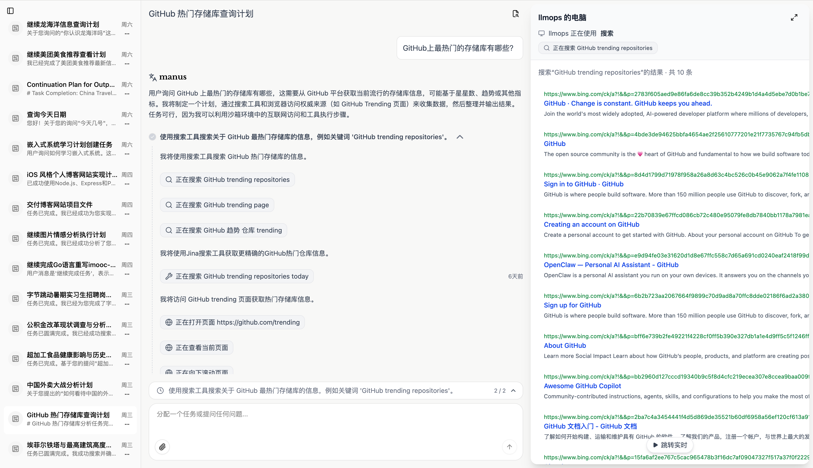
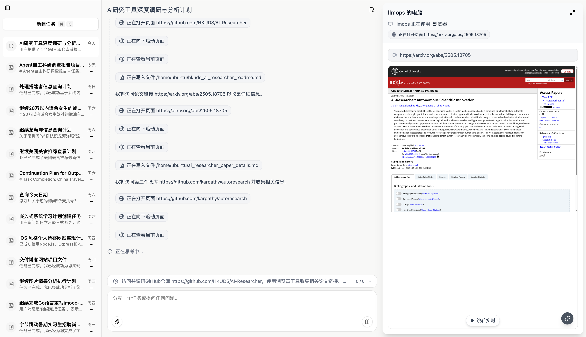
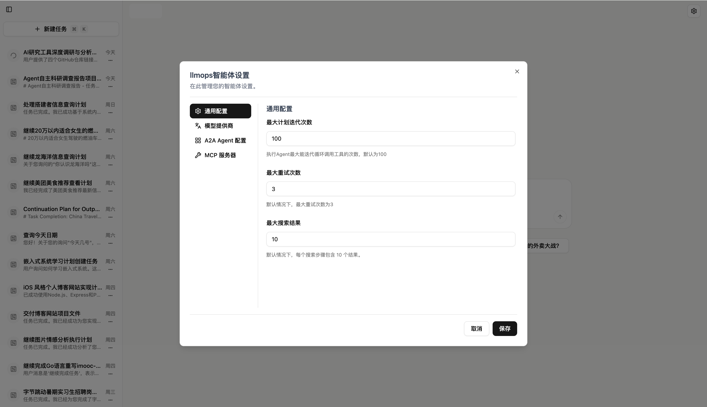
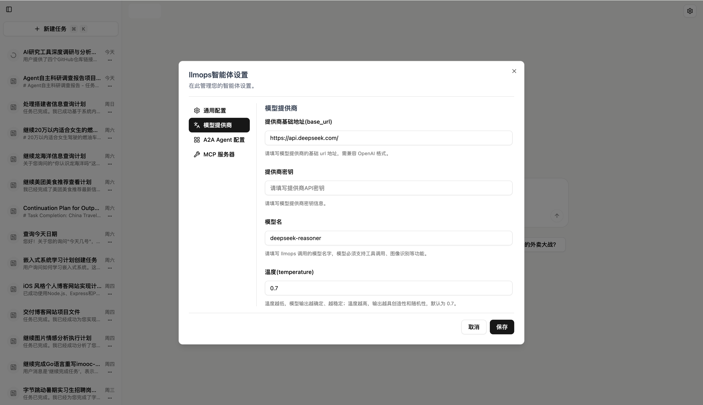
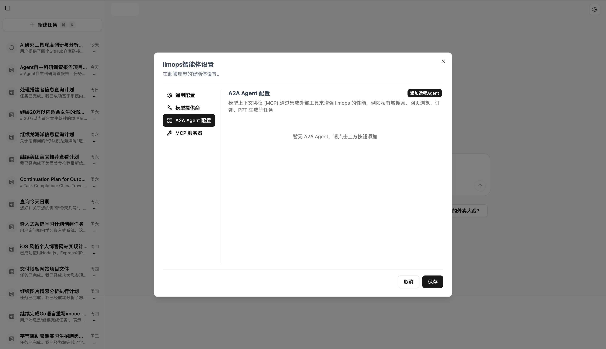
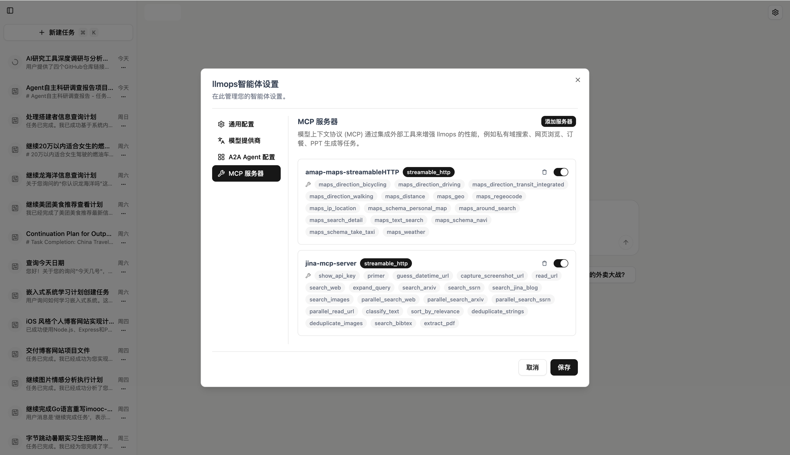
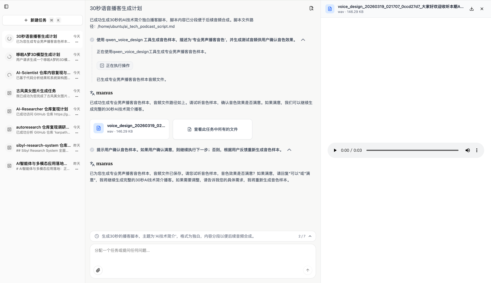

English | [中文](./README.zh-CN.md)

# MultiGen - General-Purpose AI Agent System

MultiGen is a general-purpose AI Agent system designed for fully private deployments. It connects Agents/Tools via A2A + MCP, and supports running built-in tools and operations inside a sandbox.

## Screenshots

<p align="center">
  
</p>

<table width="100%">
  <tr>
    <td align="center">
      
    </td>
  </tr>
  <tr>
    <td align="center">
      
    </td>
  </tr>
</table>

<table width="100%">
  <tr>
    <td width="50%" align="left" valign="top">
      
    </td>
    <td width="50%" align="right" valign="top">
      
    </td>
  </tr>
  <tr>
    <td width="50%" align="left" valign="bottom">
      
    </td>
    <td width="50%" align="right" valign="bottom">
      
    </td>
  </tr>
</table>


<p align="center">
  
</p>


<table>
  <tr>
    <td width="33%" align="center">
        
    </td>
    <td width="33%" align="center">
        
    </td>
    <td width="33%" align="center">
        
    </td>
  </tr>
</table>


<p align="center">
  
</p>


## Project Layout

```
mooc-manus/
├── api/              # Backend API service (FastAPI)
├── ui/               # Frontend service (Next.js)
├── sandbox/          # Sandbox service (Ubuntu + Chrome + VNC)
├── nginx/            # Nginx gateway configuration
│   ├── nginx.conf
│   └── conf.d/
│       └── default.conf
├── docker-compose.yml
├── .env              # Environment variables (create it yourself)
└── README.md
```

## Quick Start (Local Deployment)

### Prerequisites

- Docker >= 20.10
- Docker Compose >= 2.0

### One-command Deployment

1. **Configure environment variables**

   Create a `.env` file in the project root and adjust values as needed:

   ```bash
   # Required
   COS_SECRET_ID=your_cos_secret_id_here       # Tencent COS SecretId
   COS_SECRET_KEY=your_cos_secret_key_here     # Tencent COS SecretKey
   COS_BUCKET=your_cos_bucket_here             # COS bucket name
   OPENAI_API_KEY=your_vocano_api_key_here     # Vocano API key
 

   # Optional
   NGINX_PORT=8088                             # Public port for Nginx
   ADMIN_API_KEY=your_admin_api_key_here       # Admin API key for authentication
   LLM_PROVIDER=vocano                      # LLM provider (deepseek or openai)
   TENCENT_AI3D_API_KEY=your_tencent_ai3d_api_key_here # Tencent AI3D API key
   DASHSCOPE_API_KEY=your_dashscope_api_key_here # Dashscope API key
   ```

2. **Configure the AI model**

   Update the LLM configuration in `api/config.yaml`:

  ```yaml
  llm_config:
    base_url: https://api.deepseek.com/
    api_key: YOUR_DEEPSEEK_API_KEY
    model_name: deepseek-reasoner
    temperature: 0.7
    max_tokens: 8192
  agent_config:
    max_iterations: 100
    max_retries: 3
    max_search_results: 10
  mcp_config:
    mcpServers:
      amap-maps-streamableHTTP:
        transport: streamable_http
        enabled: true
        description: null
        env: null
        command: null
        args: null
        url: https://mcp.amap.com/mcp?key=YOUR_AMAP_API_KEY
        headers: null
      jina-mcp-server:
        transport: streamable_http
        enabled: true
        description: null
        env: null
        command: null
        args: null
        url: https://mcp.jina.ai/v1
        headers:
          Authorization: Bearer YOUR_JINA_API_KEY
  ```

3. **Start all services**

   ```bash
   docker compose up -d --build
   ```

4. **Open the app**

   Visit `http://localhost:8088` (or the port defined by `NGINX_PORT` in `.env`).

### Local URLs

- Web UI: `http://localhost:${NGINX_PORT:-8088}`
- API health check: `http://localhost:${NGINX_PORT:-8088}/api/status`

## Architecture

```
                    ┌─────────────┐
     Port 8088      │   Nginx     │
   ─────────────────►  (Gateway)  │
                    └──────┬──────┘
                           │
              ┌────────────┴────────────┐
              │ /                       │ /api
              ▼                         ▼
       ┌─────────────┐          ┌─────────────┐
       │  Next.js UI │          │  FastAPI     │
       │  (Port 3000)│          │  (Port 8000) │
       └─────────────┘          └──────┬──────┘
                                       │
                    ┌──────────────────┼──────────────────┐
                    │                  │                   │
                    ▼                  ▼                   ▼
             ┌───────────┐     ┌───────────┐       ┌───────────┐
             │ PostgreSQL│     │   Redis   │       │  Sandbox  │
             │(Port 5432)│     │(Port 6379)│       │ (VNC/HTTP)│
             └───────────┘     └───────────┘       └───────────┘
```

## Containers

| Container | Service | Description |
|---------|------|------|
| manus-nginx | Nginx | Reverse proxy gateway, the only exposed entrypoint |
| manus-ui | Next.js | Frontend UI service |
| manus-api | FastAPI | Backend API service |
| manus-postgres | PostgreSQL | Database |
| manus-redis | Redis | Cache |
| manus-sandbox | Sandbox | Sandbox runtime (Chrome + VNC) |

## Common Commands

```bash
# Start everything (detached) and build images
docker compose up -d --build

# Check status
docker compose ps

# Follow logs
docker compose logs -f
docker compose logs -f manus-api
docker compose logs -f manus-ui

# Restart a single service
docker compose restart manus-api

# Stop everything
docker compose down

# Stop and remove volumes (dangerous)
docker compose down -v
```

## Enable HTTPS

1. Put your TLS certificate files into `nginx/ssl/`:
   - `fullchain.pem`
   - `privkey.pem`

2. Update `nginx/conf.d/default.conf` to add/enable a `listen 443 ssl` server block and point it to your certificate paths.

3. Update `docker-compose.yml` to enable the `443:443` port mapping (and mount `nginx/ssl` if needed).

4. Restart Nginx:
   ```bash
   docker compose restart manus-nginx
   ```

## Local Development

See the READMEs inside each sub-project:

- [API](./api/README.md)
- [UI](./ui/README.md)
- [Sandbox](./sandbox/README.md)

## License

[MIT](./LICENSE)