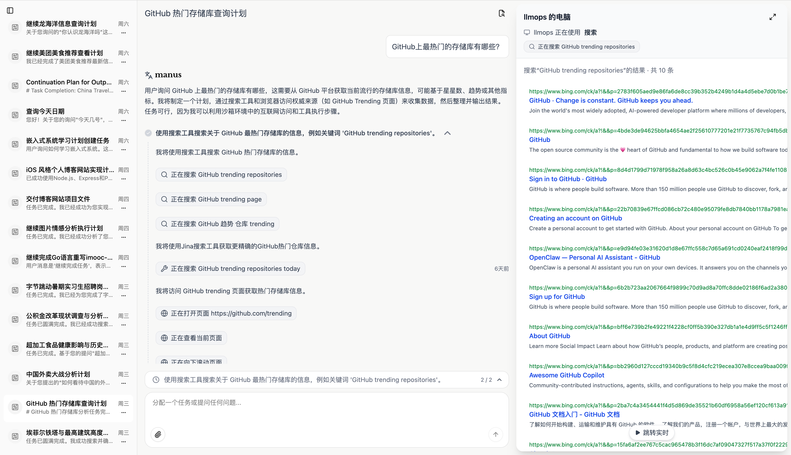
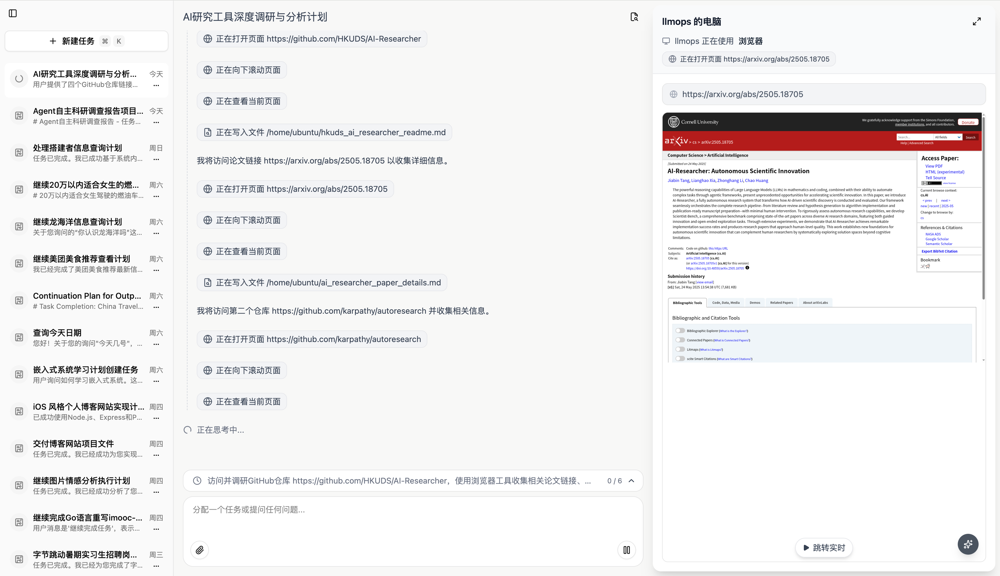
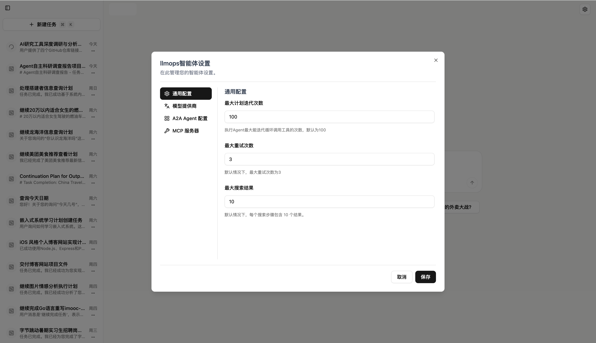
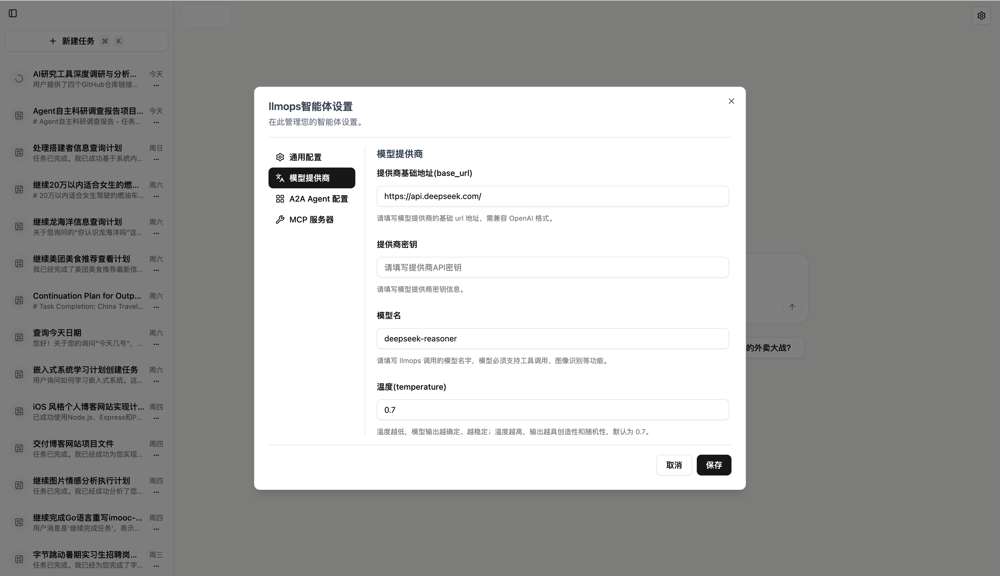
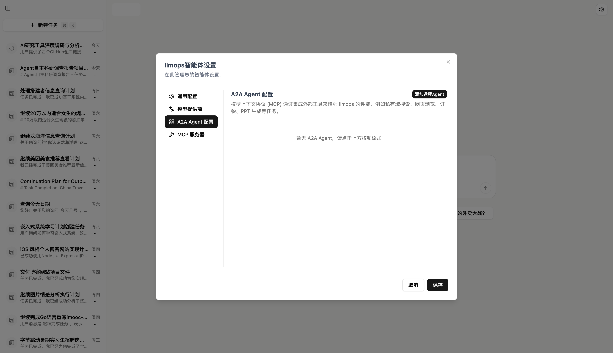
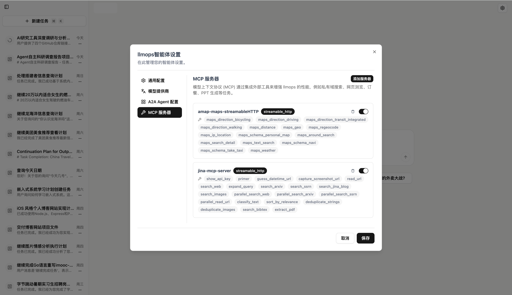
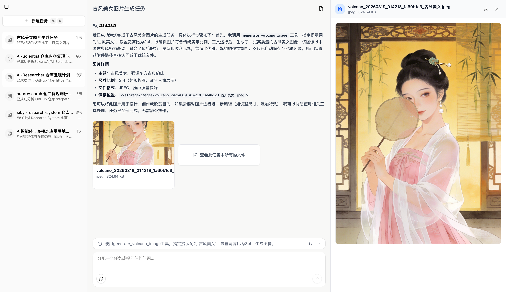
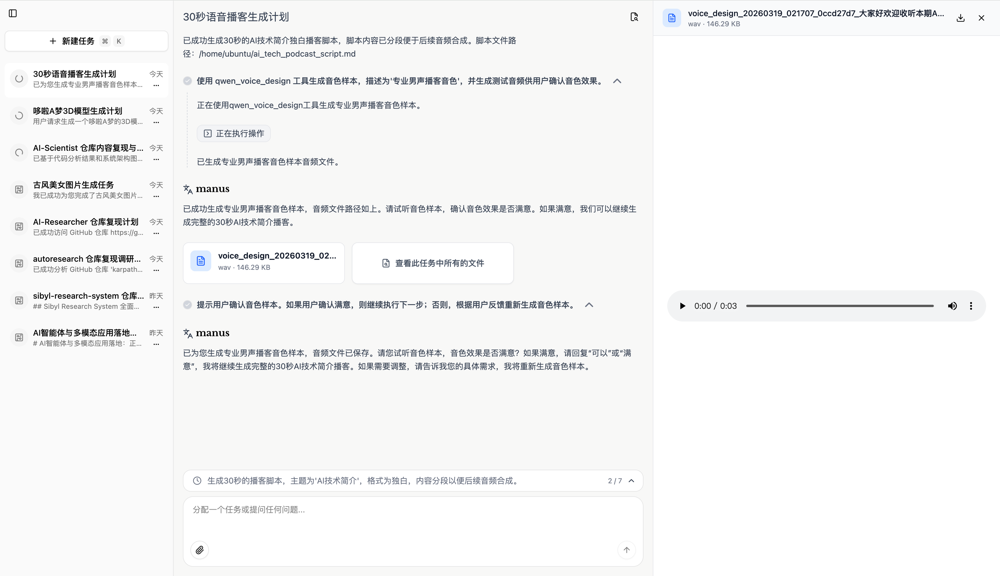

<div align="center">

# 🚀 MultiGen

### **面向完全私有化部署的通用 AI Agent 系统**

*Planner + ReAct 多智能体架构 · 原生支持 A2A 与 MCP · 沙箱执行 · 一键部署*

[](./LICENSE)
[](https://www.python.org/)
[](https://nextjs.org/)
[](https://fastapi.tiangolo.com/)
[](https://www.docker.com/)
[](https://github.com/)

[English](./README.md) · **简体中文**

<p align="center">
  
</p>

</div>

---

## ✨ MultiGen 是什么？

**MultiGen** 是一个开源的、面向 **完全私有化部署** 的通用 AI Agent 平台。它由 **Planner（规划智能体）** 与 **ReAct（执行智能体）** 双层架构组成：Planner 负责将用户目标拆解成可执行的子步骤，ReAct 在 **隔离的 Docker 沙箱** 中逐步推理并调用工具完成任务 —— 数据始终留在你自己的基础设施内。

开箱即用支持：联网搜索、Shell 命令、浏览器自动化、图像 / 视频 / 3D 模型 / TTS 音频生成、PPT 与报告产出，并通过 **A2A** 协调外部智能体、通过 **MCP** 接入任意工具服务。

> 💡 **可以把它理解为：你自己掌控数据、模型与基础设施的 Manus / Claude Agent / GPT Agent 私有化替代品。**

---

## 🎯 核心特性

| | |
|---|---|
| 🧠 **Planner + ReAct 架构** | Planner 输出 JSON 形式的子步骤计划，ReAct 智能体在每一步内进行"推理 → 行动 → 观察"循环。 |
| 🔌 **原生支持 MCP / A2A** | 接入任意 MCP 服务（搜索、地图、代码、自定义工具），并通过 A2A 协议把子任务委托给同伴 Agent。 |
| 🛡️ **沙箱化执行** | 所有 Shell / 浏览器 / 文件操作都运行在隔离的 Ubuntu + Chrome + VNC 容器中，模型无法触碰宿主机。 |
| 🎨 **多模态生成能力** | 内置图像（火山 / SD）、视频、3D 模型、TTS（Qwen / 播客）、数字人、音频混音、幻灯片等工具。 |
| 🌐 **兼容任意 OpenAI 协议** | DeepSeek / 火山 / 硅基流动 / Qwen / OpenAI / vLLM / Ollama 均可 —— 修改 `config.yaml` 即可切换。 |
| 🚢 **一键部署** | `docker compose up -d --build` 一次拉起：UI、API、Sandbox、Postgres、Redis、Nginx。 |
| 📡 **实时流式 UI** | Next.js 前端通过 SSE 实时渲染计划、工具调用、中间结果与最终答案。 |
| 🔁 **可回放会话** | 会话状态完整持久化到 PostgreSQL，生成文件同步至本地与腾讯云 COS，可回放与分享。 |

---

## 📸 功能展示

### 🌐 联网搜索与知识检索

<p align="center">
  
  <br/>
  <em>智能体自动规划搜索路径、调用合适工具，并给出带来源引用的合成答案。</em>
</p>

<p align="center">
  
  <br/>
  <em>图片搜索与相关性排序，结果实时流式回传到前端。</em>
</p>

### ⚙️ 配置与管理界面

<table width="100%">
  <tr>
    <td width="50%" align="center" valign="top">
      
      <br/><sub><b>模型配置</b> — 接入任意 OpenAI 兼容接口</sub>
    </td>
    <td width="50%" align="center" valign="top">
      
      <br/><sub><b>智能体行为</b> — 迭代次数、重试、搜索深度</sub>
    </td>
  </tr>
  <tr>
    <td width="50%" align="center" valign="top">
      
      <br/><sub><b>MCP 服务</b> — 在线接入第三方工具</sub>
    </td>
    <td width="50%" align="center" valign="top">
      
      <br/><sub><b>A2A 智能体</b> — 与同伴 Agent 协同</sub>
    </td>
  </tr>
</table>

### 🖼️ 多模态生成

<p align="center">
  
  <br/>
  <em>端到端的创作流水线 —— 从一段 Prompt，到规划、到最终渲染产出。</em>
</p>

<table>
  <tr>
    <td width="33%" align="center">
      
      <br/><sub>古风人像 · 示例 1</sub>
    </td>
    <td width="33%" align="center">
      
      <br/><sub>古风人像 · 示例 2</sub>
    </td>
    <td width="33%" align="center">
      
      <br/><sub>古风人像 · 示例 3</sub>
    </td>
  </tr>
</table>

### 🎙️ 播客与 TTS

<p align="center">
  
  <br/>
  <em>使用 Qwen-TTS 生成多角色播客，自动叠加背景音乐与多轨混音。</em>
</p>

---

## 🏗️ 系统架构

```
              ┌─────────────────────────────────────────────┐
              │              Next.js UI  (3000)             │
              │   计划 · 步骤 · 工具调用 · SSE 流式渲染      │
              └────────────────────┬────────────────────────┘
                                   │  /api  (SSE)
                                   ▼
              ┌─────────────────────────────────────────────┐
              │              FastAPI  (8000)                │
              │  ┌──────────────┐    ┌───────────────────┐  │
              │  │ AgentService │ →  │ AgentTaskRunner   │  │
              │  └──────────────┘    └────────┬──────────┘  │
              │                               ▼              │
              │              ┌────────────────────────────┐  │
              │              │   PlannerReAct Flow        │  │
              │              │  Planner ─► ReAct (循环)   │  │
              │              └─────┬──────────────────────┘  │
              │                    │ 工具                    │
              │  ┌─────────────────┴──────────────────────┐  │
              │  │ file · shell · browser · search · MCP  │  │
              │  │ image · video · 3D · TTS · A2A · ...   │  │
              │  └────────────────────────────────────────┘  │
              └─────┬─────────────┬───────────────────┬─────┘
                    ▼             ▼                   ▼
              ┌──────────┐  ┌──────────┐     ┌──────────────────┐
              │PostgreSQL│  │  Redis   │     │  Docker 沙箱     │
              │  会话    │  │  任务流  │     │  Ubuntu + Chrome │
              └──────────┘  └──────────┘     │     + VNC (8080) │
                                             └──────────────────┘
```

**Agent 执行流程：**
1. `AgentService` 接收用户消息 → 通过 Redis Stream 派发给 `AgentTaskRunner`。
2. `AgentTaskRunner` 运行 `PlannerReActFlow`：
   - **PlannerAgent** —— 将用户请求拆解成 JSON 形式的子步骤计划；
   - **ReActAgent** —— 对每个子步骤迭代执行"推理 → 调用工具 → 观察 → 继续"循环，最终汇总结果。
3. 事件通过 SSE 实时回推（`plan` · `title` · `step` · `message` · `tool` · `wait` · `error` · `done`）。

---

## 🚀 快速开始

### 前置要求

- 🐳 Docker `>= 20.10`
- 🐙 Docker Compose `>= 2.0`
- 🔑 任意 OpenAI 兼容协议大模型的 API Key（DeepSeek / 火山 / OpenAI / vLLM / Ollama 等）

### 1. 克隆仓库

```bash
git clone https://github.com/your-org/multigen.git
cd multigen
```

### 2. 配置环境变量

在项目根目录创建 `.env`：

```bash
# ── 必须 ─────────────────────────────────────────────
COS_SECRET_ID=your_cos_secret_id_here       # 腾讯云 COS SecretId
COS_SECRET_KEY=your_cos_secret_key_here     # 腾讯云 COS SecretKey
COS_BUCKET=your_cos_bucket_here             # COS 存储桶名称
OPENAI_API_KEY=your_llm_api_key_here        # 大模型 API Key

# ── 可选 ─────────────────────────────────────────────
NGINX_PORT=8088                             # 对外端口
ADMIN_API_KEY=your_admin_api_key_here       # 管理员 API Key
LLM_PROVIDER=volcano                        # deepseek / openai / volcano
TENCENT_AI3D_API_KEY=...                    # 3D 模型生成
DASHSCOPE_API_KEY=...                       # Qwen-TTS
```

### 3. 配置大模型

编辑 `api/config.yaml`：

```yaml
llm_config:
  base_url: https://api.deepseek.com/
  api_key: YOUR_DEEPSEEK_API_KEY
  model_name: deepseek-reasoner
  temperature: 0.7
  max_tokens: 8192

agent_config:
  max_iterations: 100
  max_retries: 3
  max_search_results: 10

mcp_config:
  mcpServers:
    amap-maps-streamableHTTP:
      transport: streamable_http
      enabled: true
      url: https://mcp.amap.com/mcp?key=YOUR_AMAP_API_KEY
    jina-mcp-server:
      transport: streamable_http
      enabled: true
      url: https://mcp.jina.ai/v1
      headers:
        Authorization: Bearer YOUR_JINA_API_KEY
```

### 4. 启动服务

```bash
docker compose up -d --build
```

### 5. 访问系统

浏览器打开 **`http://localhost:8088`**（或 `.env` 中配置的 `NGINX_PORT`）。API 健康探针位于 `/api/status`。

---

## 🧩 内置工具

| 工具 | 用途 |
|---|---|
| `file` | 沙箱内文件读 / 写 / 增量修改 |
| `shell` | 在沙箱中执行 Shell 命令 |
| `browser` | 无头 Chrome —— 浏览、点击、抓取、截图 |
| `search` | 联网搜索（Bing / Google / Jina） |
| `message` | 任务执行中向用户追问澄清 |
| `image_generation` · `volcano_image` | 文生图 |
| `volcano_video` · `video_concatenation` | 文生视频与后处理 |
| `model_3d` | 文 / 图生 3D（腾讯 AI3D） |
| `virtual_anchor` | 虚拟数字人视频 |
| `qwen_tts` · `audio_mixing` | TTS 与多轨混音 |
| `mcp` | 调用任意已注册的 MCP 服务 |
| `a2a` | 把子任务委托给同伴 Agent |

> 📚 添加自定义工具的方式，请参考 **[CLAUDE.md → Adding a New Tool](./CLAUDE.md#adding-a-new-tool)**。

---

## 📦 项目结构

```
MultiGen/
├── api/              # 后端 API 服务（FastAPI）
│   ├── app/          # Domain / Application / Infrastructure 分层
│   ├── tests/        # Pytest 测试
│   └── config.yaml   # 运行时 LLM / MCP / A2A 配置
├── ui/               # 前端（Next.js 14, App Router）
├── sandbox/          # 沙箱运行时（Ubuntu + Chrome + VNC）
├── nginx/            # 反向代理网关
│   ├── nginx.conf
│   └── conf.d/default.conf
├── assets/           # README 使用的截图
├── docker-compose.yml
├── .env              # 环境变量（请自行创建）
└── README.md
```

---

## 🐳 容器清单

| 容器 | 服务 | 说明 |
|---|---|---|
| `manus-nginx` | Nginx | 反向代理网关，唯一对外暴露端口 |
| `manus-ui` | Next.js | 前端 UI |
| `manus-api` | FastAPI | 后端 API |
| `manus-postgres` | PostgreSQL | 会话与消息存储 |
| `manus-redis` | Redis | 任务流与缓存 |
| `manus-sandbox` | Sandbox | 隔离的 Ubuntu + Chrome + VNC 运行时 |

---

## 🛠️ 常用命令

```bash
# 一键启动 + 重新构建镜像
docker compose up -d --build

# 查看服务状态
docker compose ps

# 查看日志
docker compose logs -f
docker compose logs -f manus-api
docker compose logs -f manus-ui

# 重启单个服务
docker compose restart manus-api

# 停止全部服务
docker compose down

# 停止并清除数据卷（危险 —— 会清空数据库）
docker compose down -v
```

---

## 🔒 启用 HTTPS

1. 将证书文件放入 `nginx/ssl/`：
   - `fullchain.pem`（证书链）
   - `privkey.pem`（私钥）
2. 在 `nginx/conf.d/default.conf` 中添加/启用 `listen 443 ssl` 配置并指向证书路径。
3. 在 `docker-compose.yml` 中启用 `443:443` 端口映射（如需挂载 `nginx/ssl`）。
4. 应用变更：
   ```bash
   docker compose restart manus-nginx
   ```

---

## 💻 本地开发

各子项目分别提供独立开发文档：

- 🔧 [API 服务](./api/README.md) —— FastAPI、SQLAlchemy async、Alembic、Pytest
- 🎨 [前端 UI](./ui/README.md) —— Next.js 14、App Router、SSE 流式渲染
- 📦 [沙箱服务](./sandbox/README.md) —— Ubuntu + Chrome + VNC 运行时

API 服务的本地启动示例：

```bash
cd api
python -m venv .venv && source .venv/bin/activate
pip install uv && uv pip install -r requirements.txt
playwright install
uvicorn app.main:app --host 0.0.0.0 --port 8000 --reload
```

---

## 🗺️ Roadmap

- [x] Planner + ReAct 双智能体执行流
- [x] MCP / A2A 集成
- [x] 多模态工具（图像 / 视频 / 3D / TTS）
- [x] DeepSeek 推理模型 (v4) 兼容
- [ ] 长期记忆 / RAG 插件
- [ ] 多用户工作区权限
- [ ] 工具与 MCP 服务插件市场
- [ ] 移动端适配

---

## 🤝 参与贡献

我们欢迎一切形式的贡献 —— Issue、PR、工具插件、翻译……

1. Fork 本仓库
2. 创建特性分支（`git checkout -b feat/amazing-thing`）
3. 提交改动（`git commit -m 'feat: add amazing thing'`）
4. 推送到分支（`git push origin feat/amazing-thing`）
5. 提交 Pull Request

在开始之前，请先阅读 [CLAUDE.md](./CLAUDE.md) —— 其中详细描述了系统架构、Agent 契约与新增工具 / 接入新模型的安全方式。

---

## 🙏 致谢

MultiGen 站在如下优秀项目的肩膀上：

- [FastAPI](https://fastapi.tiangolo.com/) · [Next.js](https://nextjs.org/) · [SQLAlchemy](https://www.sqlalchemy.org/)
- [Model Context Protocol](https://modelcontextprotocol.io/) · [A2A](https://google.github.io/A2A/)
- [Playwright](https://playwright.dev/) · [Docker](https://www.docker.com/)
- DeepSeek、火山引擎、硅基流动、Qwen —— 提供了优秀的开源大模型与推理服务

---

## 📄 License

基于 [MIT License](./LICENSE) 开源发布。

<div align="center">

**如果 MultiGen 对你有帮助，欢迎点一个 ⭐ —— 这对我们意义重大！**

用 ❤️ 为构建私有 AI Agent 的开发者们打造。

</div>
